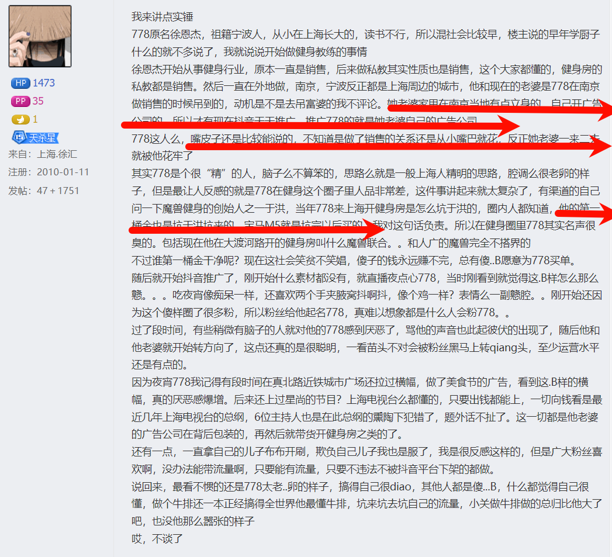

我来讲点实锤
778原名徐恩杰，祖籍宁波人，从小在上海长大的，读书不行，所以混社会比较早，楼主说的早年学厨子
什么的就不多说了，我就说说开始做健身教练的事情
徐恩杰开始从事健身行业，原本一直是销售，后来做私教其实性质也是销售，这个大家都懂的，健身房的
私教都是销售。然后一直在外地做，南京，宁波反正都是上海周边的城市，他和现在的老婆是778在南京
做销售的时候吊到的，动机是不是去吊富婆的我不评论。h波家甲在南点当地有点立自的白己狂广雪
ハ的Mオ右な立エエ雄雄779的旦加波白コ的广生ハ司
778这人么，嘴皮子还是比较能说的，不知道是做了销售的关系还是从小嘴巴就花反正她老婆一来一
就被他花牢了
其实778是个很“精”的人，脑子么不算笨的，思路么就是一般上海人精明的思路，腔调么很老卵的样
子，但是最让人反感的就是778在健身这个圈子里人品非常差，这件事讲起来就太复杂了，有渠道的自己
问一下魔兽健身的创始人之于洪，当年778来上海开健身房是怎么坑于洪的，圈内人都知道，仙的笛一
超全h旦培王计培屯的宁口M5武旦片户心三的我对这句话负责。所以在健身圈里778其实名声很
臭的。包括现在他在大渡河路开的健身房叫什么魔兽联合。。和人广的魔兽完全不搭界的
不过谁第一桶金干净呢？现在这社会笑贫不笑娼，傻子的钱永远赚不完，总有傻。B愿意为778买单。
随后就开始抖音推广了，刚开始什么素材都没有，就直播夜点心778，当时刚看到就觉得这B样怎么那么
戆。。。吃夜宵像痴保一样，还喜欢两个手夹腋窝抖啊料，像个鸡一样？表情么一副戆腔。。刚开始还因
为这个傻样圈了很多粉，所以粉丝给他起名778，真难以想象都是什么人会粉778。。
过了段时间，有些稍微有脑子的人就对他的778感到厌恶了，骂他的声音也此起彼伏的出现了，随后他和
他老婆就开始转方向了，这点还真的是很聪明，一看苗头不对会被粉丝黑马上转qiag头，至少运营水平
还是有点的。
因为夜宵778我记得有段时间在真北路近铁城市广场还拉过横幅，做了美食节的广告，看到这。B样的横
幅，真的厌恶感爆增。后来还上过星尚的节目？上海电视台么都懂的，只要出钱都能上，一切向钱看是最
近几年上海电视台的总纲，6位主持人也是在此总纲的熏陶下犯错了，题外话不扯了。这一切都是他老婆
的广告公司在背后包装的，再然后就带货开健身房之类的了。
还有一点，一直拿自己的儿子布布开刷，欺负自己儿子我也是服了，我是很反感这样的，但是广大粉丝喜
欢啊，没办法能带流量啊，只要能有流量，只要不违法不被抖音平台下架的都做。
说回来，最看不惯的还是778太老卵的样子，搞得自己很di阳o,其他人都是傻。B,什么都觉得自己很
懂，做个牛排还一本正经搞得全世界他最懂牛排，坑来坑去坑自己的流量，小关做牛排做的总归比他大了
吧，也没他那么嚣张的样子
哎，不谈了

人家玩的套路你们是不知道的，直播上买过一次牛肋骨，1个月没发货，订单显示交易成功，然后找客
服，客服还不让线上退款，加微信私底下退款，奶奶的什么玩样儿，和我说快递弄掉了