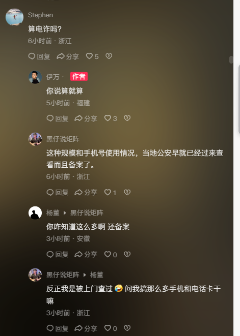
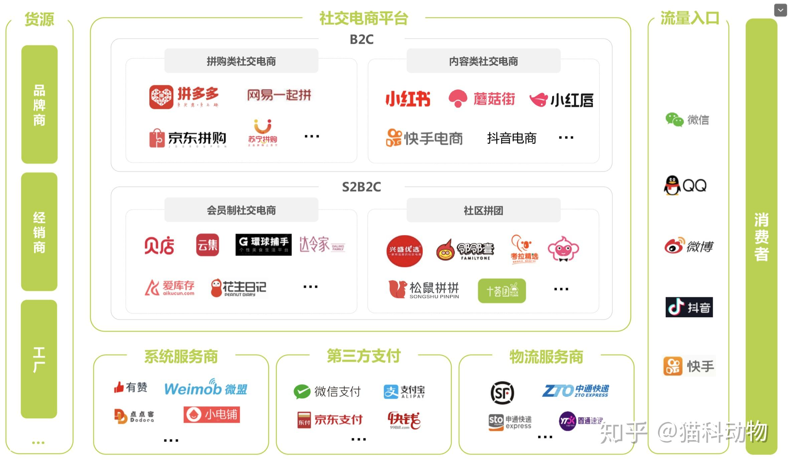
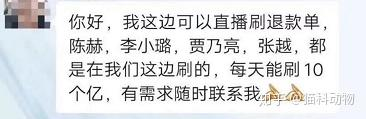

# 穷人家的孩子缺少什么?

1. 缺少有人兜底的认知, 导致不敢去犯错, 做事犹犹豫豫, 瞻前顾后, 战战兢兢唯唯诺诺, 失败一次就没有机会了
2. 虚假教导咯, 就像面试一样, 双方都不能讲真话
3. 潸然泪下的评论, 真所谓, 只有经历过才能体会到
4. 社会的许多底层逻辑, 只有达到了一定的财富和地位级别后才会感受到, 而且是不方便拿上讲台教的, 穷人家庭的父母没有办法提前告诉子女

# 面向用户思维

1. 觉得用户需要什么产品, 解决客户痛点, 环境不允许, 大家都在往低价低质量拼杀, 明星直播疯狂抢流量
2. 面向平台思维, 平台要什么你就给什么, 卖货给平台平台帮你成交
3. 资源为王, 电商、新媒体、粉丝、用户这些概念大量充斥着所有行业, 事实上, 商业上层撬动的本质还是 toB 的, 不论是大的代理签订,
   大的平台入驻, 或者是大的主播入选, 都是 toB 的资源, 必须靠利益和关系去撬动

# 新零售

1. 新零售没有套路, 必须根据行业属性, 消费习惯和自己企业基因进行定制
2. 没有哪一家供应商给出的标准化产品 100% 满足企业的业务需求, 必须定制化开发
3. 珠宝不属于快消品, 在电商平台很难有大的发挥, GMV低, ROI也低, B2C商城里根本不可能有线下门店那么的赚钱
4. 珠宝价高, 消费者购买要线下体验, 平台替代不了
5. 新零售策略是线上为线下赋能, 也就是通过第三方电商平台为线下门店进行引流, 获得体验用户, 然后再区别线上线下SKU, 线上做复购
6. 消费者买东西要的是两样: 体验好的、便捷的, 体验在线下, 复购在线上
7. 门店作为线下流量的来源, 天猫京东作为初期的试水, 有了一定的用户量之后, 则通过导流到自媒体、自营平台内做维护和销售
8. 新零售是结合行业特性和企业基因, 利用新技术、新平台、新体验, 整合渠道、用户和商品 资源, 扩大用户基数、优化用户体验、提升单客价值而打造的定制化生态系统,
   新零售的核心是"用户思维"和"用户导向", 基于最方便接触用户, 最深刻打动用户、最直接转化用户为基本逻辑, 在技术、平台、系统、体验和模式上创新
9. 线上只是打开了通路和口碑, 但是对于用户而言, 线下也在做传统渠道销售, 这只是增加销售渠道而已
10. 根据产品的特色, 选择能够解决的主要功效, 选择对应的场景做内容营销, 不需要海量, 但是很精; 不需要巨大的流量, 但是浓度够高;
    不需要专利技术, 但是有专业态度。不需要嫁接第三方平台, 但有自己的个性做自媒体; 不需要上百万的粉丝, 但有几万高粘度的忠粉;
    不需要几十亿的销售额, 但有高盈利的能力

# 电商业务

**自营电商:** 载体是微信服务号, 可自己开发, 也可以用有赞来做, 优势在于利润率高, 因为没有平台的推广费, 劣势在于这是封闭的平台,
品牌必须要有自营电商的部分, 以前是官网, 现在可以通过自媒体或品牌APP来, 销售完全是通过自媒体粉丝量和内容质量来决定的    
**平台电商:** 平台被推着走, 被平台绑架了不赚钱, 大活动一来就苦不堪言, 花钱买新流量, 传统广告费转成数字营销推广,
在塑造品牌的同时直接为电商引流  
**内容电商:** 做种草和背书, 小红书, 根据电商活动销售节奏, 每月针对主推产品进行 kol 种草, 效果的衡量指标就是天猫访客数的增加,
测算一个月再做调整, 小红书期间店会开, 但是一定是种草在先, 2 个月后再进入平台  
**社交电商:** 尾货的清仓我们会指定社交电商去处理: 云集、拼多多和爱库存

# 策略

1. 通过 CRM 系统和数据分析让人员, 所以不能从会员价值、人数、复购来计算。所以只能从最简单的访客数、转化率和客单价来说
2. 大号合作推送、小红书平台种草, 抖音号运营以及淘客活动。前面三个其实做的是品宣, 大约只有阅读量3—5%的隐形流量转化搭配天猫平台的销售中,
   淘客活动比较直接, 低价, 佣金。但是存在的问题是, 不用天天搞, 因为进来的流量对店铺的权重有伤害, 淘客销售绝对不能高于店铺日常销售额的25%占比,
   这个是需要控制的
3. 小红书和抖音都已经签约和合作单位, 3月1日开始正式实施。小红书一律签约的是腰部网红, 先期密集投放, 以量轰炸, 在小红书投放一周后,
   看店铺访客数自然搜索"品牌词"进来的提升率
4. 抖音的合作第一期也是3—6月, 费用不便宜, 但抖音虽然流量大, 但定位在于品牌宣传, 两大但浓度不高, 带货效果不佳,
   真正要带货的其实是快手平台, 那里浓度较高, 也是带货达人们的战场
5. 至于小红书和抖音以及大号推广, 产生的流量不直接, 能增加访客数, 但转化率不高, 属于品牌建设

# 站内引流策略

1. 直通车, 流量90%以上是用户搜索品牌词进来的
2. 平台坑位活动, 和小二对赌, 保证有有那么多销量, 不然自己刷单都得刷上去, 否则以后就别指望上
3. 我希望给2个月时间站外品牌流量的推广时间, 做一点基础和背书, 这样当消费者用直通车找到我们的时候, 也能联想起曾经在抖音和小红书上看到过我们,
   形成二次记忆, 这样转化率才能高RR
4. 核心的关键在于中间佣金的部分, 平台服务费+网红佣金

# 电商品类

1. 一类电商是天猫、京东等大型平台类电商, 做的是熟悉互联网的那帮用户, 主要是一二线城市人群, 很多化妆品品牌这几年通过一类电商建立品牌,
   一类电商做的是用户、是品牌、是口碑、是复购。但是一类电商的红利期早就过去了, 上千万家品牌聚集在一类电商的平台上,
   流量是个巨大的问题, 站内、站外的引流需要巨大的费用投入。如果在没有费用引流的情况下, 是无法起步的
2. 二类电商, 主打人群是四五六线城市, 通过头条、贴吧、QQ、微信广告等入口直接进入产品单页, 点击购买, 填写地址,
   货到付款。相当于是广撒产品单页到各个地方。二类电商做的是单一爆品、出量、低折扣, 一次性。二类电商需要的是信息流费用,
   运营团队会那拿一个后台, 充钱进去, 选择露出平台、人群和区域, 把详情页（营销素材）撒出去。用户一般是CPC点击扣费
3. 一是亏钱, 二是降低品牌形象, 在二类电商中的品牌很少有知名品牌, 2 元开发成本售价 99,工厂产品没有任何知名度, 但是因为成本很低,
   中间毛利很高, 就会有很大范围和空间做信息流投放
4. 但是货品不算高的周转率和库存压力, 每个阶段都会造成巨大的库存压力, 尤其是服装行业, 这就需要有二类电商来进行消化,
   少部分在后台充一点广告费进去(几千块), 试一个sku, 看看点击扣费和购买回款的ROI, 计算出临界成本, 之后再大规模已投入广告开始售卖
5. 二类电商的退货率远大于一类电商。因为——货到付款, 一类电商化妆品品牌退货率一般在5%-10%(大促可能会更高一点), 但是二类电商的话,
   10%—30%之间的退货率很正常, 所以做二类电商之前你的客服团队要想清楚

# 电商

双微一抖自媒体运作方式作为品牌职能架构, 一方面粉丝量需要引流, 另一方面“品效合一”是每个甲方营销人都头疼的问题, 品牌进行了包装,
内容做起来了, 销售转化就一定成正比吗
红利期已经过去了, 消费者是比较难以伺候的, 不能把宝压在个别直播平台和网红身上, 而是要通过设计品牌业务矩阵来好好规划社交电商
获客成本太高了, 一场双十一活动下来, 销售额很高, 但基本上不赚钱, 因为站外广告稿费引流也好, 还是站内的坑位费以及直通车,
消耗巨大, GMV高, 但没有利润, 消费者在线上可选择的太多了, 需要花费巨大的成本引起消费者的注意力

互联网电商只是消费升级过程中的一个环节, 利用信息化技术模糊了品牌的地域性, 缩短了人和货之间的距离, 加快了需求和供给之间的效率,
但它无法取代的是用户肉身、情绪上真实的体验

# 社交电商平台

1. 完全面向消费者的, 以精品优选, 好物推荐和内容种草为主的类型
2. 面向企业和品牌方的, 为其喜爱华库存临其产品, 并给到消费者实实在在的优惠
3. 目前最多的主流平台, 通过高额佣金面向微商团队
4. 小红书本身就是 UGC(用户生成内容)平台, 重营销, 而非销售
5. ROI 在降到一定程度的话, 就不要继续放量了, 疲乏的拉新购买, 一方面 ppc 的增加, 转化率的降低, 人群也不精准
6. 好的内容可遇不可求, 所以与其花很长周期拍摄创意视频, 不如堆量（一两万的预算 100 多条 15s 的短视频做千川计划）, 同样也有爆的概率,
   但操作周期更短, 成本更少
7. 好的内容、好的创意、好的直播形式打磨——是另外一条线, 是品牌线, 需要长期的反复实验, 也是需要做的, 同步

# 内容电商平台

“基础研究”, 是一个微信订阅号, 定位很明确, 成分党的好物推荐, 老板本身就是学化工的, 每日一篇文章也是他亲自写的,
每天早上6点准时推送, 文章的阅读量几乎都是10万+, 文章不单单只针对产品成分的研究, 更会切中用户对于产品本身的社会化需求,
所以往往在文章中嵌入链接销售国内外爆品, 都能卖到爆。消费者信这个号, 信老板, 信这个专家。这是一个PGC营销的典型, 他通过专业的咨询建议,
帮助消费者绕开了很多求证、搜索、问询, 他通过专业的咨询建议, 帮助消费者绕开了很多求证、搜索、问询的环节, 品牌上这样的公众号进行背书,
在理性层面会高过小红书这样的UGC平台, 毕竟现在的消费者会越来越相信穿白大褂的专家和医生, 而不是一味的相信生活在表面的奢华明星和小网红

与这些平台合作, 也有两种模式: 一种是平台对你们家产品看好, 进行集采, 你给一个不错的折扣就OK了, 他来营销他来卖；
另一种是你需要给平台缴纳基础费用, 在5-10万元一次推送, 他们做一件代发, 内容他们做他们发, 钱也他们收, 但是货由你来发,
最后活动结束后进行结算

前者取决于品牌高度

“云集”、“环球”、“考拉”、“贝店”这些“社交电商”的逻辑在于:
前端整合了品牌方的低价货品、 中端获取了大量用户的流量(自购省钱分享赚钱)后端拥有庞大的“带货团队”

这样的模式解决了三方面的需求:

1. 品牌方需要解决库存问题, 和爆品销量(低毛利的方式)
2. 用户需要以更低更优惠的价格买到产品(低于天猫京东这样的一类电商), 同时用户还有赚零花钱的需求, 不用投本, 就可以自己拿朋友圈做生意
3. 背后的销售团队, 则是以前的代购、微商团体的转型并赚到钱, 拥有大量的社群基数(注意, 没有社群这些私域流量,
   这个生意的80%销售额是带不动的, 仅靠用户分裂, 只是很小的一部分)

社交电商中往往提出来的分享赚钱, 是一个非常理想的模式, 也是平台的对外SLOGAN, 对它本身的盈利模式起不到决定性的作用。真正的用户是因为低价和优惠被吸引进平台,
有一部分人有赚钱的思想, 就参与了分裂和分享

真正把这个当做自己的副业和一门生意用心做, 所以通过用户本身的分裂, 不是平台壮大的决定性因素, 真正的决定性因素是微商私域流量的团队

根据经济学定律和市场规律, 市场最后的发展一定会趋同于"私域流量"的个人化小组织销售行为

抖音首购不赚钱是应该的, 私域赚钱就好, 放量的目的在于拉新, 更多的订单进入私域里, 用有赞做复购, 推广拉新

# 坑位费

坑位, 是指固定的广告位, 坑位费, 是指买这个广告位需要花的钱, 可以理解成发布费, 也就是商家需要给带货主播坑位费, 主播才会给商品上架,
在直播间介绍你的商品

主播一般都是采用坑位+佣金的形式合作的, 除了收取固定的坑位费外, 还会收取部分佣金, 佣金就是按照你的实际销售额抽成,
大部分主播的佣金在20-30%之间

打个比方, 一个主播会给你10-20分钟时间, 来介绍你的产品

# 主播带货

主播们深知自己能持续再这个行业发展, 能继续圈粉卖货的核心是好物低价, 他们自己就是一个比聚划算、比拼多多的百亿补贴更加黑洞的一个购物渠道

还有主播每一单10-25%的抽佣, 然后不算你人员工资的话, 天猫平台扣点、快递物流费等等

工厂, 自己做的, 成本低到你想不到, 他们把产品挂在天猫的多品牌专营店里面, 然后花钱刷了1000单作为基础销量, 然后就上直播了,
花点钱做个小红书基础, 再刷点基础销量

每一次的直播都是像是在“买大小”, 赌博一样的操作。第一次不赔, 可能下一次就翻车, 然后再下一次又微赚, 哪个品牌方是拿直播作为主要销售渠道,
基本上都是“玩一次”后, 叹一口气, 就撤了。有预算的品牌方可能就真的拿直播做营销素材做品宣了

很多MCN机构的主播招商部, 也承担了刷单的工作, 并从里面赚钱——如果你不交坑位费, 像用纯佣的方式和我们合作带货也行,
那么首先得选品能选到你才行。什么, 你就这点基础销量? 不行不行！你的基础销量最起码得1000+, 所以你要先刷单！刷单必须得由我们给你刷,
这是规矩！

很多 MCN 主播说可以可以保 ROI, 事实上都是实现拿高额的坑位费串通灰产退单公司一起坑品牌方, 直播卖出去1000单里面, 有70%是假的,
都是刷出来的, 后续全部会退款

一个直播销售货品的价值, 要3方分摊: 平台费(淘宝最便宜, 快手50％最贵)、主播费(链接费几万到上百万不等, 和10％-20％佣金)
、消费者折扣(这是主播拿货与否的核心条件, 一般低于70％)

目前的直播行情, 只适合品牌方“花钱拉新”和“清库存”这两件事, 绝不是打开渠道的救命稻草

# 抖音直播

1. 产品要新奇——传统的东西没有特色, 你不论在包装和要有一定的营销功能
2. 要有引流品——便宜、低价、福利、吸引人成交加粉
3. 场景化直播——直播间打造的创意和氛围营造, 举一大堆类似太空舱和迪厅的直播间例子
4. 优惠的价格——全平台最低
5. 直播的节奏——有技巧的、短频快的叫卖的方式——这点是我最不认同的

1、【店铺】主账号店铺直播(投流)卖货挣钱
2、【商务】和抖音 KOL 进行商务合作,短视频挂车分佣赚钱
3、【分销】要么联系团长,要么自己海量的找 KOC 进行分佣大s, 服务费小的短视频/直播带货合作
4、【直播】和头部主播谈合作,巨额坑位费进行外场带货
5、【投流】自己做内容挂车,做账号,投抖家,投信息流赚钱

你们的品牌不是这个样子的, 就必须符合抖音规则和流量算法, 调整成这个样子的, 品牌方在平台里面玩, 就不要装逼放不下身段
抖音的模仿跟风有一个模式火了, 在抖音系, 最迟三天, 你一定能刷到第二个、第三个

很多非官方的抖音培训讲师在外面教品牌方如何做抖音的, 都是抖音体系里面出去的

# 电商流量理解

电商行业流行的 MCN 机构和 TP 公司所代表的观点, 他们认为”流量即一切“, 建议品牌方或企业,
砸资源做流量——投最火的明星、蹭最热的话题、在小红书、抖音、微博这些热门平台做内容来提高电商平台的流量,
有限的新客来了之后, 想办法做好口碑留住他们, 让他们复购

任何一个品牌从创业, 到生存、到突围, 到壮大、到出圈, 靠的不是所谓的“营销”和“砸钱”, 而是选择了自己在当时极为有限条件下的独特形态或基因,
做好用产品、服务和渠道才有今天的

# 营销方式

1. 各种打车平台、电商平台的百亿补贴, 比的是谁能先熬死谁够资本
2. 瑞幸咖啡送折扣券, 做假账, 夸大销售割资本韭菜

# 短视频看的视频未必真实可信

总有办法能够规避平台监控将单量刷上去, 消费者相信KOL和KOC的推荐, 那么那些有口碑的自媒体人, 哪个不恰饭, 哪个不做广告

营销人员在推广层面考虑的是传播学以及用户心理, 新媒体矩阵、海陆空轰炸、刷数据、内容种草, 等一系列影响你买单的营销操作

产品设计、服务体验和内容价值上。都是通过精品打动用户, 而不是通过套路去吸引流量

用户触点体验设计要不要做?
品牌物料提升要不要做?
私域流量运营要不要做?
会员权益政策要不要做?
vip服务和专属体验打造要不要做?
专家背书行业沉淀要不要做?

新品牌孵化?
电商运营、新媒体营销都不是最主要的, 那拼的是谁砸的钱更多, 谁更有技巧和套路。新品牌没有足够硬货背书的话(研发、专利、背景),
那么请在服务和体验上做到足够用心和诚意, 让用户接触到的瞬间, 有良好的体验

转成品牌的自播+达人带货相结合的方式。自播是日常每天8-10小时, 达人带货是每隔4-8周弄一次

# 营销套路

小红书做给小主播看,小主播做给大主播看,大主播做给消费者看,这就是营销的套路,热卖链接都是被刷单刷上去的

# 公司

1. 公司招不到人, 没有巨额资本投入加持, 品牌没有知名度、供应链不完善、资金支持不足、内部基础流程体系不健全
2. 并不是用专业和资历可以支撑的, 判断的关键是资源, 百万的岗位大部分是开拓资源和渠道的岗位, 高薪挖你是为了带资源过来,
   花钱买你的资源, 资源和增量才是企业愿意花大代价去投入的
3. 资源一旦获取到了, 你的生命周期也就结束了, 在半年内开掉高薪的

# 洗钱

一个整体通过无数个人账户化整为零, 经过各种复杂的支出和收入操作, 直到无法追查路径, 最后再通过合法生意汇聚起来, 这就是洗钱的大致过程

1. 有个罪叫巨额财产来源不明罪, 银行有一套监管系统, 几万块的资金进入账号都会查来源的, 这么一倒腾来源正规了就可以存银行,
   也可以流通了
2. 洗不了那么多, 都可以和抖音谈的, 大主播和平台的分成是不一样的, 知道为啥要用传媒公司吗？他们购买抖币七折就可以,
   刷礼物可以返还五折, 平台实际到账也就两折, 也许抖音只拿了2成, 另外就是还有一些小平台, 55开门路多得很, 去一趟澳门,
   在那里找人洗
    1. 某些打赏匪夷所思
    2. 挣到钱的主播退网不播了, 就是洗钱洗怕了
3. 黑灰黑产的钱必须洗白才能花, 比如你诈骗的钱你直接花警察就会顺着账号冻结你的钱, 往平台打赏走一圈提现出来钱就白了刑侦冻结不了
    1. 传媒公司如果申请了公会资格 损耗率应该是25%—30%
    2. 奇光传媒APP,美孚App
4. 公会买音浪7折, 主播返50%, 新人主播有17%的新人培训奖励, 完成公会任务还有5%的奖励
5. 最稳妥的方法, 就是大量包地。先几百万的开始, 然后上万亩, 中原地区一年二茬, 一年怎么的也得二千多万的种地本钱, 轻轻松松,
   赢利一千万。赔了也是赢利, 赢利也是赢利。怎么的, 一年也能洗个千多万
    1. 包地的钱哪来的? 种几年地, 周转起来, 没人知道你哪来的。北方一千亩土豆都需要一二百万
6. 那些明星开空壳公司的就是为了洗干净
7. 游戏充钱洗装备买东西, 古董珠宝收藏品, 还有烟酒行, 还有那种大型商场, 购物平台里的店面
    1. 比如你冲 100, 这 100 不是到游戏账户里, 到他的账户, 然后他帮你游戏里充100, 这就洗 100
    2. 弄游戏的一方你需要, 在我俩协商下搞一个装备, 你一直冲钱搞装备就行了, 还能带动游戏里氪金玩家充钱
    3. 某宝有帮你买装备的, 比如说王者皮肤, 你下单花一百, 他用他的号买一个 168 的皮肤赠送给你
8. 茶庄, 烟酒店, 彩票, 古玩字画
9. 小平台查得准, 找多几个分批搞, 一个以上那就要去企业
10. 很多的, 200 元到账大概 300 左右
11. 你是县长你找个靠得住的别人却觉得你们八竿子打不着的人开个茶叶店, 小明给你送礼办事80w, 他能直接给你转账吗? 他去你的茶叶店买茶叶,
    钱不就到茶叶店了, 你需要钱茶叶店就给你现金, 你想定制套西装10w你凉了尺寸茶叶店去付款

## 店铺洗钱

1. 县城里有一家电影院, 大概有一年的时间, 随地可见的体验券, 随时都可以免费看电影。游戏厅也是, 一佰多20分钟的开车的游戏机,
   十字路口, 校园门口, 甚至垃圾堆里都能找到体验卷, 促销
2. 比如说我手上有一千万, 然后我开家烟酒店, 摆几瓶酒在柜台, 然后进货50万的酒全部拿去送人, 自己记账销售额200万,
   那150万理论上就是合法收入了, 这么搞几次钱就能洗干净大部分。大胆点甚至进货都不用,
   找人做几张进货单结账单更省钱省事。烟酒店洗完钱以后可以收转让费把装修款挣回来的, 成本就是看店员工的薪酬和电租而已
3. 受贿了1000万, 我借助烟酒店怎么洗这笔钱, 我给你的这一千万, 就是分多次再你店里虚拟消费的总和。这是你的合法收益,
   我把钱冲烟酒行的账, 造虚拟客户来消费, 也是合法收入
4. 比如请菲力宾的哲学教授到中国任教, 比如研发高科技, 比如开洗衣店, 比如开烟酒行、比如开茶叶店、比如开洗衣服的店、比如买个店铺再卖出、比如买个房子再卖出,
   比如做游戏, 比如拍电影
5. 洗钱者拍一个电影, 这些关联公司来做这部电影的某一部分工作, 通过关联交易把资金转移到这些公司去, 或者转移到其他人身上,
   或者转移到境外, 其实就是左手倒右手

# 跑分

## 购买银行卡给你倒钱, 30% 提点, 操作步骤

1. 自己手里的干净钱, 转到指定账号, 比如你转 10000 到黑账户, 给你转 10800, 不会让你上来就砍大单, 小试牛刀尝到甜头
2. 在国外诈骗没办法把现金带回来, 不能用银行卡存进来, 只能用 usdt
3. 个人账号银行限制5w, 以恶个月不超过 150w, 公司财务拿着企业对公账号洗钱, 几百万的洗, 公司每天正常报账, 钱没少, 老板不会发现
4. 财务总监洗钱, 对卡主风险很大

## 电商平台洗钱

1. 租赁银行卡、兼职、刷单, 散户洗钱, 卡卡转账很容易追踪, 第三方支付平台中转提高监管难度
2. A 关联银行账户 1000w 黑钱, 大额交易怕被查, 1000w 批量转账给 300w 人, 每人 3.3 (取决于对方保证金大小)
3. 搭建虚假平台, 300人分别多次在虚假商城通过微信、支付宝支付购物, 通过支付机构央行备付金账户结算给电商平台对公银行账户
4. 电商平台对公银行账户, 转账给A 关联人(一般是洗钱团伙购买或租借的公司三证、公章及网银U盾等)控制企业银行账户或者个人银行账户,
   变成了进货款

# 诈骗

1. 车和房产销售, 一套房子能拿八万佣金, 白玩女生几个月, 几个月下来就赚了100万, 零首付, 但是不会告诉女生, 让女生以为男的真的给他付了首付,
   然后明白过来后才知道零首付比普通贷款买房会贵出十几万

# 充电宝

1. 充电宝直接通过抖音发到店里, 成本 580, 商家 480 买走
2. 商家拿到全部利润, 满 100 才可以提现, 但是大部分人都不会全部提现, 3000w 流水 1500w 不会被提现
3. 厂家直接对接商家, 比美团设备便宜, 不需要代理商

# 阶梯式提成

根据销售额的不同区间, 应用不同的提成比例。例如, 假定业绩为60万元, 提成计算如下：10万元按5%提成, 20万元按6%提成, 20万元按8%提成,
剩余10万元按10%提成, 总计4.3万元

# 运营岗位

**视频运营** 从01运营料音号, 研究抖音全平台内容, 采用可量产方式, 每天输出15条以 , 只场技能、沟通技
, 能、情商为主题的内容, 0成本6天内快速增粉40万, 为下一步头条号付费课程引流培育种子用户

**微信群运营**针对0-5年职场新人, 通过Woo+爆汁雅送话动信息, 组建微信群进行线上线下职场公开课分享：经过用户分流筛选付费客户和潜在客户：以活动激活客户
运营500+微信群为活跃微信群, 每天推送情选新闻, 抛出热点话题引发讨论, 同时推出新产品拉动复购

**活动策划** 策划社群裂变活动为付费课程做推广, 第一轮免费课变113个群获取10089个准用户, 0成本3天、10000人变活动爆光量近100万

**内容运营** 负责内容生产及多平台运营, “高兴哥聊社群”
账号杜群技能日更, 打造IP进行引流。头条号4.1万粉丝累计94万阅读篇最高2.3万阅读量搜狐最高阅读量2.1万同时发布新浪看点、大鱼号、企鹅号、网易号、简书、风凰号、百家号、北京时间、东方号等,

**设计制作** 独立负责海报。详情页、PPT等设计制作, 2016.04-2017.06 在新标签页中播放有限公司活动策划专员

# 反作弊
https://maimai.cn/web/gossip_detail?gid=23031328&egid=4b542960b4ff11e9b850246e96b48088
