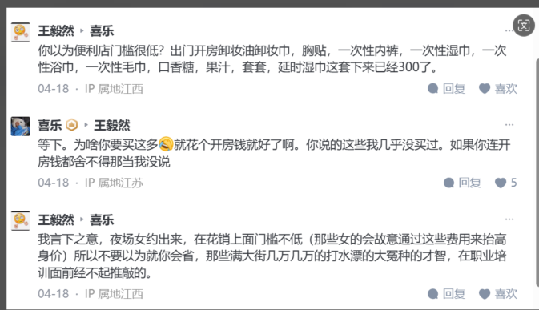
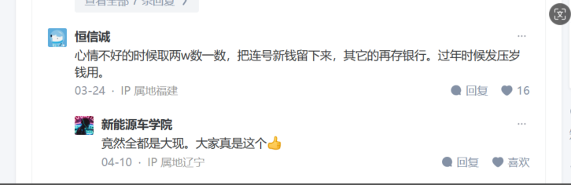
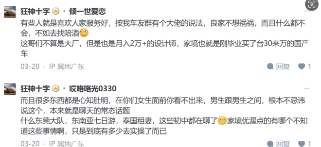

# 药片加淀粉才能做成片

# 关系

重点是关系网的开通几乎都不是清白无暇的, 疏通的过程中有大量灰色操作甚至涉黑, 比如你喜欢美女, 我用黑帮人脉帮你要协过来,
任何职业, 循规蹈矩肯负责的老实人都可以被取代, 但推锅不负责的渣津没法被取代, AI唯一缺点是没法坐牢

## 政府关系专家

1. 你爸谁政府官员, 你去挂个名, 不上班, 他们都求着你去
2. 某些职位门槛设在那摆明了就是留给有关系的, 就算你简历再优秀人家也能给你挑毛病出来
3. 辞掉公职的人, 关系户

# 品牌总监

- 要理解老板, 向上管理, 助理老板实现企业愿景一品牌总监=董秘
- 要玩的转新媒体, 要对新的推广玩法门儿清一一品牌总监=新媒体总监
- 要有创意, 有艺术细菌, 对视觉形象有品位一一品牌总监=设计总监
- 要有媒介资源, 拿得到一手的媒介采购价一一品牌总监=媒体总监
- 要懂PR, 有各方关系和资源, 善于整合一切品牌能露脸, 白piao的机会一-品牌总监=PR总监
- 要懂用户, 对人群insight有强烈的敏锐度, 捕捉一切商机一品牌总监=市场研究总监
- 要懂得卖进新品牌, 打通各渠道通路一一一品牌总监=渠道拓展总监
- 要会给销售培训, 从品牌和人群开始, 建立品牌文化和理念一品牌总监=培训总监

# 高管住酒店

这种客人多是公司高管, 费用都由公司承担, 他们住的都是套间, 并不是30平的普通客房, 酒店费用开增票还可以抵税
酒店和合作的公司都有公司协议价的, 长住客会更低价格, 之前长租过, 200多的房子, 长租就4折, 很划算的, 跟自己租房差不了很多

# 被调公司

简历库、运营商数据库、企业合作

# 任何产品

品宣成本 ＞ 产品成本本身
1亿人买, 每个人花 1块钱, 至少要 10亿广告费

# 选择行业赛道

数据调研型的问题, 不能思考

# 私域

做平台最好是方便的一对一微信咨询, app 基本必死, 用户沉淀到私域, 增加 app 实际上是让用户体验路径变长了, 把顾客沉淀到私域去做,
都希望文字咨询, 满世界都是抖音, 何必到小程序

# 转介绍

转介绍是所有成交最难的路径, 你要做到什么程度人家才会给你转介绍

不管什么行业,
首先开始做的就是薄利多销, 稳定之后
然后就是扩展产品, 筛选客户, 二次销售
第三步, 多方引流, 老带新

# 公司股份

1. 做法人就要绝对控股 67%, 绝对领导地位和话语权, 否则就让别人做自己当跟随者
2. 51% 不行, 万一重组就只有 33%, 所以 67% 重组有话语权决策权
3. 没资材, 法人是职业背债人, 普通人打官司浪费律师费只能吃亏

# 抖音短视频

意营造一个和外界反差感强的氛围产品实际烂的要死然后狠命往上提价。无印良品就是这种模式的代表骗倒一堆傻娘们

# 朋友

别说朋友就是一起长大的兄弟, 他肚子里面想什么我也不清楚, 人心隔肚皮, “诛九族”划分不公平

# 疫情买口罩

熔喷布生意, 半年挣 8000w, 现金, 二道贩子和口罩商拎着麻袋现金来提货, 设备厂房转让给别人, 一个好几块海不好买, 半夜现金上门拿货

# 企业申请破产

破产也是健身房的商业模式之一, 破产是在他们建立健身房初期就已经设定好的, 能证明自己资不抵债, 剩余资产按照比例偿还债务,
方式方法证据等也早已备齐, 因为法律是允许破产的

是做健身房的最后一个环节, 预售, 租器材, 赖装修款, 赖房租, 最后一波大福利, 跑路

人家正规成立一家公司, 然后租场地, 压2付3,5个月房租。找个装饰公司装修, 谈好了付款方式, 先付一半,
剩下的半年后付。再然后找一家公司租赁他们的健身器材。说实话, 肥水不流外人田, 找一家自己实际控股的器材公司就行。然后办卡收钱,
快半年了就跑路。器械你还动不了那是人家租赁公司的, 人家到期拉走没毛病, 不光拉走, 家还说自己也被欠款没收回来呢, 最后剩点桌子椅子,
人家还能分走点收起

# 是否要买新器械

有些东西非职业用不到, 销量少, 厂家少, 维护只能找厂家, 赚钱很难

# 举报公司

1. 劳动监察
2. 社保公积金
3. 举报消防
4. 偷税漏税

# 销售公司抱团

销售是为公司赚钱, 内勤是为销售部门辅助, 财务和采购为销售提供很多政策, 回扣都能把公司干死

# 快递公司

退快递费赚钱, 发快递 3-4 块, 退快递 7 块

# 大米饭

饭店里的米饭好吃, 不传之秘都是加了稻花香粉末香精

# 邮寄最快

1. 拉到邮局
2. 邮政平邮
3. 最便宜的方法

# 免费平台

平台是为消费者服务的, 如果一种服务是免费的, 说明你不是他的服务对象, 而是一种资源

# 6 个月没被抓就没事

过了时效了

# 电商 ab 货

买家秀和卖家秀不一样的

# 商业理解

商业的本质就是合法的诈骗, 如果不合法那就交税转为合法

# 代运营

老早淘宝代运营在里面玩烂的套路, 假装帮你拍视频, 买量让你觉得有效果   
一般开三个月就换场地, 换个壳儿继续开展   
网上买一个1～2年不活跃的账号(大约十几万粉)然后用这个账号开直播, 一个人就赚回来了, 同时资金流水过平台, 属于合法课程,   
实际上交一个大纲, 看看官方直播内容记一下笔记就可以搞一整套的带别人创业内容, 大体那种封不掉合规的都这么搞的   
公司做这个成交量都是假的 p 图   
大部分收课程费用 2980 不到 3000

新模式 个人账号达到级别就是合作 也就是拿销售分成 现在做的很好的就是抖音星图的合作

如果做个人ip那都是公司招人, 账号归公司所有, 实体引流的都是客户所有

所有网红爆红天仙妹妹, 贾君鹏, 现在的丁真, 都是资本包装, 营销模式, 背后的人剥削你分了你大部分的盈利…多少个网红因为分钱不均闹翻的

# 投资自动售卖机

还有投资自动售卖机的骗局, 比这玩的大, 玩法是：花十几万买一台自动售卖机, 这还只是骗第一波；然后合同规定只能买他们提供的食材,
他们提供的食材的成本比别人市场价还贵, 多干一天就多亏一天；第三波骗的是场地租赁、运营费,
也写在合同里了；第四波就是你干不下去了退出还要给高额退出费、设备处理费等, 不用说, 也写在合同里了；我这还有一份他们的合同；专骗老人家,
很多老人家有一点点积蓄又想不劳而获, 只听他们吹牛不用干活就能赚多少合同看都不看就签了, 每一条很明显的坑他们都会有专门的借口搪塞,
小白就被忽悠了, 大家多多宣传一下防止家人被骗。

1. 带你去看工厂, 增加信任度, 他们真的有造售卖机的厂子, 至于厂子经营如何不得而知；
2. 骗不懂科技的：咱们这是高科技, 无人售卖, 专人帮你运营, 你不用出力就能赚钱；
3. 画大饼：咱们这低人力成本, 可以批量投放, 未来可以赚大钱, 上市都不成问题；
4. 你提出质疑他们会拿打公司举例：要有长远眼光, 美团怎么做起来了....巴拉巴拉；
5. 带你去他办公室楼下的自动售卖机请你吃便饭, 吃人家的嘴短, 顺便伪造出很高销量的错觉

时时刻刻就催着让你签合同, 那些生意都没做过的小白在现场能细看合同？就算看了, 在对方干扰下, 小白基本上看不出合同漏洞,
光想着上市发财了, 合同一签, 几十万没跑了。

奶茶店咖啡店餐厅花店文具店都是这样的

都是学校内有经营权力的超市合作, 其他都是坑, 地铁只是人流大不是客流大

加盟费、租赁费、代运营费、进/出场费、分成之类

# 诈骗报警没用

买东西只要有合同, 就是合同纠纷, 警察不管

# 短视频赚钱的秘密

烧钱, 碰运气很难, 供应链最重要, 内容不重要, 重要的是视频数据, 有数据就有流量, 就有成单

# 快手代投流

方式之一砸钱推流
带货直播不好做

# 短视频带货

1. 取决于抖爹给推荐的流量池(堪比玄学, 不能用数据计算)
2. 泡泡机团队, 18 年猜中抖音封口做礼物号, 星空灯爆了, 但是商家直接客服截流不让他吃佣金
3. 复读鸭, 10个刚毕业大学生组成工作室, 上来开抖加
4. 深夜宿舍偷吃团队, 搭建宿舍, 带零食, 带游戏, 游戏更好做

# 流量玩法

## 引流

添加好友, 邀请进入设群, 设群或者朋友圈和客户信息触达

## 截流

借助服务号将用户圈进公众号, 每周每个月正式营销活动(新品、节日、优惠), 将内容转发设群, 朋友圈, 实现客户截流消费

1. 评论截流: 在同行的笔记或视频下进行批量评论, 发布软文广告或硬广。软文广告不易被删除, 而硬广可能导致封号
2. 关注截流: 批量关注精准用户, 并通过优化账号（昵称、头像、主页设置）吸引他们查看你的主页内容
3. 艾特截流: 利用发笔记时的艾特功能或标签功能, 触达精准用户。通过艾特让他们收到你的信息, 从而增加曝光度
4. 私信截流: 对客单价较高的 B 端业务, 可以批量私信找到的客户。个人号每天限制 10 条, 而企业号可发送 20 条, 适合大规模操作
5. 昵称截流: 使用统一且具一致性的昵称, 打造个人IP。例如, 可以使用与热门人物相关的昵称来吸引流量
6. 账号截流: 通过特定的账号设置（如字母加手机号）增加账号的可添加性, 以便更好地吸引用户
7. 群聊截流: 在企鹅群或QQ群中搜索并加入相关群聊, 与群员互动引流。通过指向性昵称和蝴蝶号内容进行导流
8. 某音、某手评论区截流: 搜索对标视频并在评论区引流。注意避免直接发布广告, 以免被删除或封号

## 回流

拼团、分销、转发有奖, 腾瑞智能获客系统

# tiktok

1. 搭建环境成本很高, 域名备案, ICP 许可证, 支付也要申请, 部分行业还需要文网文, 其次数据库、服务器、安全之类的也要自己搞,
1. 新规企业销售自营商品服务无需 icp, 网页内嵌一个客服系统都需要 icp
1. 不同的类型需要不同的资质, 卖不同的东西还需要不同的证, 各种手续多的很

# 抖音形式

口播, 文案, 剪辑

# b 站推流机制

b站经典流量池规则了, 视频发布时依据视频标题与标签进行范围内推流, 被判定经常看这个标签的人才能刷到,
只有在推流时的峰值超过了某个标准（＞赞币评收藏转发数据阈值）才会进入主流量池推流, 一部分UP自身没多大人气＋题材比较冷门的情况下直接pass了
目前b站大环境下「入站声明」是一个比较吃香的题材, 毕竟“新人UP”之类基于视频创作者本身的tag, 受众范围广的同时也容易激发粉丝的好奇心,
因为好奇点进来的粉丝, 他们行为数据会被算法捕捉并用于后续的内容推荐, 从而形成一个正向的循环, 增加视频的曝光量, 引发更多的人来看,
滚雪球导致数据越滚越多

# 监狱

1. 灌浓盐水, 不给喝水, 不让睡觉, 开空调冻你
2. 四肢全段, 强奸罪罪犯容易被整, 饭菜减半, 蹲厕所吃饭, 下楼梯从后面踹下去, 每天罚两个班

# 叔叔

1. 公安现在可以冻结和划扣, 外贸行业基本都被划扣过(远洋捕捞, 自动划走冻结的卡上的钱)

# 快递寄刀

1. 资质备案
2. 安全协议
3. 当地派出所登记备案
4. 工商登记刀具网络销售

# 养老

1. 社区小的不让干, 大一点的要审批, 消防基本过不了, 小的不让干, 大的没本钱投入

# web3

被盗有两种原因

1. 暴力撞钥: 不断生成私钥, 碰到有钱的就划走
2. 授权未知项目, 授权会提醒, 项目方划走账户资产

# 主播

平台推广费穿性感点引流, 做噱头让客户下载, 赚平台推广费, 吸引客户刷礼物

# 汽车贴小卡片

1. 环卫工人, 摩的司机, 小黄车管理员
2. 清洁工兼职成本低, 积极天天不睡觉去贴小卡片
3. 按张算, 3-4毛/张, 发视频, 半夜 12 点到 5-6 点
4. 卖车卡片正规的半夜干

# 手机 root

1. 容易变砖报废, 嘴还哦怕温度的是电池

# 同样是非法集资非吸罪, 有的人判的多有的人判的少

1. 积极退款, 有人死活不退钱
2. 经济有关的罪犯, 积极退赃从宽处理, 死杠的就完蛋

# 开厂

自己开厂做不大, 大单要投标, 投标要无犯罪证明

# 外包公司仲裁

1. 甲方退回基本无理由, 属于违法退回, 甲方和外包公司一起承担责任
2. 劳动关系在外包公司, 但是外包公司要求调岗待岗的直接原因是甲方无理由退回, 要求甲方、外包公司共同承担赔偿责任
3. 两者列为被告, 在于甲方一定给外包公司施压, 不想被牵扯进官司
4. 列为被告狗咬狗

# 外贸电商要不要入行

1. 小白没人带吃一大堆亏, 很多细枝末节的事情要学习
2. ip 搞错就被扫店铺, 要押款

# 跨境电商
里面有羊毛党, 白嫖党

本土备货模式, 量起来了要小心

temu 大部分做不好, 真正赚钱的是清尾货的, 低成本卖出去, 货源从海外仓卖不完清货大把, 纯纯价格战, 销量不好仓库会退回, 有压货风险

跨境电商得存货, 掏 10个、20个

没资源做不起来, 过外能做和不能做的差距很大, 只要是社交平台必有电商

上链接比较久, 发货还要看时机, 半托自己联系快递仓库

服装流量大, 避免过多售后还是很好做

自己合作海外仓, 罚款哭死你

# 离婚后钱能不能要回去
1. 通过平台转帐, 要不回去, 正常消费, 交税, 通过转帐就能要回去
2. 语音厅不要收礼物、转帐、快递, 不透漏个人地址信息, 不能收礼物/转帐, 真要也不能超过 2000
3. 代聊不犯法, 私下聊天有口头承诺
4. 干电商囤货太多, 各种各样款式要囤货, 但是爆款也就那么一两款, 其他亏本, 盲盒玩法

# 社工库很多民警参与
1. 公安部以下的省厅 市局 区分局 派出所的民警用警务通只能查到当地省的
2. QQ微信微博手机号随便一个都可以开全家只要有社交平台全家的姓名, 手机号, 身份证号, 家庭住址, 大头照全都出来了
3. 小网站需要实名千万不要填因为如果有人想搞你和网站管理员联系一下给点钱他们很愿意出卖你的个人信息, 几千块钱就能买这个网站上所有人的信息
4. 省厅以下的警务通只能查本省, 警务通权限低, 警务通辅警都能用, 功能没那么多, 警务通只能查最基本的个人信息, 办公室内网的基本上都能查但是有痕的, 辅子哥, 一人一钥, 查即留痕
5. 明码标价, 找打手小孩哥悬赏干你咯
6. 高薪找公安合作, 权限根据高低给的报价都不一样
7. 纸飞机能查全国的说明要么是全国 34 的基层派出所、分局、市局、省厅都参与了, 省厅级别的警察才能查, 市局, 分局和派出所只能查本省
8. 跨省要高级警官可以二级警督以上, 查身份证和住址被通报, 一级警司目前查不到外省的身份, 但是身份证号电话等基本信息还是能查到的
9. 特殊警种, 户籍警和出入境是全国可查的权限查到外省, 老虎的权限高

# 叠马仔
拉赌客抽返佣赚钱  
私人洗钱  
借钱给赌客的利息  