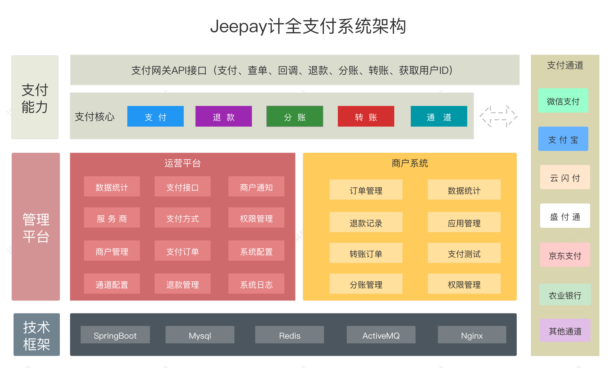
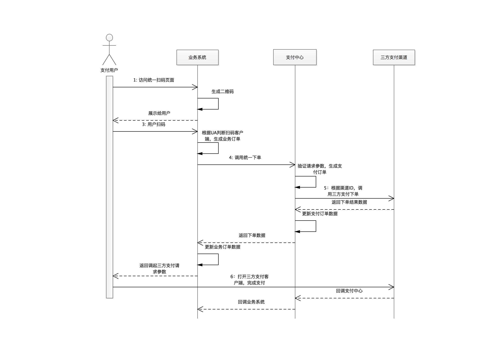
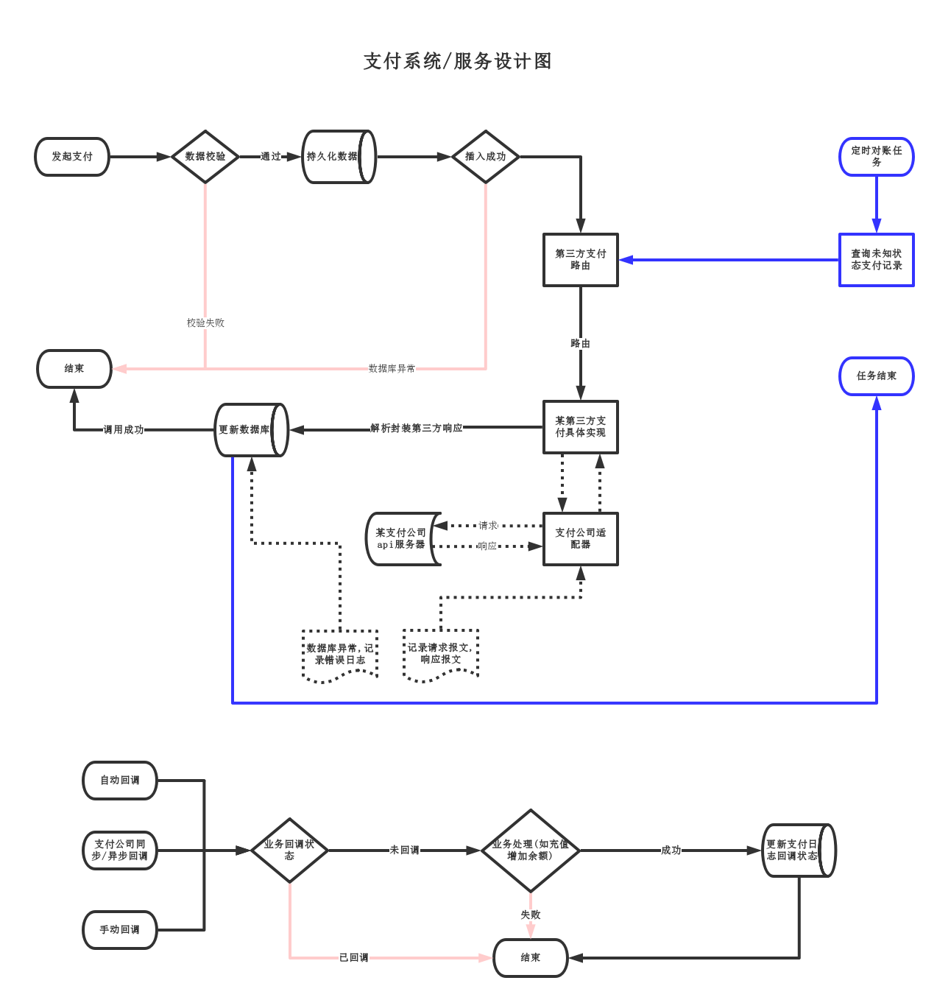
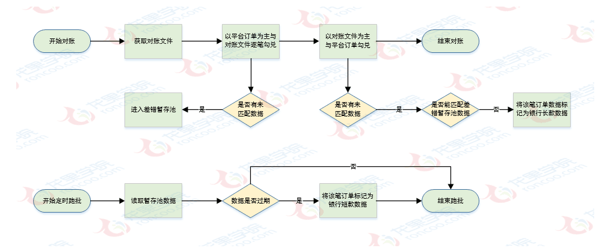
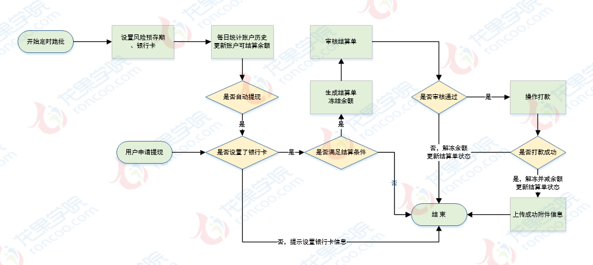
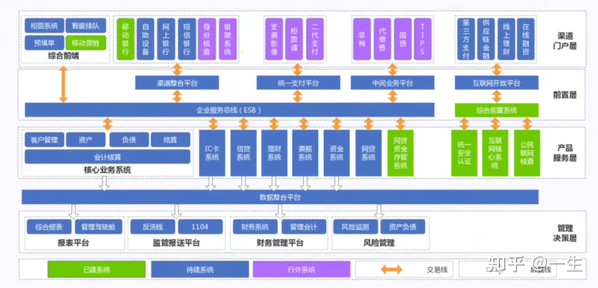
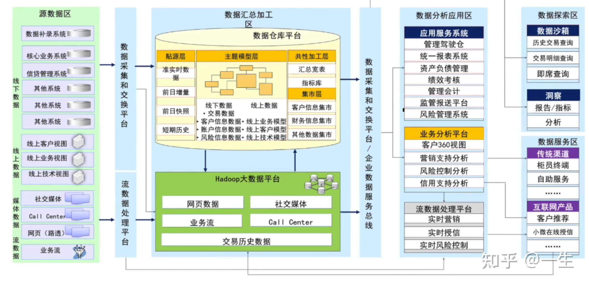
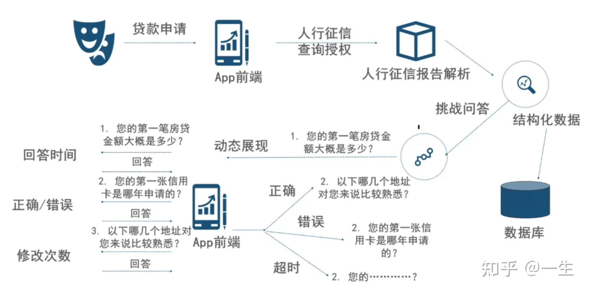
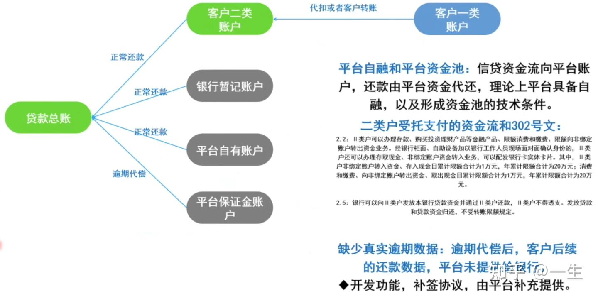
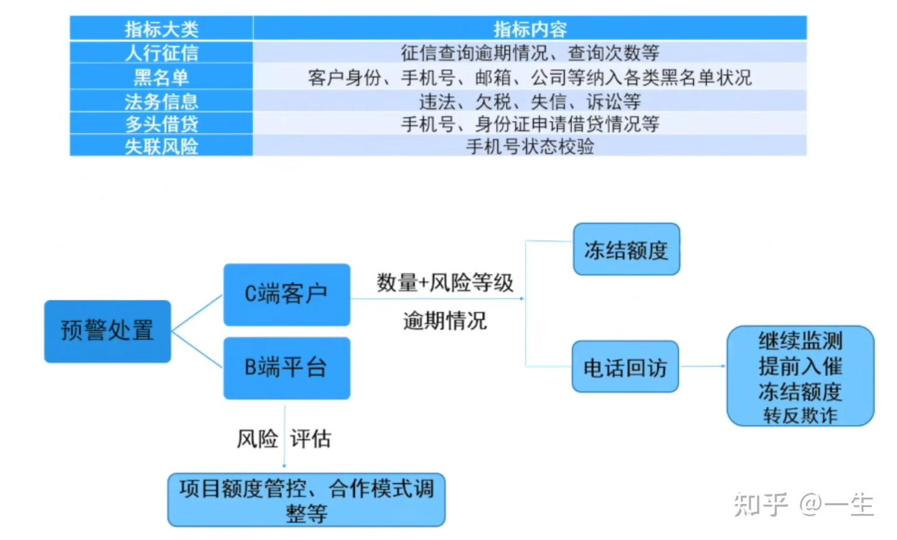

# 金融行业领域

写代码, 有专门的软件公司啊, 只要提着需求和钱, 没有开发公司解决不了的事  
金证, 恒生, 大智慧, 同花顺, 乾隆, 顶点, 这些都是行业内数得着的专门服务金融(主要是证券)机构

# 恒生

1. 恒生电子, 主营业务是开发和销售证券、银行、基金等金融行业的应用软件
2. 上游是一些硬件设备和产品, 下游是证券公司、银行、基金、信托等金融机构
3. 且以直销为主, 与客户直接签订开发合同, 然后提供安装、调试、维护等服务

恒生电子的产品横跨证券行业、基金行业、银行业、信托、期货、保险等领域有着绝对领先优势, 也是目前唯一一个拥有金融领域全牌照的企业

核心系统服务商开发, 恒生和证券, 给银行提供技术支持, 例如 Microsoft, IBM, Oracle, vmware 等

1. 前台业务 (经纪业务、投行业务、资管业务、自营业务、esop业务)
1. 中台业务(产品设计、风控结算、合规法务、IT研发等)
1. 后台业务(人力资源、行政岗位、运营岗位、市场品牌、商业分析部等支持性岗位)

# 支付业务(支付系统是对接别人支付平台还是支付平台)
1. java对方能给示例demo、sdk, go的话很有可能需要自己动手翻译一遍加密模块
2. 银行的API很头疼的, 一个接口几十个字段。有例子可以直接拿来测, 没例子要很小心的组织
3. 不一定都是http, 有些时候是SDK, 底层是SSL socket实现。问就是安全需要。
4. 但没SDk和具体协议文档, 接不了, 当初对接银行NFC功能, 不给现成SDK, 直接调硬件返回一堆二进制, 我是可以自己拆包封包, 但你得给我协议数据逻辑文档
5. netty非常方便
6. Java自带bigdecimal, 处理钱等需要精度的情况下比较方便。c的话还得自己实现一遍或者找第三方库
7. 支付系统的事务一定也用得很重,100%的单元测试覆盖率
8. 除非做实时证券, 否则用Java
9. 用java记得配个Xmx或者给容器配个内存limit知乎上好多人说java堆内存高, 其实是没配Xmx,生产环境一个容器就部署一个服务, 内存独占
10. 加密, 签名, 对方有demo提供对接会很快, 签名最多用 secp256k1
11. 支付业务在中国不是你想做就能做的, 需要有相应的牌照, 其次就算你做了, 你要不要建立自己的帐户体系又是另一个选择, 现在大部分做的其实类似于聚合支付, 他们的交易最终都会提交给大的支付, 例如支付宝或微信支付去完成, 同时所有的第三方支付机构的交易都需提交到网联, 由网联最终完成
12. 金融清算相关的, 例如场内清算、待遇支付（例如某社保基金向个人活期账户发放养老金）
13. 通常会有资金台账和会计账簿两本账的, 一般情况, 流水入台账, 加工后的借贷凭证进会计账簿（会计账簿是借贷记账法, 台账有单边的, 也有复式的, 看具体场景）。另外, 我初级会计师资格证和基金从业资格证都拿下来了, CPA我也考了一门了, 操作细节还是比较清楚的。表面上我是个程序员, 其实我的目标是注册会计师, 登账复杂的是业务逻辑, 对技术层面的并发要求并不太高, 很多账务都是批量处理的
14. 很多银行内部的实际操作是这样的：先记录台账流水（当然记录流水的过程中涉及到账户余额等校验, 这一般是联机交易）, 然后有个Handler会每隔一段时间去发起专门的批处理异步任务, 根据流水来出凭证, 这个异步任务会有较高的并发量。 
15. 实时交易, 基本上都是只记录台账流水的。按借贷记账法出的会计凭证, 都是后续异步任务来搞的。用Java、Python都一定能满足并发要求的, 以银行为例, 性能瓶颈从来都是取决于数据库, 而非编程语言, 因为涉账高频的数据表, 数据量一般都是百亿条目级别的（通常会以日期或账户序号对表进行分区, 目前以日期分区的比较多） 
16. 凭证是记录经济业务的依据, 而账本审计则是对这些凭证的真实性和准确性进行核查和验证。如果没有账本审计, 即使有凭证, 也无法保证其有效性。账本审计可以帮助发现潜在的错误、欺诈或其他违规行为, 确保财务报表的准确性和可靠性。因此, 凭证和账本审计是相辅相成的, 缺一不可 
17. 资金账肯定都是D+1, 断直连以后银网联都是次日给清算文件。实时的外部账户, 用户侧肯定是实时扣款, 这里就有个热点账户问题。支付公司资金核算方向
18. 加个锁呗。。我们通常在网关那边就解决了, 传递幂等key, 去防止重复订单。对于多扣钱, 通常来说是业务处理有问题, 针对这种一般会有一个对账系统, 每天执行t+1对账
## 业务架构 

## Jeepay

将订单号, ip, url, 时间戳, version 使用签名算法加密

### 系统架构

#### 支付流程图

#### 对账流程图

#### 结算流程图

# 问题

## 重复支付

redis 分布式锁, 支付单号为 key

接口幂等性

设计防重表

mq 可以防止重复提交

## mq 解耦异步操作

用户扫码支付, 再接收到支付成功回调后, 把用户购买的订单发货, 用 MQ 进行异步解耦  
支付成功后发送消息到 MQ, 修改订单的任务状态发布到 MQ 里面  
支付成功后发短线的流程, 支付服务和短信服务就可以通过 MQ 的解耦进行异步通信

# 财务系统

老板都有一个数字化的梦想, 第一步就是 erp, 最后一步就是从 excel 导入, 实际是把 excel 从线下传递, 变成了通过系统传递

采购不见得会省钱, 维护费, 改点加点功能往死里收钱

制造业的成本会计, 做成本核算还是很复杂的, 另外报表会计出报表还有杂七杂八的汇报、分析等等

采购的 SaaS 系统, 营销功能很不完善, 提了几个需求报价 120 万

数据安全, 另一个是定制化需求多的时候, 自研方便, 提个需求研发团队几周就给搞定了, 出问题响应也快

采购的oa系统, 改一个定制的流程报价50万。转手让内部开发学习学习他们的二开框架, 一周完成。采购的系统啥都不改是划算, 你要定制就贼贵

合同尾款一付, 供应商留下屎山一样的代码就跑了, 最多再签个维护合同或者采购合同包含维护期, 很多就是采购了系统, 然后用着发现是一坨屎,
最后招研发重构自研

采购加二开, 比如用友, 加模块加实施, 加每年维护好多钱, 可以买软件加基本功能, 外挂软件或应用, 打通数据接口就行

阿里是Excel手工核算, 你没有听错手工核算, 做分析也是分析人家的Excel底稿, 系统倒出来的数据没法用, 不重视财务会造成公司内部混乱, 会经常被税务稽查

结算, 核算, 计费, 收费都是异步链路

# 信贷业务

## 流程

1. 身份证核查: 输入的身份证号码、客户姓名与公安系统存档信息比较, 身份证照片与公安系统的存档照片做比较, 判定证件真伪。
1. 人证比对: 活体检测照片、与公安系统存档照片做比较, 判定“人证合一”
1. 活体检测: 系统随机发出一组动作指令, 根据测定者在规定时间内完成动作的成功率, 判断被测对象是否作 假, 防止在线假体。
1. 要素鉴权: 客户姓名、客户证件号码、客户的他行银行卡号、他行预留手机号码, 4要素如可匹配, 可证明客户掌握在他行已认证的资料。
1. 短信认证: 向客户的他行预留手机号发送短信验证码, 可验证客户对他行预留手机的持有性。
1. 黑名单检验: 黑名单客户拒绝开户。黑名单数据包括：人行黑名单、电信欺诈名单、银行自主名单。 存证一生
1. 电子合同: 在身份识别通过的基础上, 在线签订开户合同、征信授权等合同, 并通过签约外台存证

## 风控反欺诈(跑决策树写规则)

## 贷前-后爬虫时代的特征选择

## 贷中-放款与还款(一类户?二类户?平台户?)

## 贷后-监控预警、疫情下的逾期认定与催收

# 规则引擎
比如年龄低于23岁的客户拒绝贷款授信，这是一个规则，多个规则放在一起就是规则集，多个规则集和模型等等模块串联在一起就是决策流。部署这个风控流程的系统就是风控规则引擎或叫风控决策引擎。

没啥前景的，风控的核心是在策略和模型上，风控系统开发就是工具人。而且规则引擎市面上已经很成熟了

策略偏业务，模型偏算法，当然模型也可能是调参侠

风控系统中很重要的核心系统，功能是将风险政策人员产出的风控策略逻辑部署到规则引擎系统里执行进件的自动审批，主要有基础准入规则，反欺诈规则（内部，外部），人行征信规则，模型，额度定价等，在规则引擎系统里可以方便快捷的将规则逻辑配置完成，主要做简单的逻辑判断，判断是否命中阈值，最终输出决策结果（通过or拒绝or转人工or退回等）以及其他风险字段（比如：额度值、期数、利率、支用产品编码、拒绝原因、拒绝原因编码等）给到上游系统，系统一般有可视化界面，组件可以托拉拽，对业务人员使用很友好。组件有很多，规则集、决策流、评分卡、决策表、决策树、变量集、支持自定义函数编写等等。规则引擎系统对逻辑实现，阈值修改，甚至包括决策流程的更新迭代都很方便，支持热部署到生产实时生效，效率极高。市面上成熟的决策引擎产品很多，比如：旗正规则引擎（国产最早的商业化规则引擎）；FICO 的Blaze（美国）；科孚（CRIF）；算话科技；益博睿等公司都有成熟的规则引擎系统产品。许多公司也会自研，基于drools等等。一般规则引擎上的风控策略是风险政策人员亲自部署，决策引擎专家进行辅助的技术支持，系统维护等。