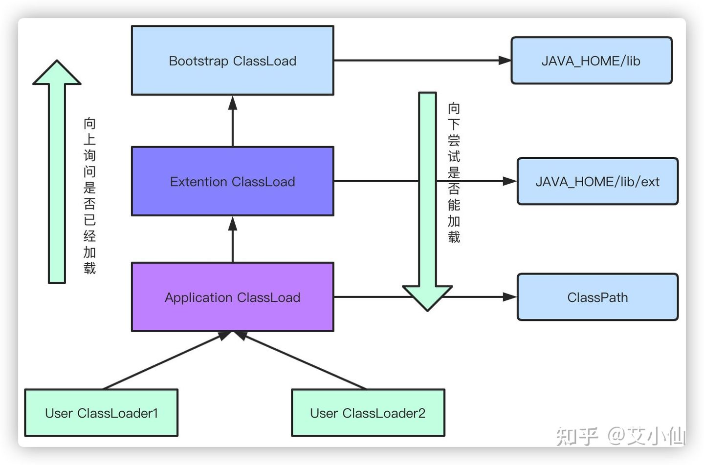

# jvm内存模型

1. 程序计数器: 让jvm知道执行到哪个字节码, 从哪开始执行
2. 本地方法栈: 虚拟机用到的 native 方法服务 sof 和 oom
3. 虚拟机栈: 局部变量, 操作数, 动态链接, 方法返回地址
4. 堆: 存放对象实例, 静态变量在堆中 xmx 和 xms 控制
5. 本地内存元空间: 常量池在元空间还有 class 文件
    1. 老年代:  2/3
    2. 年轻代: 1/3
    3. eden: survivor0 : survivor1 = 8 : 1 : 1

# 新生代晋升为老年代

- 对象优先分配在 eden 区, eden 区满时会触发一次 minor GC, 长期存活的对象进入老年代, 对象每熬过一次 GC 年龄+1(默认年龄阈值15,
  可配置),
  对象太大新生代无法容纳则会分配到老年代 GC 进行时, Eden 区所有存活的对象都被复制到 To Survivor 区, 而 From Survivor 区中,
  根据年龄值 (默认15是因为对象头中年龄战 4 bit,
  新生代每熬过一次垃圾回收, 年龄+1), 则移到老年代, 没有达到则复制到 To Survivor

## Young GC

1. 内存不足:
   当年轻代中的 Eden 区没有足够的连续空间来分配新对象时, 会触发 Young GC。Eden 区是年轻代中最初分配新对象的地方。
2. 对象晋升失败:
   如果 Survivor 区（年轻代中的两个区域之一, 用于存储经过一次或几次 Young GC 后仍然存活的对象）满了, 无法容纳从 Eden 或另一个
   Survivor 区晋升过来的对象, 也会触发 Young GC。
3. 对象分配速率过高:
   如果应用程序创建对象的速度超过了垃圾收集器清理的速度, 可能会导致频繁的 Young GC。
4. JVM 参数配置:
   JVM 提供了一些参数可以控制 Young GC 的行为, 比如 -Xmn 设置年轻代大小, -XX:MaxTenuringThreshold
   设置对象晋升到老年代之前的存活次数等。调整这些参数可能会影响 Young GC 的频率和效率。
5. TLAB (Thread Local Allocation Buffer) 溢出:
   每个线程都有一个 TLAB, 用于减少多线程环境下的锁竞争。当 TLAB 耗尽时, 线程需要从 Eden 区分配新的 TLAB, 如果此时 Eden
   区不够大, 就会触发 Young GC。
6. 元数据区/永久代溢出:
   在某些情况下, 即使年轻代本身没有满, 但如果元数据区（Metaspace, 在 Java 8 及之后版本中取代了永久代）
   , 也可能间接地触发 Young GC, 因为这可能导致整个堆的重新组织

# full gc 触发条件

1. 老年代空间不足：
   当老年代的空间不足以容纳从年轻代晋升过来的对象时，会触发 Full GC。这通常是由于长期存活的对象过多或大对象直接进入老年代导致。
2. 永久代/元空间满：
   在 Java 7 及之前版本中，如果永久代（PermGen）满了，可能会触发 Full GC。在 Java 8
   及之后版本中，虽然用元空间（Metaspace）取代了永久代，但如果元空间满也会触发 Full GC。
3. 显式调用 System.gc() 或 Runtime.getRuntime().gc()：
   虽然不推荐，但程序中显式调用 System.gc() 或 Runtime.getRuntime().gc() 可能会导致 Full GC。需要注意的是，这只是一个建议，具体行为取决于
   JVM 实现。
4. CMS 收集器的启动阈值：
   使用 CMS（Concurrent Mark-Sweep）收集器时，当老年代使用率达到一定阈值（如默认为 92%），会触发 Full GC。这个阈值可以通过 -XX:
   CMSTriggerRatio 参数调整。
5. 分配担保失败：
   如果在 Young GC 期间发现无法为 Survivor 区中的对象找到足够的空间晋升到老年代，JVM 会尝试执行 Full GC 来腾出更多空间。
   串行GC、并行GC等收集器的特性：
   某些垃圾收集器（例如 Serial GC 和 Parallel GC）会在特定条件下自动触发 Full GC，比如老年代空间达到一定比例或者发生分配担保失败。
   JVM 内部操作：
   某些 JVM 内部的操作，例如类卸载（Class Unloading）、内存压缩（Heap Compaction）等，也可能触发 Full GC。

# GC roots 对象

1. 虚拟机栈中引用的对象
2. 方法区中类静态属性, 一般指被 static 修饰引用的对象, 加载类的时候就加载到内存中
3. 方法区中的常量引用的对象
4. 本地方法栈中 JNI (native方法) 引用的对象

# 栈和堆

- 栈解决程序的运行问题, 即程序如何执行, 或者说如何处理数据(局部变量(含形参)、程序运行状态、方法返回值)
- 堆解决的是数据存储的问题, 即对象数据怎么放、放在哪儿
- test: 为对象引用, 存在栈中, 对象(new Test())存在堆中
- 栈中, 存放的是基本数据类型和堆中对象的引用, 而堆中, 存放的则是对象, String 字符串的放到堆中常量池里面

# new 对象的过程

1. 虚拟机遇见 new 时候, 判断是否已经加载, 没加载执行类的加载机制, 加载完给对象分配空间、初始化, 双亲委派模型,
   类加载器收到了类加载请求, 委托给父类, 所有加载请求会委托给启动类加载器, 保证全局唯一性
2. 加载: 从字节码加载成二进制流
3. 验证: 校验 Class 文件是否符合虚拟机规范, 和接口一样, 进行参数校验
4. 准备: 为静态变量、常量赋默认值
5. 解析: 常量池中符号引用替换为直接引用(编译方面, 说不明白)
6. 初始化: 执行 static 代码块进行初始化, 存在父类, 对父类初始化
7. 使用
8. 卸载

**PS:**
静态代码块是绝对线程安全的, 只能隐式被 java 虚拟机在类加载过程中初始化调用

# 类加载器

1. Bootstrap ClassLoader 启动类加载器, 默认会去加载JAVA_HOME/lib目录下的jar
2. Extention ClassLoader 扩展类加载器: 默认去加载JAVA_HOME/lib/ext目录下的jar
3. Application ClassLoader 应用程序类加载器: 比如我们的 web 应用, 会加载 web 程序中 ClassPath 下的类,以及 main 函数所在的类的
   class 文件
4. User ClassLoader 用户自定义类加载器: 用户自己定义

# 双亲委派机制由图所示

1. 防止重复加载同一个.class, 通过委托去向上面问一问, 加载过了, 就不用再加载一遍。保证数据安全
2. 保证核心.class不能被篡改, 通过委托方式, 不会去篡改核心.class, 即使篡改也不会去加载, 即使加载也不会是同一个.class对象了,
   不同的加载器加载同一个.class也不是同一个Class对象,
   这样保证了Class执行安全

----

# 垃圾回收算法

- 标记清除: 标记出要回收的对象, 标记完后统一回收所有被标记的对象, 标记过程要遍历所有的根对象, 清除过程遍历堆中所有对象。效率低下,
  带来了内存碎片问题
- 复制算法: 内存分大小相等两块, 先用其中一块, 内存使用完了, 将存活对象拷贝到另外一块内存, 当前内存清空, 性能和内存碎片问题解决,
  可用内存空间缩小一半, Eden+S0+S1组成, 因为根据IBM的研究显示, 98%的对象都是朝生夕死 所以默认8: 1: 1
- 标记整理: 老年代存活率比较高, 频繁复制比较大了, 标记整理后存活对象都向一端移动, 再清理边界以外的内存空间

# 垃圾回收器

## CMS

适用于需要低延迟的应用程序，如交互式 Web 应用程序，但在大堆或者高并发环境中可能会遇到挑战。

## G1

适合于大堆内存和需要平衡延迟与吞吐量的应用场景，特别是当应用程序希望拥有较长的持续运行时间而不需要频繁的长时间暂停时。

# 一个对象包含的元素

1. 对象头
2. 对象体
3. 对齐字节

# 如何避免 full gc

比如 common poll 使用对象池技术, 可以复用池中对象, 没有分配内存和创建堆中对象的开销, 没有释放内存和销毁堆对象的开销,
减少垃圾收集器的负担, 避免内存抖动, 不必重复初始化对象状态

# 垃圾回收器选型

1. G1 GC是基于 Region 的 GC, 适用于大内存机器, 即使内存很大, Region扫描, 性能还是很高的
2. CMS 追求停顿时间越短越好, 对 cpu 性能要求高同时对内存要求不高, cpu 性能好但是内存不大可以用 cms

# pod 的 jvm 配置参数

jvm 达到 xmx 之后, 跟你 pod 剩余的内存就没关系了, jvm 配置 pod 90%
jvm 要是达到了 xmx 配置的最大内存之后, 对你的 pod 来说, 就相当于已经完全分配了 xmx 出去了, jvm 不会在还回去

# 实际问题

pod 16G 16核 8 pod 多分点内存

jstat -gcutil pid 2s 观察堆内存情况

jmap pid 触发 fullgc 假死的服务器就活了

或者 grep '异常' *.log 或者 直接 less *.log |grep '异常'

几百亿的 ip 请求, 要计算出请求前 10 的 ip, hash 分治只需要准备 x 台机器分治处理, 每个机器你去预估能处理的资源瓶颈,
然后每个机器取前 10 的排名, 然后汇总 10 个机器的结果, 再取前 10