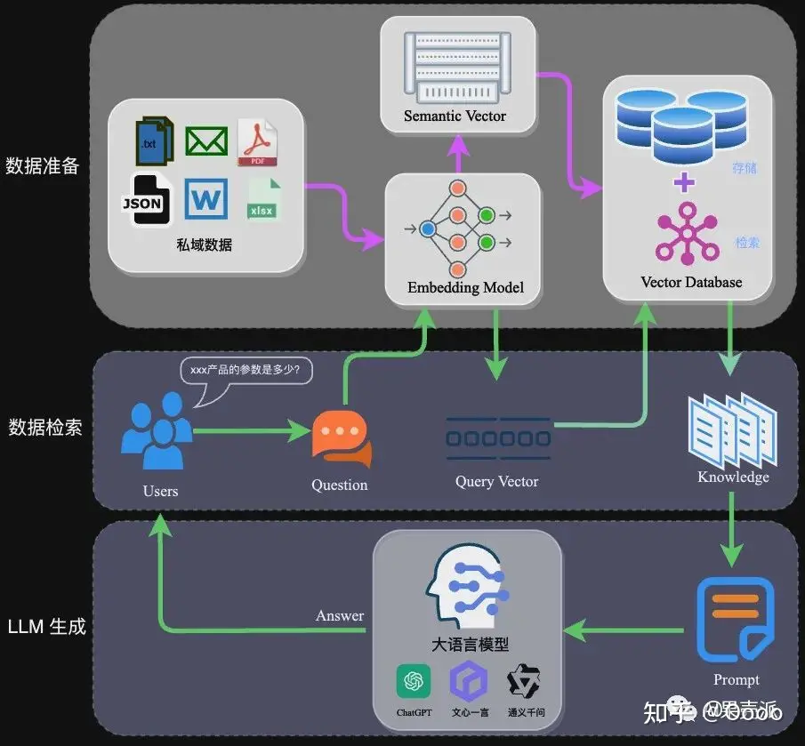
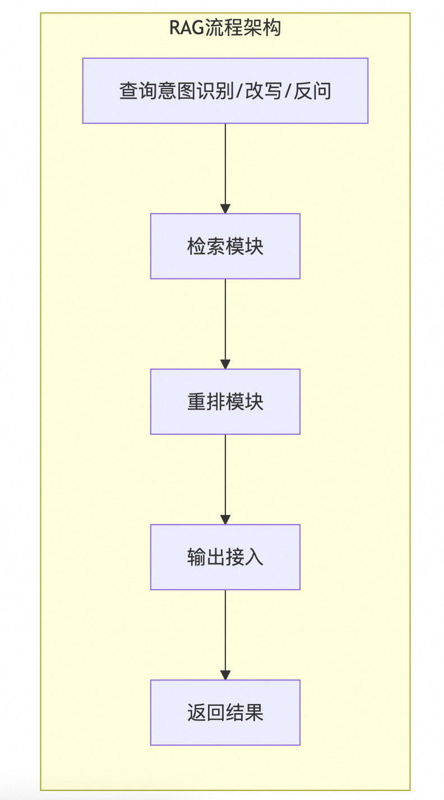
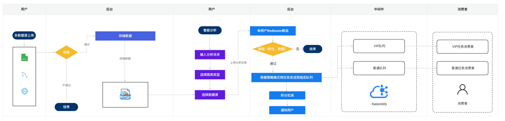
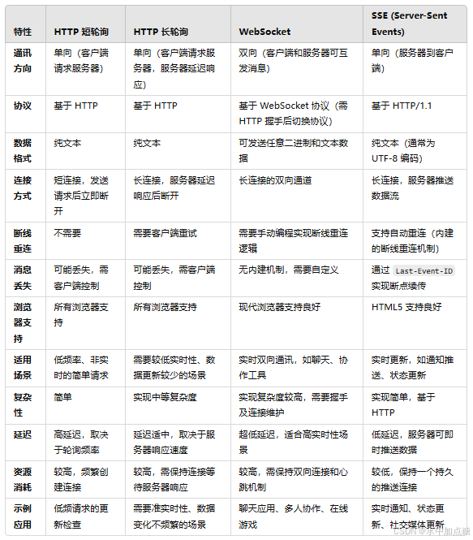

# 大模型项目架构设计

## 目录

1. [采用模型](#采用模型)
2. [主要做了两件事](#主要做了两件事)
   1. [离线数据准备](#离线数据准备)
   2. [在线应用阶段](#在线应用阶段)
3. [智能搜索(RAG)](#智能搜索rag)
   1. [预处理模块](#预处理模块)
   3. [离线处理背景](#离线处理背景)
   4. [向量化模块](#向量化模块)
      1. [向量化背景](#向量化背景)
   5. [向量存储 ES + Milvus](#向量存储-es--milvus)
   6. [检索和重排模块](#检索和重排模块)
   7. [回答处理模块](#回答处理模块)
4. [在线前后端应用细节](#在线前后端应用细节)
   1. [在线数据召回部分](#在线数据召回部分)
5. [查询意图识别/改写/反问模块](#查询意图识别改写反问模块)
6. [前后端实时方案](#前后端实时方案-http-短轮询--http-长轮询--websocket--sse)
7. [离线模型/智能对话 llama2](#离线模型智能对话-llama2)
8. [milvus 使用](#milvus-使用)



## 采用模型

1. qwen 2.5
1. ollama
1. gpt 4.0
1. 清华 glm4
1. google gimini pro

## 主要做了两件事

1. 离线数据准备: 数据提取(app采集和爬虫)——>文本分割/数据清洗——>向量化(embedding)——>数据入库 es 和 milvus (向量数据和元数据)
2. 在线应用阶段: 用户提问通过 LLM 模型——>数据检索(召回)——>问题和上下文注入封装 Prompt——>Prompt 引入 LLM 生成答案

## 智能搜索(RAG)
先快速搜索公司自己积累的资料（比如产品手册、客户档案）, 再结合自己的知识回答问题
查询意图识别/改写/反问模块会分析用户提出的自然语言问题, 识别其背后的真实需求, 并可能对原问题进行适当的调整来提高匹配度


### 预处理模块

多数据源采集数据(APP埋点/爬虫/历史数据), 高性能将常用的字段预先加载在内存中, 通过算法引擎(allma)提取知识

#### 离线处理背景

由于知识条目是通过算法进行抽取的, 而且知识还会存在一定的时效性, 可能造成知识的不准确等问题, 为此我们进行了以下一些优化:

1. 持续的算法迭代
2. 根据用户埋点信息和标注信息对模型进行持续迭代
3. 选取更加优质的知识抽取结果对线上数据进行全量/增量更新
4. 对模型输出的知识进行后置处理
5. 将仅存在部分助词差异的知识条目进行过滤、合并给部分热门的知识条目设置过期时间
6. 并通过部分人工审核的方式干预知识条目的生产
7. 维护专家知识库的方式对可信知识进行标记及提权
8. 维护了 X 类目的 Y 条专家知识, 同时经过人工干预了大概 Z% 的知识条目, 将知识的正确性从 W% 提高到了 K%
    1. 随着数据量的增长、并发请求的增加、数据使用场景的变化, 搜索引擎系统需要更多的组件一同完成其功能,
    2. 如搜索前的数据预处理
    3. 到搜索过程中的 query 理解、改写、自动补全, 缓存, 分数计算, 地理位置信息计算
    4. 到返回结果前的结果排序和过滤, 结果分页等, 距离计算

### 向量化模块

采用 bert tersonflow 等框架, 特征提取技术 embedding 将数据转化为向量
将知识条目转化成向量, embedding 负责将文本或者图片、视频等变成向量的一种技术

1. 通常采用预训练的语言模型算法引擎, DeepLearning4j(一个基于Java的深度学习库, 支持多种神经网络结构和算法)
2. 数据存储/索引构建模块负责保存这些向量化数据, 并为其创建索引结构
    1. kid 是自增 id, 同时可能会对知识的置信度做排序等
    2. 将原文、知识条目等核心内容插入 Elasticsearch
    3. 将核心知识内容、向量等组装成检索单元插入 Milvus
4. 迭代:
    1. 专家团队会针对数据库中的知识条目进行审核、修改、迭代
    2. 算法团队会根据知识条目的更新以及其他的标注对数据链路中的模型进行迭代, 对在线知识库进行更新

#### 向量化背景

商用的 ai 大模型都提供了对应的 embedding 接口, 比如 openai、百川、千问等等, ollama 里所有的大模型也可以通过
/api/embeddings 接口调用其 embedding 能力

1. 不同的大模型, embedding 后的结果不一样, 它们不是通用的, 不能用 A 大模型 embedding 的结果存到数据库里, 下次用了B大模型
   embedding 的结果去匹配
2. 不同的 embedding 模型, 生成的向量维度不同, 这个要明确是多少, 比如百川的是 1024 维, openai 的有 1536 维的还有 3072 维的,
   这关系到数据库建表的时候向量字段怎么定义, 表一旦建好就不可更改了
3. 不同的 embedding 模型, 允许输入的文本长度也不同, 比如 openai 最大允许输入 8k 多长度的文本, 百川只允许 512,
   这个长度就限制了你需要将一个大的文本比如一整篇文章, 拆成多少段存到数据库中

#### 向量存储 ES + Milvus

1. Elasticsearch: 擅长关键词匹配, 适用于基于关键词的全文搜索。然而, 随着语义搜索需求的增加, ES
   在处理同义词、近义词等语义相近的内容时表现欠佳无法有效搜索同义词、近义词或语义相近的词语
2. Milvus: 是一个高性能的向量数据库, 具备强大的语义搜索能力,
    1. 能够基于向量的相似性进行检索, 弥补 ES 在语义搜索上的不足
    2. 用户通过直接搜索代码、API 无法找到对应文档
    3. 开源的向量数据库, 本地化部署的有
    4. 计算向量之间的距离来评估向量之间的相似度, 支持高效的相似度搜索和向量索引功能, 常见的距离度量包括欧氏距离和余弦相似度等
3. Milvus 辅助 ES: 主要通过 Milvus 进行语义搜索, ES 进行关键词匹配, 最终合并结果
4. 评分策略(模型的相关度): 通过自定义评分调整, 确保 Milvus 和 ES 的结果合理排序

### 检索和重排模块

1. 很多提示词大概两三千字
2. 结合业务指定详细处理流程
3. 需要什么输出
4. 格式是什么
5. 搜索排序
6. 搞个有用无用的按钮(依赖点击反馈)
7. 推荐语生成, 网页关键词提取, 广告创意生成, Bert(语言模型), 对话形式比搜索推荐效率低太多
8. 确保高质量的内容优先展示

### 回答处理模块

1. 给业务方提供一些文本输出, 一个是长文本输出, 一个是短文本输出
    1. 短文本输出, 可以理解为就是我们的一些标题
    2. 长文本输出主要就是比如说你在抖音上面看到了一些这种长篇的文章
    3. 整个的流水线给他进行全链路规范化打通
2. 有大量非结构化数据处理的, 可以用 (基于llama2) 先理解, 再抓取, 企业大量内部培训资料的搜索和问答,
   直接将需要的所有文件一次推送到支持长文本 LLM 中
3. 结果返回用户:
    1. 高亮显示: 向量搜索结果不具备关键词高亮, 需要通过 ES 的搜索结果进行实现
    2. 最终返回: 将合并、排序后的搜索结果返回给用户, (归一化)去重处理, 避免同一文档重复出现

## 在线前后端应用细节

### 在线数据召回部分

1. 用户请求: 用户提交搜索关键词, 从前端获取搜索条件
2. 特征化处理: 后端将关键词转换为向量(词嵌入), 理解模块进行检索条件解析, 知识进行大致分类, 并对 query 和分类进行不同权重的匹配
3. 从 ES 中进行搜索, 关键词检索, 召回之后增加多种打分策略, 通过配置进行应用、权重调整等操作调整和排序
4. 向量搜索: 语义搜索和生成输出 RAG   
   a. 检索(利用向量数据库的高效存储和检索能力, 召回目标知识)  
   b. 生成(利用大模型将召回的知识, 生成目标答案, 就是通过检索获取相关的知识并将其融入 Prompt, 让大模型能够参考相应的知识从而给出合理回答)  
    1. 根据输入 prompt 调用 Milvus 的向量搜索接口, 查询出获取相似文档文本
    2. 返回 topK 条, 文档封装到模板文件中, 形成 SystemPrompt
    3. 将 langchain 模型写成了 http 服务, java 调 api, 爬一些好的标题/文章去训练
    4. 问题 question 和上下文 SystemPrompt 输入到大模型 llama2 中, 作为消息列表传递给大模型, 以让大模型根据(上下文)
       SystemPrompt 中的内容为背景知识来应答用户的输入
    5. 两个上下文发送到 llama2 生成一个更通用的查询, 以此检索到更通用或高层次的上下文
5. 自定义评分/评估标准: 根据文档类型(如标题、正文)给予不同权重, 给定输入提示、用于回答问题的上下文或标准, 以及生成的输出,
   模型生成推理并将评估结果分类为“Y”或“N”, 以表示输出的准确性
6. 通过 model 处理请求获得响应, 返回结果是一个字一个字冒出来的, SSE 方案的方式进行字符(token)的推送, 实时地将结果通知到前端

### 前置机
1. 就医院而言, 他不希望病人在他那里拍的片子, 然后流传到外网上面去。我们也会去他们医院里面去部署一个
   前置机, 然后这个前置机要做的事情就是脱敏和加密去把他那个片子里的一些敏感信息, 包括姓名, 性别。这些给它脱掉, 然后再通过加
   密给它送到我们云上去再去跑云上的算法
2. 是类似于专有云了。然后这种情况下就是他们即使
   脱脱敏和加密之后, 也不希望这个数据出来, 他更希望我们的模型也放到他们医院里面去跑。所以对于这种场景, 我们会搞一个类似于一
   体机。它既包含模型, 包含我们的显卡, 然后也包含我们的网关服务。还有一些他看片过程中可能需要的一些可视化工具, 然后跟算法相
   关的主要就是这三种形态, 然后还有的一些周边平台

## 离线模型/智能对话 llama2

1. 利用私有知识库的信息来辅助大型语言模型(基于 llama2 )生成回复,根据企业的自有数据提供更加精准和具体的答案,
   生成的内容基于广泛的知识, 融合了特定领域的私有信息, 从而增强了回答的相关性和实用性
2. 将问答以 Word 形式导入系统, 数据清洗和向量化处理
3. 利用向量化后的数据构建索引, 便于快速检索
4. 当用户提出问题时, 系统先识别查询意图并改写查询
5. 再从已建立的索引中检索相关信息
6. 根据检索结果生成回答返回给用户

### 消息队列优先级方案

1. topic
    1. 创建不同优先级的 Topic, high-priority-topic, medium-priority-topic, low-priority-topic
    2. 高优先级的消费者分配更多的消费者资源
2. tag
    1. high、medium、low
    2. 根据 tag 过滤, 先订阅 high 标签的消息, 在订阅 medium 和 low
3. 自定义排序, 拉消息后根据字段排序
4. 延迟队列: 设置低级消息延迟, 高优先级消息延迟处理
5. 队列: 顺序处理, 高于县级的消息不会因为乱序而被延迟处理



### 并发线程处理方案(asyncTool)

1. CompleteableFuture 每一个执行单元的回调, 失败记录异常信息, 执行异常、超时, 可以在定义这个执行单元时就设定默认值
2. 调整执行顺序, 加以组合编排

### JCTools(队列)
批量写, 读不到就睡眠等待写, cas 唤醒

解决, cache失效, 阻塞引起的 CPU 指令浪费, 内存的频繁申请和释放, 多写多读
数据量很小, 比如一秒钟几百个、几千个消息, 对于消息量很小的情况, 无锁队列的吞吐量并不会有很大的提升, 没有必要使用无锁队列
每秒需要处理几十万条数据时

采用 disruptor 框架, 3s 发送一次数据到第一个系统, 3s 生产 100w 消息, 结果推到另外一个系统整理, 通过 websocket 推送到客户端,
disruptor 每秒可以 100w 数据量, 内存、cpu、线程配置高一点, 优雅停机和启动数据恢复就可以, 采用写日志的方式存储

适用于频繁 push、pop 场景比如股票行情, 基于链表、数组实现
1. n生产者, n消费者
2. SPSC: 无等待, 有界和无界版本
3. MPSC: 无锁, 有界和无界版本
4. SPMC与MPMC: 无锁, 主要为有界设计

### 前后端实时方案 HTTP 短轮询/ HTTP 长轮询/ WebSocket / SSE



### 冷启动怎么做
[冷启动推荐策略](https://zhuanlan.zhihu.com/p/626459428)

### 向量召回和协同召回

# 标注
1. 数据预处理, 源数据处理成可标注数据, 导入标注平台

# milvus 使用

```java
FieldType id = FieldType.newBuilder()
        .withName("id")
        .withDataType(DataType.Int64)
        .withPrimaryKey(true)
        .withAutoID(false)
        .withDescription("id")
        .build();
FieldType user_id = FieldType.newBuilder()
        .withName("user_id")
        .withDataType(DataType.VarChar)
        .withMaxLength(1000)
        .withDescription("user_id")
        .build();
FieldType question = FieldType.newBuilder()
        .withName("question")
        .withDataType(DataType.VarChar)
        .withMaxLength(10000)
        .withDescription("question")
        .build();
FieldType answer = FieldType.newBuilder()
        .withName("answer")
        .withDataType(DataType.VarChar)
        .withMaxLength(10000)
        .withDescription("answer")
        .build();
FieldType question_vector = FieldType.newBuilder()
        .withName("question_vector")
        .withDescription("question 向量")
        .withDataType(DataType.FloatVector)
        .withDimension(1536)
        .build();
CreateCollectionParam createCollectionReq = CreateCollectionParam.newBuilder()
        .withCollectionName(FaceArchive.COLLECTION_NAME)
        .addFieldType(id)
        .addFieldType(user_id)
        .addFieldType(question)
        .addFieldType(answer)
        .addFieldType(question_vector)
        .build();
            milvusServiceClient.

createCollection(createCollectionReq);    
            milvusServiceClient.

createIndex(CreateIndexParam.newBuilder()
                .

withFieldName("question_vector")
                .

withCollectionName(FaceArchive.COLLECTION_NAME)
                .

withIndexType(IndexType.HNSW)
                .

withMetricType(MetricType.L2)
//nlist 建议值为 4 × sqrt(n), 其中 n 指 segment 最多包含的 entity 条数。
                .

withExtraParam("{\"M\":8,\"efConstruction\":64}")
                .

build());
/**
 *  注意 load（） 把数据加的内存中 影响 搜索
 */
R<RpcStatus> response1 = milvusServiceClient.loadCollection(LoadCollectionParam.newBuilder()
        //集合名称
        .withCollectionName("qalog")
        .build());

LambdaQueryWrapper<QaLog> lambdaQueryWrapper = new LambdaQueryWrapper<>();
             lambdaQueryWrapper.

eq(QaLog::getStatus,"未审核");

//todo 正则 优化
List<QaLog> qaLogList = qaLogService.list(lambdaQueryWrapper);
int total = qaLogList.size();
                     for(
int i = 0;
i<total/100;i ++){
List<InsertParam.Field> fields = new ArrayList<>();
                         fields.

add(new InsertParam.Field("id", Collections.singletonList(Long.valueOf(qaLogList.get(i).

getLogId()))));
        fields.

add(new InsertParam.Field("user_id", Collections.singletonList(qaLogList.get(i).

getQuestion())));
        fields.

add(new InsertParam.Field("question", Collections.singletonList(qaLogList.get(i).

getQuestion())));
        fields.

add(new InsertParam.Field("answer", Collections.singletonList(qaLogList.get(i).

getAnswer())));
        fields.

add(new InsertParam.Field("question_vector", embeddingsUtils.getEmbeddings(qaLogList.get(i).

getQuestion())));
InsertParam insertParam = InsertParam.newBuilder()
        .withCollectionName("qalog")
        .withFields(fields)
        .build();
R<MutationResult> insert = milvusServiceClient.insert(insertParam);

```

```python
         # 定义字段模式  
         dim = 128  # 向量的维度  
         fields = [  
             FieldSchema(name="id", dtype=DataType.INT64, is_primary=True, auto_id=True),  
             FieldSchema(name="embedding", dtype=DataType.FLOAT_VECTOR, dim=dim)  
         ]  
           
         # 定义集合模式  
         schema = CollectionSchema(fields=fields, description="Test collection")  
           
         # 创建集合  
         collection = Collection("test_collection", schema=schema)
         
         import numpy as np  
           
         # 生成一些随机向量数据  
         vectors = [np.random.random(dim).astype(np.float32) for _ in range(100)]  
           
         # 插入数据  
         collection.insert([{"id": None, "embedding": vec.tolist()} for vec in vectors])  
         collection.flush()  # 确保数据被写入存储
         
         # 假设使用IVF_FLAT索引  
         index_params = {"nlist": 16384}  
         collection.create_index("embedding", "IVF_FLAT", index_params)
         
         # 定义一个查询向量  
         query_vec = np.random.random(dim).astype(np.float32)  
           
         # 执行搜索  
         top_k = 10  # 返回最相似的10个结果  
         search_params = {"metric_type": "L2", "params": {"nprobe": 16}}  
         results = collection.search("embedding", [query_vec.tolist()], top_k, search_params)  
           
         # 打印结果  
         for result in results[0]:  
             print(f"ID: {result.id}, Distance: {result.distance}")
             
             # 定义一个查询向量  
         query_vec = np.random.random(dim).astype(np.float32)  
           
         # 执行搜索  
         top_k = 10  # 返回最相似的10个结果  
         search_params = {"metric_type": "L2", "params": {"nprobe": 16}}  
         results = collection.search("embedding", [query_vec.tolist()], top_k, search_params)  
           
         # 打印结果  
         for result in results[0]:  
            print(f"ID: {result.id}, Distance: {result.distance}")
```

