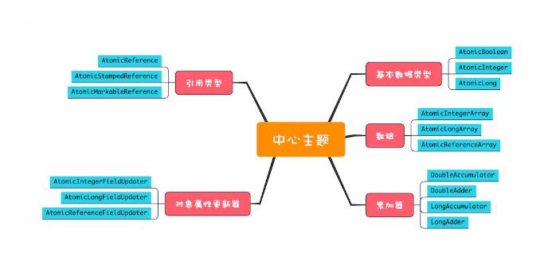

# 并发编程思维导图

# 原子性

原子性的源头是线程切换, 要保证操作中间状态对外不可见

# 锁

加锁本质就是在对象的对象头中写入线程 ID, 如果 new Object 每次在内存中都是新对象那加锁无效

new 出来的对象只在一个地方使用, 逃逸分析会被编译器优化掉和没有 synchronized 的效果相同

## 活锁

线程虽然没有发生阻塞, 但仍然会存在执行不下去的情况, 这就是所谓的"活锁"

## 保护多个资源

1. 多个资源如果没有关系, 每个资源一把锁, 比如订单和修改密码两个事件可以同时进行
2. 多个资源有关联, 就选择一个粒度更大的锁, 覆盖所有相关资源
3. 如果 String 和 Integer 的对象赋值了, 都会变成新的对象, 锁失效了

## 死锁的四个条件

1. 互斥, 共享资源 X 和Y 只能被一个线程占用
2. 占有且等待, 线程 T1 已经取得共享资源 X, 在等待共享资源 Y 的时候, 不释放共享资源
3. 不可抢占, 其他线程不能强行抢占线程 T1 占有的资源
4. 循环等待, 线程 T1 等待线程 T2 占有的资源, 线程 T2 等待线程 T1 占有的资源, 就是循环等待

## 死锁解决

1. 加锁顺序(线程按照一定的顺序加锁)
2. 加锁时限超时放弃(线程尝试获取锁的时候加上一定的时限, 超过时限则放弃对该锁的请求, 并释放自己占有的锁)
3. 死锁检测(jstack -l jvm_pid)

## 可重入锁

线程重复获取一把锁

## 公平锁和非公平锁

唤醒线程, 先来先到

## 用锁最佳实践

1. 永远只在更新对象的成员变量时加锁
2. 永远只在访问可变的成员变量时加锁
3. 永远不在调用其他对象的方法时加锁(其他对象可能会有奇慢无比的 I/O 操作), 其他类可能也有锁, 双重加锁可能死锁

## 读写锁

读多写少场景, 元数据和基本数据

### ReadWriteLock

多线程读, 单线程写

### StampedLock

写锁、悲观读锁和乐观读

循环读会浪费大量 CPU, 要升级为悲观锁

### 场景

缓存

### 原则

1. 允许多个线程同时读共享变量
2. 只允许一个线程写共享变量
3. 如果一个写线程正在执行写操作, 此时禁止读线程读共享变量

# 死循环等待怎么解决

## 尽量用 notifyAll

notify 随机释放一个线程, notifyall 通知等待队列所有线程

# volatile
禁用 cpu 缓存

# 性能问题

要尽量减少串行, 那串行对性能的影响是怎么样的呢？假设串行百分比是 5%, 我们用多核多线程相比单核单线程能提速多少呢？
有个阿姆达尔（Amdahl）定律, 代表了处理器并行运算之后效率提升的能力, 它正好可以解决这个问题, 具体公式如下:

n 可以理解为 CPU 的核数, p 可以理解为并行百分比, 那（1-p）就是串行百分比了, 也就是我们假设的 5%。我们再假设 CPU 的核数（也就是 n）无穷大, 那加速比 S 的极限就是 20。也就是说, 如果我们的串行率是
5%, 那么我们无论采用什么技术, 最高也就只能提高 20 倍的性能

## 性能问题优化

1. 无锁算法或数据结构
    1. 例如线程本地存储 (Thread Local Storage, TLS)
    2. 写入时复制 (Copy-on-write)
    3. 乐观锁等
    4. Java 并发包里面的原子类也是一种无锁的数据结构
    5. Disruptor 则是一个无锁的内存队列
2. 减少锁持有的时间
    1. ConcurrentHashMap 的分段锁
    2. 读写锁, 读无锁, 写互斥

## RUNNABLE 与 BLOCKED 的状态转换

synchronized

## RUNNABLE 与 WAITING 的状态转换

1. Object.wait()
2. Thread.join() 调用 A.join() 执行这条语句的线程会等待 thread A 执行完
3. LockSupport.park() 调用 LockSupport.unpark(Thread thread) 可唤醒目标线程

## RUNNABLE 与 TIMED_WAITING 的状态转换

1. 调用带超时参数的 Thread.sleep(long millis) 方法
2. 获得 synchronized 隐式锁的线程, 调用带超时参数的 Object.wait(long timeout) 方法
3. 调用带超时参数的 Thread.join(long millis) 方法
4. 调用带超时参数的 LockSupport.parkNanos(Object blocker, long deadline) 方法
5. 调用带超时参数的 LockSupport.parkUntil(long deadline) 方法

# 最佳线程数

简单的工具就是 APM 测耗时比例, 根据 CPU 计算和 I/O 操作的耗时比值, 最终还是要根据压测

1. IO 密集型: 1 +(I/O 耗时 / CPU 耗时)
2. CPU 密集型: CPU 核数 * [ 1 +（I/O 耗时 / CPU 耗时）]

不同的 I/O 模型对最佳线程数的影响非常大, 例如大名鼎鼎的 Nginx 用的是非阻塞 I/O, 采用的是多进程单线程结构, Nginx 本来是一个 I/O 密集型系统, 但是最佳进程数设置的却是 CPU 的核数, 完全参考的是 CPU
密集型的算法

# 并发程序原则

1. 优先使用成熟的工具类: Java SDK 并发包里提供了丰富的工具类, 基本上能满足你日常的需要, 建议你熟悉它们, 用好它们, 而不是自己再“发明轮子”, 毕竟并发工具类不是随随便便就能发明成功的
2. 迫不得已时才使用低级的同步原语: 低级的同步原语主要指的是 synchronized、Lock、Semaphore 等, 这些虽然感觉简单, 但实际上并没那么简单, 一定要小心使用
3. 避免过早优化: 安全第一, 并发程序首先要保证安全, 出现性能瓶颈后再优化。在设计期和开发期, 很多人经常会情不自禁地预估性能的瓶颈, 并对此实施优化, 但残酷的现实却是, 性能瓶颈不是你想预估就能预估的

# Lock

synchronized 缺点是一个线程如果获取资源, 获取不到会阻塞, 我们希望主动释放资源

1. 支持中断: lockInterruptibly
2. 支持超时: tryLock(long time, TimeUnit unit)
3. 支持非阻塞获取锁: tryLock()

# 信号量实现限流器

最多允许多少个线程通过 
aquire 
release 

# CountDownLatch

主要用来解决一个线程等待多个线程的场景

# CyclicBarrier

是一组线程之间互相等待

# 并发容器

## CopyOnWrite

并发写的时候复制一份再写

## 阻塞队列

注意使用中是否有界, 是否存在 OOM 的问题

1. 单端阻塞队列
    1. ArrayBlockingQueue
    2. LinkedBlockingQueue
    3. SynchronousQueue
    4. LinkedTransferQueue 融合 LinkedBlockingQueue 和 SynchronousQueue 的功能, 性能更好, 但是工作为了防止 OOM 基本用有界队列
    5. PriorityBlockingQueue 支持按照优先级出队
    6. DelayQueue 支持延时出队
    7. SynchronousQueue 此时生产者线程的入队操作必须等待消费者线程的出队操作
2. 双端阻塞队列
    1. 其实现是 LinkedBlockingDeque
3. 单端非阻塞队列
    1. 其实现是 ConcurrentLinkedQueue
4. 单端非阻塞队列
    1. 其实现是 ConcurrentLinkedDeque

## 原子类概览

## Executors

大厂编码规范不建议使用, 提供的很多方法默认使用的都是无界的 LinkedBlockingQueue, 高负载情境下, 无界队列很容易导致 OOM, 而 OOM 会导致所有请求都无法处理, 这是致命问题。所以强烈建议使用有界队列

# CompletionService

内部维护了一个阻塞队列, 当任务执行结束就把任务的执行结果加入到阻塞队列中, 不同的是 CompletionService 是把任务执行结果的 Future 对象加入到阻塞队列中, 而 future 是把任务最终的执行结果放入了阻塞队列中

对于简单的并行任务, 你可以通过“线程池 +Future”的方案来解决；如果任务之间有聚合关系, 无论是 AND 聚合还是 OR 聚合, 都可以通过 CompletableFuture 来解决；而批量的并行任务, 则可以通过 CompletionService 来解决

# ForkJoinPool 
二分递归, 任务队列采用的是双端队列, 工作线程正常获取任务和“窃取任务”分别是从任务队列不同的端消费, 这样能避免很多不必要的数据竞争

## 模拟 MapReduce 统计单词数量

# copy-on-write
并发修改的时候复制一份, 适合读多写少的场景

没有提供 CopyOnWriteLinkedList 是因为
因为linkedlist的数据结构关系分散到每一个节点里面, 对每一个节点的修改都存在竟态条件, 需要同步才能保证一致性。arraylist就不一样, 数组天然的拥有前驱后继的结构关系, 对列表的增删, 因为是copy on wirte, 所以只需要cas操作数组对象就能够保证线程安全, 效率上也能接受, 更重要的是避免锁竞争带来的上下文切换消耗