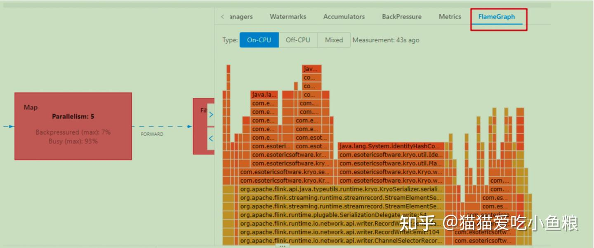
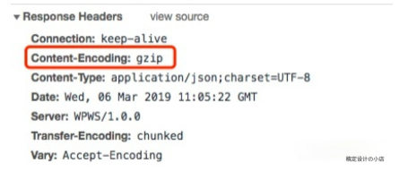
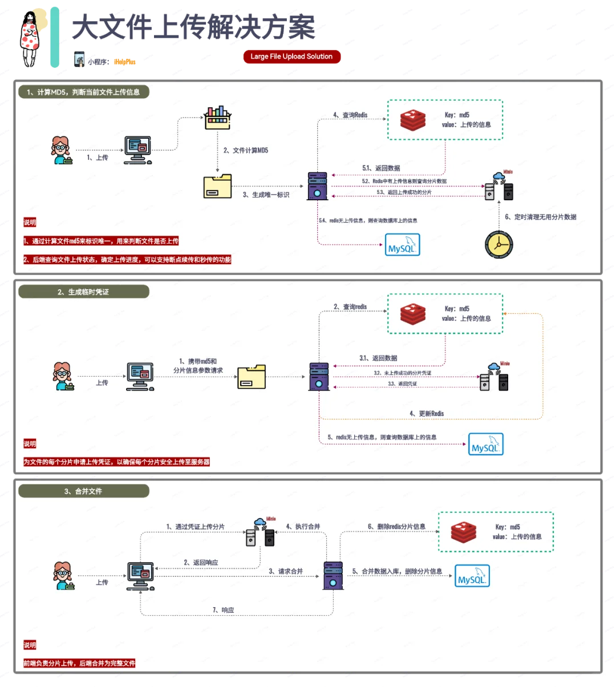

# 火焰图

[怎么看懂火焰图](https://www.ruanyifeng.com/blog/2017/09/flame-graph.html)

纵向是调用链, 从下往上, 顶部就是正在执行的函

横向是样本出现次数, 可以理解为执行时长
看顶层的哪个函数占据的宽度最大。只要有"平顶"（plateaus）, 就表示该函数可能存在性能问题

# 代码怎么判断节假日

写配置文件把国家公布节假日数据每年输入系统, 好处是离职后不用交接这部分, 给来年的愣头青埋个雷

# 互联网常见的事故和解决策略

1. 服务器硬件故障死机: 集群部署、多机备份、自动检测并切换
2. 网络丢包、光钎断: 异地部署、自动检测故障并切换
3. 服务器雪崩: 负载均衡、过载保护、容量告警
4. 外部依赖故障: 柔性逻辑、降级服务、限制重试
5. DNS 故障: 自搭建类 DNS 服务、使用 IP 列表替代 DNS
6. 程序 CORE: 自动拉起、实时告警
7. 操作事务: 灰度、保护逻辑、人员备份确认

# 微服务系统

1. 压测
2. 监控
3. 报警
4. 预案
5. 值班制度
6. 熔断
7. 限流
8. 资源隔离
9. 演练、事故相应、复盘

# 线上 OOM 调整

1. cpu 高影响线上业务, 查看最近是否有新版本, 有就回滚
2. 没有的话, 看看是否有突增请求
3. 有的话先扩容, 后续做限流
4. 没有的话, 扩容到业务正常, 后续线下分析
5. 业务稳定优先, 如果有的场景对耗时毛刺容忍度低, 一般是调 JVM 参数, 降低 GC 频率, 线上少量机器灰度, 观察机器灰度有效,
   再推线上全量

# 微服务监控

1. 全栈监控: 基础层、中间件、应用层监控
2. 资源/服务调度: 硬件、服务、架构调度
3. 数据状态调度: 数据可用性、数据一致性、数据分布式
4. 流量调度: 服务治理、流量控制、流量管理

# 线程数量配置

1. cpu 密集型: 看执行多长时间, 8 核 16 线程的话给个 14-18 个
2. io 密集型: 看执行时间和 io 等待时间, 执行时间短, 等待时间长就往多了给, 否则少给, 内存够用的情况下, 有多少给多少,
   靠压测往下降

# 负载均衡

1. 轮询: 按照时间顺序逐一分配到不同后端服务器, 后端服务器分配的请求数基本一致, 后端服务器 down 就剔除
2. 加权轮询: 根据权重进行轮询, 权重高的服务区分配的请求多, 适应于后端服务器性能不均的情况, 比如新老服务器混用
3. ip_hash: 按照 IP 的 hash 结果分配, 每个访客固定一个后端服务器, 主要用于解决 session 问题, 如购物车类
4. fair: 按后端服务器响应时间来分配请求, 响应时间短优先分配, 最大化的平衡后端服务器压力
5. url_hash: 按照 url 的 hash 结果分配请求, 每个 url 定位到同一个后端服务器, 适用于后端服务器能够将 url 响应结果缓存的情况,
   比如电商架构和 session 强相关的

# 分库分表

1. 业务分库
2. 单表数据量大就分表
3. 加入路由算法计算
    1. 范围路由: 根据有序数列选择路由条件, 比如主键时间戳, 分段一般在 100w-2000w 之间
    2. hash 路由: 选取某个列的值 hash 运算, 根据结果分散到不同的数据库表, 表分布均匀但是扩表很麻烦, 所有的数据都要重新分布
    3. 配置路由: 用一张独立的表来记录路由信息, 缺点是必须多查询一次
4. 阿里 Java 手册建议单表 500 万即可考虑分表

# Redis 大 key :

1. 抓取 redis 统计数据, 大量请求这些大 key 会造成 CPU 飙高, 网卡流量暴涨
2. 因为 redis 的单线程模型, 主线程处理所有 key 的操作, 对 bigkey 的操作耗时增加将阻塞主线程处理其他请求, 影响整体吞吐量
3. 影响带宽, 单个 key 就 7 MB, 每秒 100 次查询, 带来 700 MB 带宽, 虽然大部分是万兆网卡, 请求量大了网卡也有被打满的风险
4. 数据倾斜: 整体不均衡, 一个分片空间容量满了造成系统不可访问, 不拆分 key 情况下扩容, 单个分片存在数据倾斜, 扩容还是存在数据倾斜,
   数据倾斜会导致热点
5. 字符串类型, 业务层面要求将 value 控制在 10kb 左右, value 如果确实很大, 考虑采用序列化算法和压缩算法处理, 比如
   protostuff、keyo 或者 fst
6. 读的时候利用 scan 命令渐进式遍历, 大量数据分批读出, 减小 redis 压力, 删除也是用 scan

# 数据库选型

1. 管理型系统: 首选关系型
2. 大流量系统: 如电商单品页某个服务, 后台关系型, 前台内存型
3. 日志型系统: 原始数据选列式, 日志搜索选倒排索引
4. 搜索型系统: 站内搜索, 非通用搜索, 如商品搜索, 后台选关系型, 前台选倒排索引
5. 事务型系统: 库存、交易、记账, 关系型 + 缓存 + 一致性协议, 或者 NewSQL
6. 离线计算: 大量数据分析, 首选列式, 关系型也可以
7. 实时计算: 如实时监控, 选时序数据库或者列式数据库

# 缓存设计

1. 触发时机和触发粒度
2. 缓存层次和粒度, 多级缓存如(nginx、本地缓存如单击文件、分布式缓存如 redis cluster、进程内缓存如全局变量)
3. 缓存命名规则和失效规则
4. 缓存监控指标和故障应对方案
5. 可视化缓存数据如 redis 具体 key 内容和大小

# 缓存存在的问题

1. 缓存穿透: 黑客攻击, 服役大量访问某些读取不存在的数据, 将存储搞垮, 如果查询系统没有找到可以设置空值或者默认值放到缓存
2. 缓存数据生成耗费大量时间或者资源: 电商商品分页, 数据巨大, 只能按照分页来缓存, 业务上最简单的就是每次点击分页时候按分页计算和生成缓存,
   竞争对手用爬虫来遍历的时候, 系统性能就会出现问题
    1. 分页有效期 1 天, 非实时性, 时间太长实时性太差
    2. 用户集中在前10页, 不可能页页都看, 10页后缓存过期可能性大
    3. 竞争对手爬数据, 可能爬全量, 很多分页都失效了
    4. 很多分页没有缓存数据, 数据库生成缓存数据非常消耗性能, 爬虫会将整个数据库拖慢
    5. 没有好的解决方案, 可能识别爬虫并禁止访问, 但是可能会影响 SEO(搜索引擎) 和推广, 一般是做好监控, 发现问题及时处理
    6. 做了策略防止搜索引擎爬取
3. 缓存雪崩
    1. 更新锁, 保证只有一个线程能进行缓存更新
    2. 后台更新, 缓存设置永久, 后台线程定时更新
4. 缓存热点
    1. 微博对于超过 100w 粉丝的明星, 每条微博都可生成 100 份缓存, key 里面加编号区分, 每次读缓存都随机读取某份缓存, 分片思想
    2. 不同缓存副本不要设置统一过期时间, 引起雪崩
    3. 根据 2-8 原则, 把占用 80% 的 20% 数据缓存出来, 埋点做好侧重点
5. 微博突发性缓存
    1. 限流, 容器化 + 动态化, 业务降级如限制评论
6. 商品描述等信息, 比如某些重要数据, 如价格、需要及时更新数据, 有什么好的办法做到刷新
    1. 同步刷新缓存: 当更新了某些信息后, 立刻让缓存失效, 这种做法是用户体验好, 缺点是改一个数据可能需要让很多缓存失效
    2. 适当容忍不一致: 例如某东商品这样, 查询的时候显示有货, 下单提示没货
    3. 关键信息不要缓存: 库存、价格等不缓存、因为这类信息查询简单、效率高、可以直接数据库查询

# 浏览器配置gzip

大部分网站使用Gzip传输 HTML、CSS、JavaScript 等, 对请求头的 Accept-Encoding 标识对压缩的支持

# 消息推送

**推送类型:** 短信、邮件、站内信、App 推送, 除了 App 不同的途径基本上调用不同的 API 完成, 技术上没什么难度, 短信依赖运营商的短信接口,
邮件需要依赖邮件服务商的邮件接口, 站内信是系统提供的消息通知功能

## 推送方案

**海量设备和用户管理:** 消息推送的设备数量众多, 存储和管理这些设备比较复杂, 针对不同用户进行不同业务推广, 收集用户一些信息,
将用户和设备关联, 提取用户特征对用户进行分类或者打标签  
**连接保活:** 要推送消息必须又连接通道, 应用不可能一直在前台运行, 大部分设备为了省电省流量会限制应用后台运行,
导致消息无法及时推送, 连接保活是整个消息推送设计中细节和黑科技最多的地方, 例如应用互相拉起,
找手机厂商开白名单等  
**消息管理:** 不是每个消息都要发送给每个用户, 根据用户的特征选择一些用户消息推送, 由于用户特征变化很大, 各种排列组合都有可能,
将消息推送给哪些用户的逻辑要设计的非常灵活, 设计方案可以采取规则引擎之内的微内核架构

# 存储云、图片云

1. 互联网业务场景中, 用户上传多种类型的文件数据, 比如微信发朋友圈上传, 微博用户发微博上传图片、视频, 优酷用户上传视频,
   淘宝卖家上传商品图片等, 这些文件具备几个典型特点, 通常是 CDN + 小文件存储,
   图片涉及的业务更多包括裁剪、压缩、美化、审核、水印等
    1. 数据量大: 用户基数大, 用户上传行为频繁
    2. 文件体积小: 大部分几百 KB 到几 MB, 短视频播放时间也是在几分钟内
    3. 访问有时效性: 大部分文件刚上传访问最多, 随着时间推移访问量越来越小

# 页面估计浏览量 uv

1. hyperloglog, 未来可能扩展的 zset bitmap, 大数据用 RoaringBitmap 压缩确定唯一条件
    1. 节约内存, 区分用户还是非常难的,
    2. 内存数据合并,一个用户多次访问算一次, 基于概率统计, 结果不精准
2. 大数据框架, 后端校验写入 kafka 或者(flink), 通过消费者消费, 将数据写入 hive、hbase表, 实时就 doris 或者 clickhouse,
   sql 出结果
3. 时效性不强, 埋点数据上报日志, 收集日志, 大数据离线统计, 时效性要求高, 可以考虑 kafka + bitmap, 剩下就是数仓, 统计任何指标
4. 页面统计, js 探针, http 接口, 未登录用户使用浏览器指纹, cookie 特殊标志

# mysql 千万级大表加字段

1. ghost
2. ptosc
3. online ddl(大部分情况)
4. percona

# 时点、时段指标在定制报表中同时体现? 例如像有一些报表需要体现年初、1月...12月、年末的相关科目

1. 年初放到00月, 也可放到列上取个名字, 这是时点数
2. 当年年初等于上年年末, 虚拟 13-16 月份用于调帐
3. 期初数放一列, 发生数放一列, 期初余额+发生=期末

# 健康码

1. 各省一套健康码, 全国没有统一, 这就是信息孤岛
2. 总部顶层设计统一 31 个省是集团企业及数仓
3. 社保、结婚证离婚证、税务、公检法等以前都是各省各市不联网, 以后跨系统统一才是真正的数据中台, 这些都建立在身份证编号统一唯一精准权威的基础上,
   身份证号码就是最大的主数据
4. 主数据的核心是不能经常变, 开始设计编码规则时就要谨慎, 用户、商家、商品的id、员工号、客户供应商id, 身份证号码等
5. 如果跨系统, 则重新选一套编号为核心, 旧的映射到新的号码上, 慢慢弃用, 如收购一公司, 被收购员工工号统一按新公司工号排
6. a系统有注册的用户, b系统有注册的用户, c系统有注册的用户, 这时候搞全域数仓, 不同系统如果要打通, 必须让用户不同帐户合并,
   一人一号, 既方便管理又避免刷单
7. 如果是手机 app, 可以强制用手号登录, 每个手机号自动生一个 user_id, 这个id不显示出来, 后台用, 每个系统用手机登录一次手机号自动把三个系统串起来,
   一人一号, 一证一人

# 购物车

1. cookie, 未登录可以用 cookie, 但是浏览器包含 cookie 会自动登录, 泄露隐私, 也可以通过 cookie 追踪访问网站的行为
2. session, 结合用户登录情况, 数据放在 session 中, 增加服务器负担
3. redis, 读取速度会慢一点

# 长连接负载均衡

1. netty websocket 是有状态的, 无法像 HTTP 直接提供负载均衡, 服务端某个节点保持会话, 集群下想要得知绘画属于哪个节点有点困难
    1. 使用注册中心维护会话映射关系, 实现复杂
    2. 使用事件广播, 基于 rocketmq, 由各个节点自行判断是否持有会话, 节点多浪费资源
2. 网关架构设计
    1. 客户端与网关握手建立长连接, 加入到内存维护的长连接队列, 超过一定时间没有心跳, 则服务端关闭连接, 清理内存的绘画
    2. 业务系统需要向客户端推数据, 通过 http 接口将数据发网关, 然后写入 rocketmq
    3. 网关作为消费者以广播模式消费 mq 的消息
    4. 节点接收消息后判断推送的消息是否在内存的长连接队列, 存在就推送数据, 否则忽略掉
    5. 网关多节点部署, 每个节点负责一部分长连接, 负载均衡, 通过增加节点分担压力, 水平扩容, 节点宕机了, 客户端与其他节点握手

(每个客户端使用一个服务端端口建立起 5 万连接, 可以同时创建百万个连接)

## 监控连接数

1. Prometheus 进行采集
2. Grafana 方便查看连接数量、用户数、JVM、CPU、内存等指标数据

# 分钟级别实时显示在线人数

北京2100万, 客户端1分钟2次, 大概70万QPS, 不算很高, 但是2100万连接大概需要200台linux满载, 还要做靠谱的负载均衡, 有波动就会宕机,
因此靠谱的做法是换用异数OS, 单台大概5000万连接, 1亿QPS,一台异数OS服务器就够用了, 而且这样的QPS可以做到500ms级别的实时显示。

微信是要求同时在线

mqtt之类专业做长链接的大概是5000左右, 10万是一般不魔改linux内核的优化上限

连接量大的话一般要用长链接, 因为短链接会有端口超时耗尽问题, 而且短链接实时显示握手成本高, 折算成成长链接, qps 压力会提高至少
5 倍以上

分布式缓存是有成本代价的, 像 12306 以前都是 10 分钟更新一次, 更新成本和集群分布式副本数量的平方相关,100 万连接在 linux
上叫做僵尸雪崩连接, 不活跃的时候像僵尸一样, 活跃的时候像雪崩一样, 所以分钟级心跳一般就做个 10 万连接左右

或者能搞到所有运营商的数据, 但是小孩没手机, 有的人有多个手机

# 顺序消费

用事务消息, 保证同一个业务主键的消息发送有序就行了

使用 mq 不能完全保证顺序消费, kafka 层面很难解决数据延迟吧, 不然整 flink, struct streaming 的 watermark 对抗延迟
消息队列发一个消息里面时候, 扩容时顺序就乱了

消息队列的应用场景面向异步和解耦, 提高系统架构的吞吐量和可扩展能力, 有些开发者天天研究异步消息的顺序性

微信偶尔也有这种情况, 新消息插入到已接收的消息里面

1. 消息打包走 mq, 消费时自己保证顺序性, 落库定时任务处理, 多线程跑的话, 通过上下文或者状态机控制, 后边消息反查前边结果
    1. 客服端接受到消息一批消息后如何排序
    2. 服务端如何确保分发一批有序消息到同一个应用
2. 消息加上顺序编号, 并且排队, 并且保证 extractly once 提交, 前面编号如果没有消费, 进度不提交, 重新消费

# flink

## 反压

1. 增加任务的并行度, 高算子的并行实例数来增加处理能力, 过量也会导致资源浪费和性能下降
2. 优化数据处理逻辑, 计算密集型任务, 优化数据处理逻辑降低数据生成速度
3. 数据倾斜任务, 优化数据流设计, 避免热点, keyby 分区, 使用 rebalance/shuffle 等操作符来随机分配数据, 减少热点问题
4. 动态调整缓冲区大小, 根据当前系统负载均衡和数据处理速度调整大小, 设置最大值和最小值, 无限缓冲不可取将受限于物理资源(
   内存、磁盘)
5. 优化检查点和状态后端, 减少检查点间隔, 如果检查点操作频繁, 可能会对性能造成影响。适当延长检查点间隔可以帮助减轻反压,
   flink 水位线控制反压, netty 超过阈值会暂停写入数据, 直到低于另一个阈值才会写入
6. 引入反压机制, 下游算子无法跟得上上游算子生成速度时, 通知上游减速
7. 断路器(Circuit Breaker)的角色, 在某个服务压力过大或系统不可用时, 不再请求而直接返回默认值, 可以认为是一种丢弃策略

## 过去2小时热门商品

时间窗口, 最热门商品, 肯定也有个时间窗口。例如2小时内最热门。你用redis怎么实现, 可以用flink

## kafka 丢数据, flink 方案解决

1. 实时链路只能尽力, 加个定时全量就行了
2. 每个消息打一个特殊数字标记, 发送方和接收方分别汇总加起来, 根据两个值的差可以直接定位到差了哪个消息
3. 每条数据在外部数据的source加traceid, sink的时候把traceid另外写表(或者写在state), 内部source取数据的时候都去找上个sink的表做比较
4. 数据源的source把整个数据做md5+timestamp, 存储到state做幂等
   全链路的监控, 从数据采集开始到下游sink, 都得加metrics, 比如每个batch的值啊, 异常数啊之类的, 到明细时做明细数据对账

# 服务循环依赖

1. A.a1=>B.b1=>A.a2 a1 是一个 mysql 事务, 将表中记录的某个字段 value1 -> value2, 然后调用 B.b1, 因为事务还没提交, 读到数据是
   value1, 但是 B.b1 想要的是 value2
2. 服务之间也经常存在, 可以通过消息系统, 明确上下游关系, 接入 BFF 系统等方式进行优化

# 处理动态海量定时任务

**场景** 钉钉会议创建 1000w 个定时任务就会有 1000w 个

1. [时间轮](C:\Users\84216\Desktop\java-lsy-study\docs\框架\定时调度\时间轮.md)
2. 多级时间轮

# 序列化

Google 的 Protobuf、Kryo、Hessian 等, 像 JSON、XML 这些标准的数据格式, 也可以作为一种序列化实现来使用, 权衡几样因素

1. 序列化后的数据最好是易于人类阅读的
2. 实现的复杂度是否足够低
3. 序列化和反序列化的速度越快越好
4. 序列化后的信息密度越大越好, 也就是说, 同样的一个结构化数据, 序列化之后占用的存储空间越小越好

# 单机限流

1. 单机限流是内存操作, cpu和内存性能是非常高的, 要扛不住也是先网络阻塞
2. 如果请求量真的很大了, 不符合流量预期, 带宽打满, 网口打爆了, 要么扩容, 要么还有客户端限流
3. 内部限流, 外部熔断。自己的接口可以限流, 你调用的接口没办法限流, 只能熔断
4. 根据 qps 阈值限流加熔断

# redis lua 脚本限流

1. 减少网络开销: 不使用 Lua 的代码需要向 Redis 发送多次请求, 而脚本只需一次即可, 减少网络传输
2. 原子操作: Redis 将整个脚本作为一个原子执行, 无需担心并发, 也就无需事务
3. 复用: 脚本会永久保存 Redis 中, 其他客户端可继续使用

# 分布式事务

1. 监控
2. 对账
3. 报警
4. 幂等
5. 手动或者自动补偿重试
6. 实时性高手动回滚(撤销) 实时性要求低自动任务补偿

# 订单超时

1. 支付接口幂等, 定时重试, 直到成功
2. 接口不幂等, 下游提供单号定时查询接口, 直到成功
3. 超过半小时不成功, 报警, 人工介入

# 幂等方案

1. 数据库唯一约束, 支持类似“INSERT IF NOT EXIST”语义的存储类系统都可以用于实现幂等, 比如, 你可以用 Redis 的 SETNX
2. 乐观锁, 设置前置条件, 先判断在操作, 根据版本号
3. token 机制或者 GUID, 执行之前检查是否执行过这个更新操作, 每条消息设置全局唯一的 ID, 没有消费过就更新状态置为已消费,
   在检查状态、更新数据、设置消费状态必须保证原子性才能实现幂等, (执行的时候生成 token 放redis, 成功了就删除)

## 2 种情况

1. 支付超时, 上游肯定关闭了, 关闭成功钱付出去了, 查询单据状态退钱
2. 用户付钱比关单快, 单据设置支付成功, 要么不处理, 要么退钱

# 深度分页

1. 普通索引查 id, 减少回表
2. 延迟关联
3. Es 的话可以选择 search after, 采用 scroll api

# 大文件上传/下载(断点续传技术)

上传途中网络中断导致失败

1. 分片上传: 上传失败就不需要重新上传, 只上传失败的文件分片
2. 多线程上传: 多线程对一个文件的多个分片上传, 加快文件上传速度
3. oss 前端直接上传, 对象存储
4. 前端获取文件 md5, 秒传, 上传部份, 是否上传一部分, 是则断电续传, 后端合并
5. 内存占用: 流式处理, 边读边写
6. 用开源中间件分块下载
7. 直接用 EasyExcel (案例编写, 适合大数据量场景)
8. 第三方依赖库 (PDF、Word、Excel) Apache Commons FileUpload

[具体方案](https://gitee.com/Analyzer/vip-file-upload)

1. 校验文件上传状态: 前端生成该文件的MD5密文并进行分片, 上传之前请求check-md5接口, 传入文件名和密文, 接口校验文件是未上传
   或 上传了一部分 或 已上传完成三个状态, 其中未上传返回自定义状态码404, 上传一部分则返回状态206+未上传的分片ID,
   上传完成则返回状态200。
1. 前端逐片上传: 校验完成后, 根据校验结果对未上传的分片进行逐个上传, 上传分片时参数主要是：总片数、当前片ID、片文件
1. 上传接口: 上传接口会先去获取并解析该文件的conf文件(conf文件是RandomAccessFile, 该类是通过提供指针的方式操作文件,
   文件存储的是一个二进制数组, 所以可以用来数组下标标记片ID), 使用setLength方法设置conf文件长度, 使用seek方法跳到当前上传的片ID的位置,
   把该位置的值替换成127, 然后将该分片使用指针偏移的方式插入到_tmp临时文件（临时文件也是RandomAccessFile文件）中,
   然后校验是否所有的片都上传完成, 是则修改临时文件为正式文件名, 至此上传完成, 否则直接返回该分片上传完成
1. 上传进度: 前端收到当前片的响应结果后, 会根据已上传片数量获取到上传进度
1. MD5的用法: 以上就是分片上传的全部过程, 其中本项目中, 文件MD5并没有派上用场, 原因是我这里是使用文件名做区分的,
   这样的弊端就是如果上传同名文件但是内容不同时, 仍然会走秒传功能；解决办法是可以使用checkFileMd5(String fileMd5, String
   fileName)方法和fragmentFileUploader(UploadFileParam param, long chunkSize, HttpServletRequest request)方法配合使用,
   这样可以识别非同一文件但同名的文件上传, 或者上传时前端传入一个唯一ID作为上传后的文件名。

# tob 业务复炸业务组件多状态联动问题

Cola 状态机适用于需要高并发支持且希望简化状态管理的场景  
spring-statemachine 学习成本高点  
工作流引擎, 状态机 – 后期如果有复杂流程的处理的话,就比较难扩展

# 业务三重校验

1. 数据提示错误让你怀疑密码不对
2. 连续输入三次会确认这个账号是你的

# 缓存一致性

cache-aside (旁路缓存)

- 读策略, 缓存读数据命中直接返回, 没有命中, 读数据库
- 写策略, 写数据库, 删缓存

1. 没有并发的话, 更数据库, 更缓存, 消息队列做最终一致性, 通过重试
2. 流量少及时性要求高的业务, 先写库, 再删缓存
3. 流量大及时性要求低的业务, 先写库, 异步改缓存, 写库再删
4. 流量大及时性要求高的业务, 先写库, 加分布式锁, 改缓存, 失败就重试, 成功以后, 解锁, 保证只有一个线程打到数据库,
   问题来了锁超时怎么玩

# 业务对账

1. t + 1, hive 走离线, 实时核对接 binlog
2. 实时对账平台, 接入 binlog 后只需要写一个简单的对账脚本就行
3. 参考下涉及到大量清结算的业务都是咋玩的就行, 还能每次接 binlog 都要开发那不是完犊子

# linux 服务器采用项目做 java 程序监控
bistoury

## hash 算法

将任意长度的二进制值串映射为固定长度的二进制值串,这个映射的规则就是哈希算法, 不能反向推导出原始数据

### 加密算法

1. MD5(MD5 Message-Digest Algorithm,MD5 消息摘要算法)不算加密
   1. MD5 可以用彩虹表破解, 盐不要写死, 因为“salt” + password 虽然无法被破解, 但是黑客自己注册一个账号密码为 11111
      很容易破解出原来的密码, 最好每个独立的密码都有盐, 20位, 可以使用 UUID 作为盐, 防止盐被做成彩虹表
2. SHA(Secure Hash Algorithm,安全散列算法)
3. 对称加密: 加密速度快, 但密钥容易被窃取, 敏感数据都是服务端的可以使用 3DES、DES(Data Encryption Standard,数据加密标准)
   AES(Advanced Encryption Standard,高级加密标准)，推荐后者
4. 非对称加密: 公钥公开, 私钥不公开, 加密速度慢但是解决密钥分发安全问题 rsa,ecc

#### 场景

1. 如何存储用户密码这么重要的数据, 字典加 salt, 和密码组合在一起, 增加密码复杂度
   1. 大部分公司采用 PBKDF2WithHmacSHA1 计算足够慢
2. BT 下载防止网络被攻击, hash 值将下载好的文件块逐一对比, 一样的话最后算出来的结果不同
3. 姓名电话身份证
4. 区块链
   1. 区块链是一块块区块组成的,每个区块分为两部分: 区块头和区块体
   2. 区块头保存着 自己区块体 和 上一个区块头 的哈希值
   3. 因为这种链式关系和哈希值的唯一性, 只要区块链上任意一个区块被修改过, 后面所有区块保存的哈希值就不对了
   4. 区块链使用的是 SHA256 哈希算法, 计算哈希值非常耗时, 如果要篡改一个区块, 就必须重新计算该区块后面所有的区块的哈希值,短时间内几乎不可能做到
5. etcd 鉴权认证
   1. 随机加盐、高安全性的 hash 函数、自定义 hash 值计算迭代次数 cost
   2. etcd 密码存储, 使用 bcrpt 库的 blowfish 算法, 基于铭文密码、随机分配 salt、自定义 cost、迭代多次计算得到一个 hash 值, 将加密算法版本、salt值、cost、hash 值组成一个字符串, 作为加密后的密码

#### 提升密码性能

1. 避免频繁、昂贵的密码计算匹配
2. 返回一个通信证凭据给 client, 后续请求携带通信证, token

## 搜索引擎背后算法

1. 搜集: 爬虫爬取网页
2. 分析: 负责网页内容抽取、分词, 构建临时索引, 计算 PageRank 值
   1. 去掉 JavaScript 代码、CSS 格式以及下拉框中的内容, 利用 AC 自动机这种多模式串匹配算法
   2. 利用 AC 自动机这种多模式串匹配算法
   3. 把单词与网页之间的对应关系,写入到一个临时索引文件中(tmp_Index.bin)
   4. 维护一个计数器term_id, 所有的网页处理(分词及写入临时索引)完成之后,我们再将这个单词跟编号之间的对应关系,写入到磁盘文件中,并命名为
      term_id.bin
3. 索引: 主要负责通过分析阶段得到的临时索引,构建倒排索引
   1. 倒排索引, 每个单词编号在倒排索引文件中的偏移位置 term_offset.bin, 倒排索引文件(index.bin)
4. 查询: 响应用户的请求,根据倒排索引获取相关网页,计算网页排名,返回查询结果给用户
   1. doc_id.bin: 记录网页链接和编号之间的对应关系
   2. term_id.bin: 记录单词和编号之间的对应关系
   3. index.bin: 倒排索引文件,记录每个单词编号以及对应包含它的网页编号列表
   4. term_offsert.bin: 记录每个单词编号在倒排索引文件中的偏移位置
   5. 先对用户输入的文本进行分词处理，假设分分词之后, 我们得到 k 个单词
   6. 拿这 k 个单词,去 term_id.bin 对应的散列表中, 查找对应的单词编号
   7. 去 term_offset.bin 对应的散列表中,查找每个单词编号在倒排索引文件中的偏移位置
   8. 去倒排索引(index.bin)中,查找 k 个单词对应的包含它的网页编号列表, 经过这一步查询之后,我们得到了 k 个网页编号列表
   9. 针对这 k 个网页编号列表,统计每个网页编号出现的次数, 按照出现次数的多少,从小到大排序。出现次数越多,说明包含越多的用户查询单词
   10. 得到了一组排好序的网页编号。我们拿着网页编号,去 doc_id.bin 文件中查找对应的网页链接,分页显示给用户就可以了
   11. 计算网页权重的 PageRank 算法、计算查询结果排名的 tf-idf 模型
