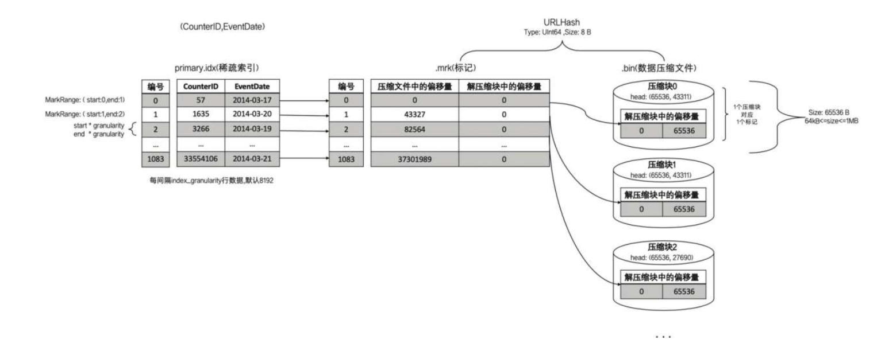

# 官方文档

https://clickhouse.com/docs/zh/interfaces/

# 重点部分

1. ORDER BY 与 PRIMARY KEY 的作用 
   1. ORDER BY的作用, 负责分区内数据排序 
   2. PRIMARY KEY 的作用, 负责一级索引生成 
   3. Merge的逻辑, 分区内数据排序后, 找到相邻的数据, 做特殊处理 
       只有在触发合并之后, 才能触发特殊逻辑。以去重为例, 在没有合并的时候, 还是会出现重复数据
       只对同一分区内的数据有效。以去重为例, 只有属于相同分区的数据才能去重, 跨越不同分区的重复数据不能去重。
2. MergeTree 引擎
   1. MergeTree分区是在数据写入过程中创建的, 每一批数据insert进去, MergeTree都会创建一个新分区, 即使不同批次写入的数据属于相同分区, 也会生出不同分区目录
   1. 在之后的某个时刻(写入后的10～15分钟, 也可以手动执行optimize查询语句), ClickHouse会通过后台任务再将属于相同分区的多个目录合并成一个新的目录
   1. 主键使用 PRIMARY KEY 定义, 待主键定义之后, MergeTree 会依据 index_granularity 间隔(默认8192行), 为数据表生成一级索引并保存至 primary.idx 文件内
   1. primary.idx内的索引数据常驻内存, 取用速度自然极快
3. 项目优化四种方案
   1. 排序键优化-跳跃扫描: 让存储层每个 DataPart 里的数据按照排序键进行严格有序存储
   1. 分区键优化: 适用于范围查找, 比如统计某一段时间的数据 不同分区在物理上是隔离的
   1. Skipping index 优化 -MetaScan: 有了索引后, 数据扫描的逻辑变成了先扫描 oid 索引文件
   1. Prewhere优化-两阶段扫描: 数据分布非常散乱的场景下, 正常的执行逻辑中存储层扫描会把5天内的全部列数据从磁盘读取出来, 然后计算引擎再按照order_status列过滤出满足条件的行。在两阶段扫描的框架下,
       prewhere表达式会下推到存储扫描过程中执行, 优先扫描出order_status列存块, 检查是否有记录满足条件, 再把满足条件行的其他列读取出来, 当没有任何记录满足条件时, 其他列的块数据就可以跳过不读了。

```sql
   // 例如
select *
from order_info prewhere order_status = 2 --订单取消
where gmt_order_create > '2020-0802 00:00:00' and gmt_order_create < '2020-0807 00:00:00'
```

[执行计划查询优化](https://www.cnblogs.com/niutao/p/15313070.html)

例如某个场景的查询需求如下:  
聚合条件, GROUP BY A, B, C  
过滤条件, WHERE A  

此时, 如下设置将会是一种较优的选择:  
ORDER BY A, B, C  
PRIMARY KEY A

# 底层原理:

1. 记录方式: 默认索引粒度 8192, MergeTree 只需要 12208 行索引为 1亿行数据提供索引, 就是一个Block, 主键每隔 8192 就会取一行主键列数据, 最终会被写入primary.idx文件进行保存, 查找通过primary.idx定位block, 然后找到对应的mrk文件
2. MarkRange是如何查询的？
    1) 查询条件转换为条件区间, 即便是单个值的查询条件, 也会被转换成区间的形式
    2) 以递归的形式, 依次对 MarkRange 的数值区间与条件区间做交集判断, 从最大的区间[A000 , +inf)开始,不存在交集, 则直接通过剪枝算法优化此整段MarkRange,存在交集, 且MarkRange步长大于8(end - start), 则将此区间进一步拆分成 8(可配) 个子区间, 继续递归
       当查询条件 WHERE ID = 'A003’的时候, 最终只需要读取[A000 , A003]和[A003 , A006]两个区间的数据
3. 以 SELECT max(id) from table 为例 从磁盘中查询数据并载入到内存中, 然后在内存中查找最大的id
4. 因为按照 block 为最小存储单位, 修改数据性能比较差, 尤其是修改了用于排序的列
`   
`
# 主键查找特点:

1. 全主键: where x = '3' and y = 'c', 只扫描 block 2、3, 使用mrk文件定位到数据, 加载内存过滤
2. 半主键: where x = '3' 只扫描2、3 , where y = 'c' block 1、4 首先被过滤
3. 非主键: where z = '?' 等效于where x = any and y = any and z = '?' 扫描所有block取所有mrk数据偏移指向
4. 支持ttl (列级别ttl 行级别ttl 分区级别ttl 过期后连锅端一起删)

# 稀疏索引和稠密索引

一对多和一对一的关系


clickhouse 不建议大规模引入物化视图实时聚合, 费资源, CPU会炸, 主键一定是排序键的子集。因为稀疏索引不能太密集, 太密集就没优势了, 有时候排序键太细粒度了, 就需要自己定义主键了

打宽表本身就耗资源, 还有笛卡尔积数据膨胀放大等畸形问题

写缓存怎么样都可以。你这个语句哪怕执行时间30min, 也可以把轮询的结果直接写到mysql或redis里面, 这样每次查询从mysql或者redis里面查, 至少可以保证30min的实时数据结果

# 联合主键
1. 以 (CounterID, Date) 为主键, 先按照 CounterID 排序, 相同的 CounterID 部分按照 Date 排序

# 数据标记
读取数据过程不需要烧苗整段解压数据, 以index_granularity的粒度加载特定的一小段, 借助标记文件中保存的解压数据块中的偏移量, 每个压缩数据块的体积都被严格控制在64KB～1MB

## 数据标记与压缩数据块的对应关系
1. 一对一: index_granularity 64KB <= 未压缩 size <= 1MB

2. 一对多: 1MB <= index_granularity

3. 多对一: 64KB <= index_granularity


# 面试

数据量 tb 级别
在 3 千亿

推荐系统实时指标 
业务背景:
已有离线AB指标, 算法研发需要实时反馈数据作为补充
需求： 
1. 可能需要查询明细数据： 
2. 维度/指标非常多； 
3. 高效按实验D查询数据； 
4. 支持AUC(Area Under Curve)计算 


基于 clickhouse 的日志系统

业务痛点
数据分布特点：当天数据+少量历史数据(3个月内)
单次消费数据非常大：Kafka max block size=1048576
某一批次数据落盘前无法查询到, 延时比较大

es 全文检索数据量大了一样哑火

重复是日志写入超时, 消费了一段未及时 ack 的日志

flink 洗了丢 clickhouse 比 es 轻了很多, 存储少了30%

用户画像表

```sql
CREATE TABLE user_profiles
(
    `user_id` UInt64,
    `name` String,
    `gender` Enum('male' = 1, 'female' = 2, 'other' = 3),
    `age` UInt8,
    `location` String,
    `registration_date` Date,
    `last_login` DateTime,
    `preferences` String, -- 假设偏好信息存储为JSON字符串
    `activity_score` Float32
)
ENGINE = ReplacingMergeTree()
ORDER BY (`user_id`, `last_login`);
```


```sql
CREATE TABLE log.log_default_local
    timestamp 'DateTime64(3,' Asia/Shanghai '),
   'domain' String,
    `host' String,
    "path' String,
    "node'String,
    logLevel'String,
    eventName'String,
    message'String,
    " offset 'UInt64,
    ' ts 'DateTime DEFAULT now（）,
    threadName' String,
    logger 'String,
    type' String,
    topic 'String,
    /以下为自定义映射字段
    s1' String,
    s2 'String,
    .s3' String,
    i1 'Int64,
    i2' Int64,
    i3 'Int64,
    f1' Float64,
    f2°F10at64,
    f3°F10at64,
    /数组自定义字段
    "string_names'Array(String),
    'string_values'Array(String),
    'number_names'Array(String),
    number_values'Array(Float64),
    INDEX domain domain TYPE set(3000)GRANULARITY 4,
    INDEX timestamp timestamp TYPE minmax GRANULARITY 4,
    INDEX host host TYPE set(50000)GRANULARITY 4,
    INDEX logLevellogLevel TYPE set(10)GRANULARITY 4,
    INDEX path path TYPE set(20000)GRANULARITY 4,
    INDEX eventName eventName TYPE set(10000)GRANULARITY 4,
    INDEX messagemessage TYPE tokenbf_v1(32768,2,0)GRANULARITY 2
    ENGINE ReplicatedMergeTree('/clickhouse/tables/{shard)/log_default_local','{replica}')
    PARTITION BY (toStartofInterval(timestamp,toIntervalHour(12)),topic)
    ORDER BY (domain,timestamp)
    TTL ts toIntervalDay(4)TO DISK 'cold_disk'
    SETTINGS storage_policy 'ssd_to_hdd',index_granularity 8192,parts_to_throw_insert 10000
```

存日志方面 ES 存储成本高, 资源占用率高, 查询比较慢, 分析能力一般

```sql
CREATE TABLE otel.otel logs
(
    Timestamp DateTime64(9)CODEC(Delta(8),ZSTD(1)),
    TraceId string CODEC(ZSTD(1)),
    SpanId string CODEC(ZSTD(1)),
    TraceFlags'UInt32 CODEC(ZSTD(1)),
    SeverityText Lowcardinality(String)CODEC(ZSTD(1)),
    SeverityNumber Int32 CODEC(ZSTD(1)),
    ServiceName LowCardinality(string)CODEC(ZSTD(1)),
    "Body string CODEC(ZSTD(1)),
    ResourceAttributes'Map(LowCardinality(string),string)CODEC(ZSTD(1)),
    LogAttributes'Map(LowCardinality(String),string)CODEC(ZSTD(1)),
    INDEX idx trace id TraceId TYPE bloom_filter(0.001)GRANULARITY 1,
    INDEX idx_res_attr_key mapKeys(ResourceAttributes)TYPE bloom_filter(0.01)GRANULARITY 1,
    INDEX idx_res_attr_value mapValues(ResourceAttributes)TYPE bloom_filter(0.01)GRANULARITY 1,
    INDEX idx_log_attr_key mapKeys(LogAttributes)TYPE bloom_filter(0.01)GRANULARITY 1,
    INDEX idx_log_attr_value mapValues(LogAttributes)TYPE bloom_filter(0.01)GRANULARITY 1,
    INDEX idx body Body TYPE tokenbf_v1(32768,3,0) GRANULARITY 1
    )
    ENGINE MergeTree
    PARTITION BY toDate(Timestamp)
    ORDER BY (ServiceName,SeverityText,toUnixTimestamp(Timestamp),TraceId)
    SETTINGS index_granularity 8192,ttl_only_drop_parts 1
```