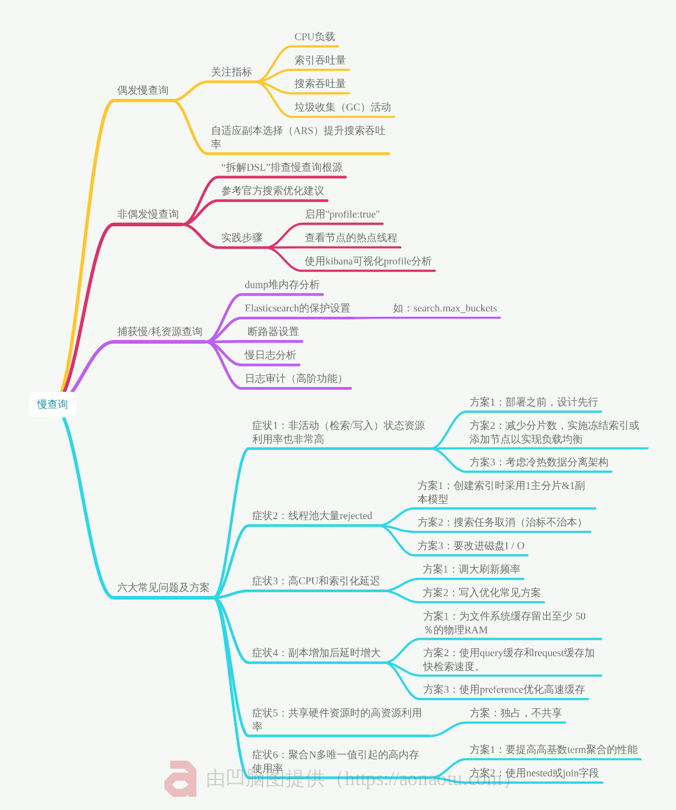
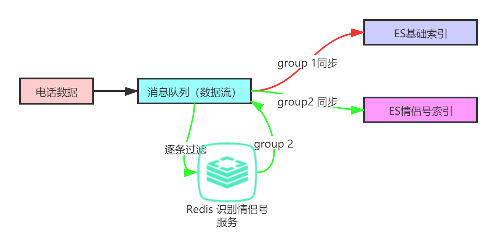
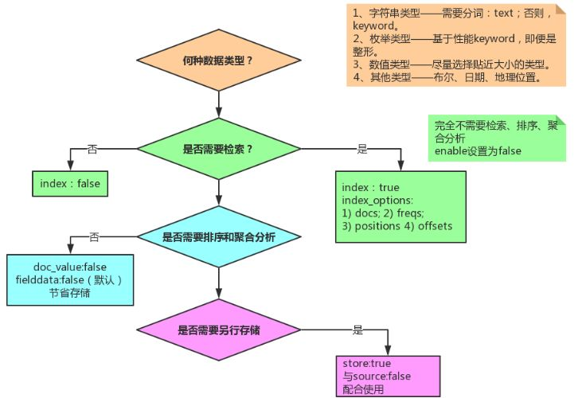
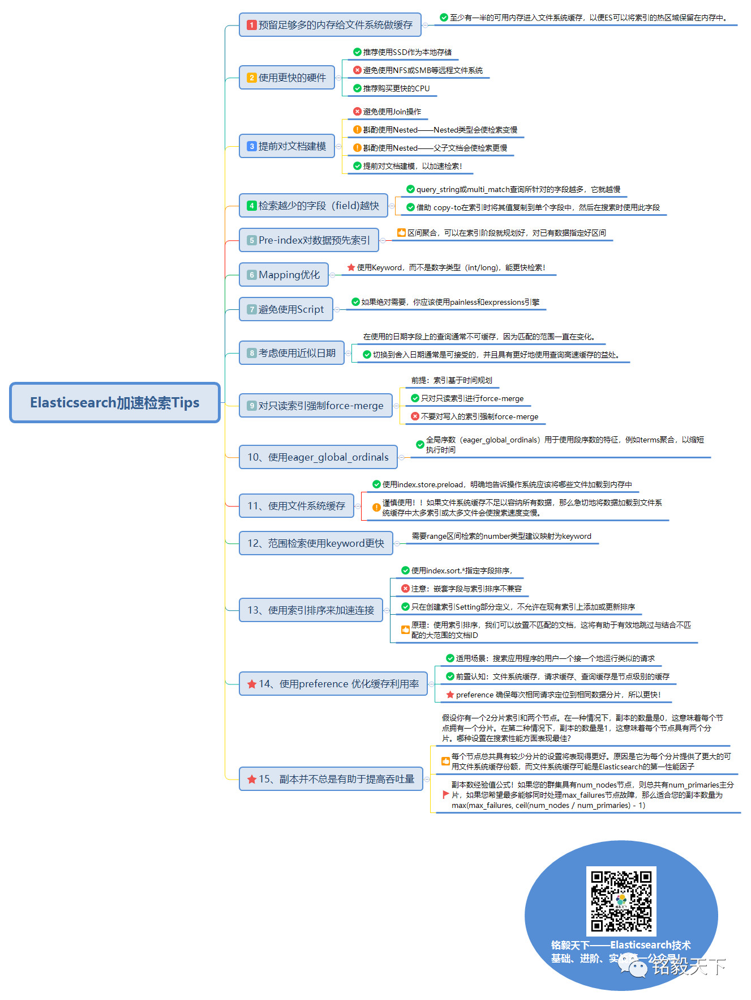
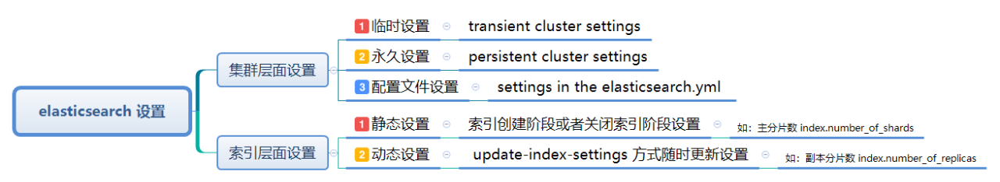

# API选型
1. 使用官方推荐的API, 版本及时更新, 新特性支持适配 
2. DSL开发推荐使用的 Kibana 的 Dev-tool, 非常高效、方便

# 核心操作
1. es存储检索字段, 方便快速检索、全文检索
2. Mysql存储所有字段, 使用 ACID 事务特性
3. 通过关联字段简历关联, news_id 在 es 和 mysql 中有相同的值
4. 核心数据通过 es 快速获取 id, 再通过 mysql 二次查询

# 注意词典的选择与更新
即便添加了行业、领域词典, 也涵盖不全新词怎么办, 分词器作为插件, 原始词典一旦配置, 是不支持动态更新的, 需要借助第三方机制实现  
IK 词典的动态更新实现机制: 结合修改 IK 分词器源码 + 动态更新 mysql 词条达到更新词典的目的

# Mapping 环节
1. text 类型的 fielddata 是内存耗费大户, 除非必须, 不建议开启
2. 根据是否需要排序或者聚合决定是否启用 keyword 类型
3. 不需要索引的字段, “index”设置为“false”
4. 不需要存储的字段, “store”设置为“false”
5. 大文本如 word, pdf 文本信息, 考虑切分成小的片段后存储

## query、filter、must、should、must_not 区别:

- query: 会进行相关性算分, 有score返回, 不可缓存
- filter: 不会进行相关性算分, 可利用缓存来提高检索速度和性能, 返回的 score 都是 0, 创建一个文档匹配过滤器的位集 bitset, 文档匹配就是1, 否则是0, 使用相同过滤器执行查询重用信息
- must: 必须匹配评分查询效率低无缓存
- should: 选择性匹配, 至少满足一条, 评分
- must_not: 过滤子句, 必须不能匹配, 但不评分
- terms: 搜索词组, 匹配一个值, 且输入的值不会被分词器分词
- match_phase/match_phrase_prefix: 匹配所有的字段要与之有相同顺序, 要完整匹配才能检索到, 短语匹配, 查准率高、召回率低
- match: 模糊匹配, 对分词后的结果查询, 只要包含查询条件的一部分就会返回, 先分词然后再匹配, 结果带上本次关联度, 用 score 表示关联度
- multi_match: 会首先把你输入的关键词进行切分后再检索, 查全率高, 召回率高但准确率低
- wildcard 模糊匹配, 除非必须, 不建议使用
- 对于检索不到的词语, 可以配置 1 个 keyword 字段, 1 个 text 字段

> score 指的是:模糊查询计算匹配到的 word 和原来的 word的相似度, term 查询会包含找到该 term 所占的百分比。一个document本身没有发生变化,
> 但是index发生变化, 就会影响匹配到document的sorce

# 追求机制响应速度
1. 加大数据节点的内存和堆内存的配比
2. _source 字段非必要不返回
3. 不在检索返回阶段做复杂的业务处理
4. wildcard 或者 regex 正则检索
5. 自定义高亮 当文件大于 1mb (大文件) 适合 fast-vector-highlighter 高亮方式 
6. 深度分页 from size 10000, 扩大 max_result_window (最大查询窗口)值

# 倒排索引分段
1. ES 默认 5 个主分片, 1 个副本分片, 副本就是用来故障转移, 增加吞吐量
2. translog 日志文件, es 每次写入数据同时写 translog 日志
3. 倒排索引不可变, 避免了数据不一致的问题, 索引没设置好就要重新设置
4. 分段不可变, 更新文档就是将旧的文档标记删除, 新文档编制索引, 合并后清除已删除文档

# ElasticSearch 写入步骤
1. 新 document 首先写入内存 Buffer 缓存中
1. 每隔一段时间, 执行 commitpoint 操作, buffer 写入新 Segment 中
1. 新 segment 写入文件系统缓存 filesystem cache
1. 文件系统缓存中的 index segment 被 fsync 强制刷到磁盘上, 确保物理写入, 新 segment 被打开供 search 操作
1. 清空内存buffer, 可以接收新的文档写入

# 热点线程 hot_threads
1. 集群响应比 CPU 使用率高的时候, 需要排查问题, es 监视热线程, 热线程(hot threads)是占用大量 CPU 执行时间的线程
2. 查询 <b>GET /_nodes/hot_threads</b>    <b> GET /_nodes/<node_id>/hot_threads</b>

### hot_threads API 原理
1. es 接收所有正在运行的线程, 并收集每个线程所花费的 CPU 时间、特定线程被阻塞或处于等待状态的次数、被阻塞或处于等待状态的时间等各种信息
2. 等待 interval 后, es 再次收集相同信息, 根据运行时间 (降序) 对热点线程排序
3. 针对 type 参数指定的给定操作类型统计的
4. es 分析前 threads 个线程, 每隔几个毫秒驳货线程堆栈跟踪的快照(由快照参数snapshot指定)
5. 对对阵跟踪进行分组以可视化展示线程状态的变化

# es线程池和队列
**线程池含义:** es 使用线程池管理请求并优化集群中节点上资源使用, 主要线程池包括搜索(search), 获取(get)和写入(write)

kafka 消费数据导入 es 时, 批量 bulk 写入抛异常被拒绝, es集群四个节点, 两个节点 node1 和 node4 thread pool bulk rejected 30w条数据
1. es bulk thread pool 线程数是8, 队列200
2. kafka 写线程池 thread 数量 2*cores+cores/2 
3. 队列数是 3

**问题:** 大量日志写入造成队列满了, 集群直接拒绝写入, 可以修改默认值、扩大队列, 根据业务后续持续观察队列大小

**分析:** 使用以下命令可以看到线程池全貌, 比如每个节点不同的线程池、线程池大小和类型, 哪些节点拒绝了操作, 根据每个节点检测到的线程数自动配置线程池参数

### 线程池类型
1. Fixed类型: 固定数量线程池
2. Scaling类型: 可变数量的线程, 根据工作负载自动调节线程大小 介于core到max
3. fixed_autoqueue_size线程: 固定数量的线程, 队列大小动态变化保持目标响应时间

### 线程池使用举例
哪些线程CPU利用率高或花费时间最长, 有助于排查性能问题

````shell
GET /_nodes/hot_threads
````

1. 必要时设置processors, 线程池是根据 es 检测的线程数设置的
2. 线程池关联队列设置, 请求存内存, 队列有限制大小, 超过了就会拒绝
3. 加强监控, 借助kibana stack monitoring 可视化监控指标更好的了解 es 集群性能, 包括总试图, 节点试图, 索引试图等监控
4. 写入bulk值要递进步长调优不要太快, 一下调大会引起reject, 先写100, 索引200个, 再索引400个, 慢慢递增

**总结:** 写入 reject、“429  too many requests” 等都是非常常见的错误, 问题多半和线程池和队列大小有关系, 需要结合业务场景进行问题排查。

### 批量写入 ES 数据, 大量文档状态变成 deleted
1. 批量插入到数据库的主键, 用 cerebro 看大量文档状态是 deleted, 数据库没有重复。
2. 更新、删除操作再原文档版本号+1, 没执行一次版本号+1, 原来老版本文档标记为 deleted 状态, 重复写入也会有文档标记为 deleted
3. **文档删除:** 删除文档是逻辑删除而不是物理删除, 需要从段合并 (force_merge) 实现, 清除标记为 deleted 文档
4. 问题是如果文档越删除越多, 历史冷数据批量或者全量删除, 可以借助删除索引来删除改索引下的数据 
5. **索引删除:** 文档删除和索引删除不同, 索引都是物理删除, 分为两个步骤, 
  1. 更新集群  
  2. 分片从磁盘删除

总结: 相同的id文档数据被频繁写入, es会做覆盖处理, 原有文档标记为已删除, 插入一条文档, 手动执行下 force merge 操作, deleted 文档就没有了

# 别名(Mapping)功能
1. 一个索引和另一个索引的切换
2. 多个索引分组组合
3. 索引文档上子集创建视图

### 索引别名的好处
1. 简化从es中删除数据的过程
2. 在没有任何停机时间情况下从es删除最旧的数据, 不会出现任何查询中断, 不会进行任何客户端更改
3. 时间索引机制, 间隔周期, 文档条数, size 值满足一个条件就索引滚动更新比如index_2019-01-01-000001 - 000003
4. 删除索引数据只能用delete by query,   只是逻辑删除, delete by query后, 磁盘空间不降反升, 检索效率很低

### 别名使用方式:
1. 基于时间创建索引(比如近一年, 近三个月, 近一个月, 近一周, 近三天)
2. 使用filter别名或者路由别名, 提升效率

# 模板
- 业务场景一: 数据量非常大, 需要进行索引生命周期管理, 按日期划分索引, 多个索引 mapping 一致
- 业务场景二: 实际业务多个索引, 多个索引相同名字字段类型完全一致, 实现跨索引检索

**模板=template** 单一索引, 静态明确定义, 系统层面自动识别, 动态匹配  
**映射=mapping** 一个或多个索引, 定义mapping全支持外, 可以指定setting、别名, 适合数据量大、灵活多变的业务场景, aliases指定别名  

# 基础认知
1. text不能用于聚合, text字段不能用于doc_values
2. doc_values保存一列数据, 加快聚合排序速度
3. filed data保存某一列加快聚合排序速度, 读取每一个 segment 片段反向索引来构建的, 保存的是 term 分词后的 terms, 而不是源字段数据。text 字段默认关闭 field data 会消耗很多堆空间

# 慢查询
1. 思路1: 索引层面: 8亿条分散到多个索引、多个副本当中, 还是一个索引
2. 思路2: Mapping映射设计层面: 举例, 设计高效检索Number类型建议改成keyword。 详细参考携程架构师的文章: number?keyword?傻傻分不清楚
3. 思路3: 检索DSL优化层面: 注意: 能使用filter过滤检索的就不要使用query, 原理参考我之前梳理的文章:  吃透 | Elasticsearch filter和query的不同
4. 思路4: 返回字段层面: 有没有检索的使用_source:""  限定返回的字段,  如果没有, 会全字段返回, 数据量大的话, 也会慢
5. 思路5: DSL 调试: 调试方法: DSL执行语句中加上profile:true 或者借助: xpack可视化插件排查。 这样, 会打印出对应查询的细节花费时间, 让你明明白白知道那里慢了
6. 思路6: 日志查询: 查询的时候, 查询ES日志, 看看有没有大量的gc。 看看有没有错误日志, 错误日志的处理就是优化的方向
7. 思路7: 借助cerebro或者xpack mointer监视集群状: 看一看, 集群堆内存、cpu、负载的使用情况
8. 思路8: 外部思维: 想一想, 查询的时候, 有没有并行的写入操作？ 那么查询的时候慢, 是不是写入压力大队集群造成的影响
9. 思路9: 排除网络慢的原因: 内网查询还是外网映射查询, 返回时间也不一样
10. 思路10: 其他问题: 结合业务场景进行分析, 自己的业务代码逻辑的问题。 一定要转成 DSL 进行最小化定位

**慢查询指标**
1. CPU负载
2. 索引吞吐量
3. 搜索吞吐量
4. 垃圾收集（GC）活动
5. 搜索线程池队列大小



# 数千万个手机号识别情侣号？

### 方案1:
1. 初次遍历, 索引是手机号+时间戳, 满足后八位相同的加上标记flag = 1
2. 循环步骤1, flag = 1的直接跳过, 直到所有手机号遍历一次
3. flag = 1的字段, reindex到情侣号索引

### 方案2:
1. 基于时间分片, 以30min为单位切割千万级数据
2. 取出最小时间, 插入最大时间, 根据数据规模分区
3. 执行当前/下一区间数据, terms聚合获取情侣号或_Id, 返回key(手机号后8位), value(相同后8位数据量)。top_hits子聚合取出手机号详情
4. reindex把步骤3的所有_id以json解析识别出来, 记录最大创建时间
5. 如果4的最大创建时间小于最大插入时间, 那就重复3

### 方案3:


1. 电话数据信息写入消息队列(kafka)
2. 消息队列同步到ES的phone_index索引
3. 情侣号的处理借助redis服务实现, 逐条过滤, 满足条件的同步到ES情侣号索引phone_couple_index

### 问题, 手机号怎么存才能查后8位？
1. wildcard模糊匹配, 效率低
2. ngram分词+match_phrase处理, 效率高, 但要独立存储后8位字段

# 实战

### 情侣号:
**数据结构:**
- insert_time date(ingest 默认生成, 不要手动添加, ingest pipeline核心功能可以理解为ELT)
- phone_number text和keyword类型(text基于ngram分词, 方便phone_number全文检索, keyword方便排序和聚合)  即便kd-tree性能高, 到树上走, 倒排索引相当于在内存定位文档id
- last_eight_number keyword(聚合排序用, 不检索)

**索引:**
1. phone_index: 存储全部手机号
2. phone_couple_index: 存储情侣号

### 副本和分片设计:
**索引设置多少分片？**
shard官方推荐是20-40GB, ElasticSearch对分片的隔离和迁移是以分片为单位进行, 分片太大增大迁移成本。
设计上要预估好成本: 
1. 预估数据量规模, 一共存储多久数据, 每天新增多少数据, 两者相乘就是总数据量
2. 预估分多少个索引存储, 根据业务需要
3. 考虑衡量可扩展性, 预估需要搭建几台机器, 存储主要看磁盘空间, 每台机器2TB, 可用2TB  0.85(磁盘实际利用率)
4. 单分片大小最大设置30GB, 增量索引可结合大索引的设计部分一起规划
>> 分片数 = 索引大小/分片大小经验值 30GB
>> 分片数建议和节点数一致, 设计的时候两者权衡考虑 + rollover 动态更新索引结合

**索引设置副本?**
集群数据节点 >= 2,  副本至少设置1

**副本分片**
每个节点的分片数量保持在低于每 1 GB堆内存对应集群的分片在 20-25 之间。 因此, 具有 30GB 堆内存的节点最多可以有 600-750 个分片

**堆内存不要超过32g**
Lucene的性能依赖于与操作系统的这种交互。但是如果你把所有可用的内存都给了 Elasticsearch 的堆, 那么 Lucene 就不会有任何剩余的内存。这会严重影响性能, 取 min(宿主机内存大小的一半, 31GB)

### Mapping设计
1. 哪些字符串字段定义为全文检索字段
2. 哪些字段包含数字, 日期或地理位置
3. 定义日期值格式
4. 控制动态添加字段映射自定义规则
5. 万能模板 template



# 分词器
1. 使用ik分词器 + match_phrase短语检索
2. ik要装到所有机器
3. ik匹配不到怎么办? ik自带的词库 + 动态更新词库, 原生的词库分词量级小, 可用搜狗词库, 结合mysql + ik更新词库动态更新, 采用字词混合索引

# 慢查询优化
1. 索引慢速日志(index slow logs) : 索引文档/添加文档
2. 搜索慢速日志(search slow logs) : 慢查询重点关注
3. 启动 debug 级别日志, 然后慢查询搜索
4. 使用 Kibana profiling 工具
5. 使用 query-bool-filter 组合取代普通 query

# ElasticSearch优化的15个核心tips


# 通用优化
**doc values** 理解为正排索引, 通过文档查找关键词
1. 针对某field排序、聚合
2. 特定过滤
3. 针对特定字段 script 操作

**norms**
索引评分银子, 如果未按分数对文档排序, 可以禁用评分节省空间

**不要返回大结果数据集, 必要的话使用Scroll API**

**避免使用大文件**
默认的http.max+context_length设置未100MB, ElasticSearch拒绝索引任何大于该值的文档

**按照日期规划索引**
方便实现历史数据秒删, 对于冷热数据分开管理, 检索最近数据, 物理指定对应日期索引, 模板使用+ rollover API使用, 索引创建超过一定天数, 或者数量超过一定值, 或者大小超过5gb后

```shell
POST /logs_write/_rollover 
{
  "conditions": {
    "max_age":   "7d",  
    "max_docs":  1000,  
    "max_size":  "5gb"
  }
}
```

**用别名**
ES不像mysql那样随意更改索引名称, 用别名可以灵活选择

# 选举
ES内部维护集群通信, 不是基于zookeeper分发部署机制, 无需奇数, discovery.zen.minimum_master_nodes值设置为奇数避免脑裂

# 集群
1. 集群出现了红灯可以用reroute命令, 执行包含特定命令的集群路由重分配。
2. unassigned(未分配) 分片, 分片保持灰色
>>1. INDEX_CREATED: 由于创建索引的API导致未分配。
>>2. CLUSTER_RECOVERED : 由于完全集群恢复导致未分配。
>>3. INDEX_REOPENED : 由于打开open或关闭close一个索引导致未分配。
>>4. DANGLING_INDEX_IMPORTED : 由于导入dangling索引的结果导致未分配。
>>5. NEW_INDEX_RESTORED : 由于恢复到新索引导致未分配。
>>6. EXISTING_INDEX_RESTORED : 由于恢复到已关闭的索引导致未分配。
>>7. REPLICA_ADDED: 由于显式添加副本分片导致未分配。
>>8. ALLOCATION_FAILED : 由于分片分配失败导致未分配。
>>9. NODE_LEFT : 由于承载该分片的节点离开集群导致未分配。
>>10. REINITIALIZED : 由于当分片从开始移动到初始化时导致未分配（例如, 使用影子shadow副本分片）。
>>11. REROUTE_CANCELLED : 作为显式取消重新路由命令的结果取消分配。
>>12. REALLOCATED_REPLICA : 确定更好的副本位置被标定使用, 导致现有的副本分配被取消, 出现未分配。
3. 集群服务连接超时, 可能集群部分节点主分片未分配
4. 删除分片
5. 节点数量大于所有索引最大副本数量+1, 节点加入和离开集群, 主节点会重新分配分片
6. 集群处于黄色, 索引仍在工作, 数据全部可以被索引、搜索, 速度可靠性达不到预期, 可以手动或者自动重新处理这些问题, 使集群恢复绿色状态
7. 集群处于红色状态, 代表一个或多个索引缺少主分片, 无法索引、搜素或提供数据, 手动查找或者修复这些未分配的分片, 一旦索引数据丢失, 只能从快照或原始数据源重新创建索引
8. 节点宕机、磁盘空间(逼近警戒水位线85%、90%)造成集群的变化,  可以重启, 重选举
9. 查看索引出现问题的分片以及问题所在, 可以用explain看一下原因
>> 可以等待让es自动修复
>> 或者将副本设置为0, 删除所有副本, 使用以下API
```shell
PUT my_index_003/_settings
{
  "index": {
    "number_of_replicas": 0
  }
}
```
>> 手动分配分片, 借助reroute API
```shell
POST /_cluster/reroute
{
  "commands": [
    {
      "move": {
        "index": "test",   "shard": 0,  
        "from_node": "node1",   "to_node": "node2"
      }
    },  
    {
      "allocate_replica": {
        "index": "test",   "shard": 1,  
        "node": "node3"
      }
    }
  ]
}
```

# Es的设置层面:


### 节点分片恢复
**问题:** 新增节点后, shard 没有分配到新节点上。
1. 确定节点角色划分, 核实未分配节点类型, 主节点不参与分片落地存储
2. 关闭索引后代开, close 后 open 走重新分配机制
3. 独立创立新索引, 设置 3 副本, 主副本分配到不同节点
4. 原因是设置了节点踢出集群的设置, 因为节点离开集群就会触发 rebalance

# elasticsearch-head 无法查看列表怎么办
docker cp path/vendor.js {CONTAINERID}//usr/src/app/_site/vendor.js
```angular2html
这里面改变两个变量
```

# elastisearch 数据清洗

## 背景
```
以下两个链接是用户的行为, 不要限制空格
http://192.168.1.1/sr/6mm/
http://192.168.1.1/sr/6%20mm/
```

## 目的
让用户输入字符加空格或不加空格去适配写入的数据

## 方法
1. 写入前做好数据清洗, 去掉特殊字符、空格等, 即 ELT, 可以用正则表达式做
2. logstash 的话可以用 ruby 语言写类似的正则
3. 如果不用 logstash 处理, 也可以用 ingest 预处理, 借助脚本实现
   1. 方法一: 自定义分词的 character filter 环节借助 pattern replace 方式将空格转化为没有任何字符, 就相当于去掉了空格
   2. 方法二: 通过 character filter 环节的 Mapping 将空格字符等同于无字符处理, 就间接去掉了空格
4. elasticsearch 预处理有三种
   1. 写入前预处理 (相对复杂逻辑的清洗)
      1. logstash filter
      2. ingest pipeline
   2. Mapping或者模板阶段处理 (特殊字符、同义词、格式的清洗)
      1. character filter 字符级过滤
      2. token filter 分此后在过滤
   3. 其他方案 
      1. kafka stream 
      2. spark stream 
      3. flink