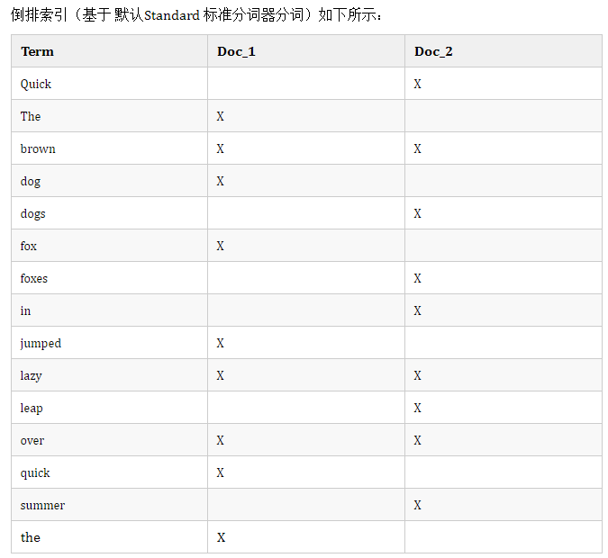

# ElasticSearch:

# 倒排索引:

**倒排索引:** 先对文本分词, key是分词, value 是文档 7 的 id 以及分词在文档的位置, 查找时可以快速通过分词获得文档的 id 和在文档中的位置,
从词出发, 记载词在哪些文档出现过----词典和倒排表, 基于 FST 数据结构

1. 空间占用小
2. 查询速度快

**实例如下:**  


**倒排索引的特点:**

文档值被序列化到磁盘, 我们可以依靠操作系统的帮助来快速访问。当工作集远小于节点可用内存, 系统自动将所有文档值保存到内存,
读写快速, 工作及远大于可用内存, 操作系统把 Doc Values 加载到系统页缓存, 避免 jvm 堆内存溢出异常

# Doc Values

doc values 相当于正排索引, 适合排序操作  
倒排是词项 -> 文档, 正排是文档 -> 词项    
需要排序、聚合、脚本计算、地理位置过滤的业务场景禁用 Doc Values 节约存储

# _source

_source字段包含在索引时间传递的原始 JSON 文档主体, 压缩大字段的内容, 为构建索引, 但已存储该字段。_source字段本身未构建索引,
已存储该字段, 以便在执行获取请求可以返回

**缺点:**

1. 导致索引内存储开销
2. 高亮操作

# store

某些场景下, 只要检索单个字段或者几个字段的值, 而不是整个_source值, 可以使用源过滤来实现,
比如新闻数据带有标题、日期、和大内容字段  
**缺点:**
启用会增加存储

# query

> + 搜索请求发送到某一个coordinate node协调节点, 会构建一个priority queue, 长度以paging操作from和size为准,
    默认是10（from+size不超过1w）
> + coordinate node将请求转发到所有的(包括主副节点)shard,每个shard本地搜索, 并构建一个本地的 priority queue
> + 各个shard将自己的priority queue返回给coordinate node,并构建一个全局的priority queue
> + 协调节点进行数据的合并、排序、分页等操作

# fetch:

> 协调节点根据 doc id 去各个节点上拉取实际的 document 数据, 最终返回给客户端。es默认是query then fetch
> 需要将每个shard的结果取回, 在协调结点进行全局排序。 通过From+size这种方式分批获取数据的时候, 随着from加大,
> 需要全局排序并丢弃的结果数量随之上升, 性能越来越差。

> 1. coordinate node协调节点构建完priority queue之后, 就发送mget请求去所有shard上获取对应的document
> 2. 各个shard将document返回给coordinate node
> 3. coordinate node将合并后的document结果返回给客户端。

# 段合并

refresh 会创建一个新的 segment, 导致短时间内 segment 数量暴增, 段数太多会带来比较大的麻烦, 每一个段都会消耗文件句柄内存和
cpu, 因为做查询或聚合的时候是要在每一个段里面查完事汇总, elasticsearch可以在后台用段合并来解决这个问题, 小段合并成大段,
大段合并成更大的

## Query Cache:

- Query Cache 也被成为 Filter Cache, 对一个查询中包含的过滤器执行结果进行缓存, 比如 term, terms, range 过滤器满足某种条件后被缓存,
  bool 过滤器不会被缓存

> 1. Node Query Cache: Node级别的缓存, 用于缓存 Filter 的 Query 结果, 基于 LRU 策略, 缓存满了去除最近最少使用的 Query
     Cache, 第一级是 Query, 第二级是 Segment
> 2. Field data Cache: 主要用于 sort 以及 aggs 字段, 把字段的值加到内存, 便于快速访问, field data cache 的构建非常珍贵,
     最好分配足够的内存来保证长时间被加载状态
> 3. Shard Request Cache: 默认缓存 size = 0 的请求, aggs 和 suggestions 和 hits.total, 采用 LRU 策略, 当分片索引 refresh
     时候, 数据发生变化就会失效

## query and fetch

query 是定位到位置, fetch 取数据向索引的所有分片(shard)都发出查询请求, 各分片返回的时候把元素文档(document)
和计算后的排名信息一起返回。因为相比下面的几种搜索方式, 这种查询方法只需要去 shard 查询一次, 但是各个
shard 返回的结果的数量之和可能是用户要求的 size 的 n 倍

## query then fetch（默认的搜索方式）

缺省搜索方式, 大概分两个步骤, 第一步, 先向所有的 shard 发出请求, 各分片只返回排序和排名相关的信息(注意, 不包括文档 document), 然后按照各分片返回的分数进行重新排序和排名, 取前 size 个文档。然后进行第二步, 去相关的 shard 取 document。这种方式返回的 document 与用户要求的 size 是相等的

> 数据少的时候用then fetch 数据多用and fetch

## scroll:

将doc id列表保存在上下文, 根据设置的size, 在每个shard内部按顺序排序, 分页查询的时候分片比较多, 索引非常大比如超过千万的情况下是不能用
query 和 fetch 的  
可以采用 scroll 游标, 将所有符合条件的结果缓存起来, 形成快照, 读的时候快照读, 写不会影响数据。游标可以增加性能,
不用每次搜索都重排序

## ES优化:

1. 写入速度优化
    0. 缺点 :牺牲可靠性和实时性
    1. 加大 translog flush 间隔
        1. 默认: 请求一次flush一次 index.translog.durability : request
        2. 手动:
            1. index.translog.durability: async
            2. index.translog.sync_interval: 120s
            3. index.translog.flush_threshold_size: 1024mb
    2. 加大索引刷新间隔
        1. 默认: 1秒
        2. 手动: index.refresh_interval : 120s
    3. 段合并优化
        1. index.merge.scheduler.max_thread_count
        2. index.merge.policy.*
    4. 索引缓存
        1. indices.memory.index_buffer_size
    5. 批量并发写入
    6. 磁盘间均衡的分配任务
        1. 轮询
        2. 根据可用空间加权轮询
    7. 节点间任务均衡, 均衡的写入到各个节点
    8. 索引优化
        1. 自动生成doc id
        2. 调整字段:
            1. 减少字段数量
            2. 不需要分词的字段不分词
            3. 选择合适的分词器
            4. 减少字段内容长度
            5. 不需要评分禁用 Norms
        3. 禁用 _all
2. 搜索速度优化
    1. 为系统缓存预留一半的物理内存
    2. 使用固态硬盘, 提高IO能力
    3. 合理文档建模, 避免嵌套
    4. 只读索引合并为单个分段
    5. 预加载文件系统
    6. 优化查询表达式
    7. batched_reduce_size: 指定数量的分片结果返回后可以处理一部分
    8. 使用近似聚合
    9. 选择聚合方式: 深度优先(默认) 或 广度优先
    10. 限制请求的分片数: action.search.shard_count
    11. 利用自适应副本ARS提升响应速度
    12. 字段映射, 如标识符映射为keyword
    13. 避免使用脚本
    14. 优化日期搜索: 日期四舍五入

# Es写入优化

1. 加大 index refresh 间隔, 除了降低 IO, 更重要的是降低了 segment merge 的频率
2. 加大 translog refresh 间隔, 目的是降低 iops、writeblock
3. 调整 bulk 请求, 控制每次 bulk 请求提交的量
4. 优化磁盘间的任务均匀情况, 将 shard 尽量均匀分布到机器的各个磁盘
5. 优化节点间的任务分布, 将任务尽量均匀地发布到各节点, 避免单点阻塞问题
6. 优化 Lucene 层建立索引的过程, 目的是降低 CPU 占用率及 IO, 例如, 禁用_all字段

## ES优化实践:

> 实践
>> 慢查询
>>> 1. 关闭swap
>>>2. 设置oom killer, oom_score_adj
>>>3. 分片数量 shard数量与节点数有关系
>>>4. 分片文档数量不超过10亿
>>>5. 副本数量, 推荐为1个
>>>6. 检查是否禁用_all, _all字段是把所有其它字段中的值, 以空格为分隔符组成一个大字符串, 然后被分析和索引, 但是不存储,
      能被查询,可提升1倍以上的写入性能, 只要是没有一次匹配查询所有字段, 就可用禁用
>>>7. 检查是否已经批量写
>>>8. 刷新时间设厂点可以提高写入速度
>>>9. 设置可缓存 [三种缓存](https://www.jianshu.com/p/e8fd5c31c020)
>>>10. 调整为均匀写
>>>11. 查询语句和查询范围优化
----
> > 慢写入:
>>> 1. 设置合适的字段类型
>>>2. 检查字段是否启用norms 和 doc_values
>>>3. 重刷数据的时候, 调整刷新时间和副本数量
>>>4. 均匀写入
>>>5. 批量写入（最常用的手段）
>>>6. 增加refresh实践间隔（最常用的手段）
>>>7. 异步写
>>>8. 避免同一个索引的shard分配到同一个节点
>>>9. disable _all _all字段是把所有其它字段中的值, 以空格为分隔符组成一个大字符串, 然后被分析和索引, 但是不存储,
      能被查询,可提升1倍以上的写入性能, 只要是没有一次匹配查询所有字段, 就可用禁用,可提升1倍以上的写入性能,
      只要是没有一次匹配查询所有字段, 就可用禁用
>>>10. 禁用_source, 把大字段的内容存在Elasticsearch中只会增大索引, 这一点文档数量越大结果越明显, 如果一条文档节省几KB,
       放大到亿万级的量结果也是非常可观的。选择压缩文档的_source。这实际上就是整行日志——所以开启压缩可以减小索引大小被内存大小和磁盘速度限制的时候,
       压缩源文件可以明显提高速度, 相反的, 如果受限的是CPU计算能力就不行了
>>>11. search_after和scroll可以解决深度分页问题, 但是最好还是不要使用, 是一种假分页方式, 根据上一页的最后一条数据来确定下一页的位置,
       同时在分页请求的过程中, 如果有索引数据的增删改查, 这些变更也会实时的反映到游标上。为了找到每一页最后一条数据,
       每个文档必须有一个全局唯一值, 官方推荐使用 _uid 作为全局唯一值, 但是只要能表示其唯一性就可以。

## Index Sorting 原理:

倒排索引默认按照自增 id 排序, 大部分检索数据时, 需要遍历倒排索引所有的 docID, 对当前 document 数据解析, 当希望对某个
Field 做预排序,
仅仅知道 TopN 时, 需要遍历倒排索引所有的数据, 因为每个 Field 都是无序的,
只有遍历所有的数据才知道哪个是 TopN, 但是这样就有很大的性能问题, Es 通过 Index Sorting 对索引里的数据做排序, 不仅仅是倒排索引,
segment 里的所有数据都是, 包括正向索引, docValues 倒排索引等等, 按照指订的 Field 和 ASC/DESC 排序, 检索时的排序方式契合
Index Sorting 形式, 不统计命中总数, 不计算最大评分,
就取 TopN 数据

- 预排序:设置好排序字段, top k就每个segment 只取出前 k 个文档进行比较.
- index.sort.field: 对应排序的 Field, 可指定一个或者多个 Field, 优先按第一个排序, 相同的情况下在按后续的 Field 排序
- index.sort.order: 对应 Field 的排序规则, 只能时 ASC 或者时 DESC
- index.sort.mode: 当对应的 Field 是数组时, 取 Max 或者 Min 的值作为排序的基准
- index.sort.missing: 当对应的 Field 为 null 时, 排第一个还是最后一个

```json
// index Sorting
PUT events
{
  "settings": {
    "index": {
      "sort.field": [
        "timestamp",
        "age"
      ],
      "sort.order": [
        "desc",
        "desc"
      ]
    }
  },
  "mappings": {
    "properties": {
      "timestamp": {
        "type": "date"
      },
      "age": {
        "type": "integer"
      }
    }
  }
}
```

## es写数据原理:

> + 客户端选择一个 node 发送请求过去, 这个 node 就是 coordinating node（协调节点）。生成 docid coordinating node 对
    document 进行路由, 将请求转发给对应的 node（有 primary shard）。实际的 node 上的 primary shard 处理请求, 然后将数据同步到
    replica node。coordinating node 如果发现 primary node 和所有 replica node 都搞定之后, 就返回响应结果给客户端
> + 刷盘:每 1s 刷新一次到内部 buffer 然后刷新到 os cache 中, translog 达到一定长度的时候, 就会触发 commit 操作
> + 生成 docId, docId 是文档在 ES 集群中的唯一标识, 默认的生成策略是基于时间戳 UUID 的 Base64 编码

## translog 日志文件的作用是什么？

你执行 commit 操作之前, 数据要么是停留在 buffer 中, 要么是停留在 os cache 中, 无论是 buffer 还是 os cache 都是内存,一旦这台机器死了,
内存中的数据就全丢了。所以需要将数据对应的操作写入一个 专门的日志文件 translog 中, 一旦此时机器宕机,
再次重启的时候, es 会自动读取 translog 日志文件中的数据, 恢复到内 存 buffer 和 os cache 中去。如果 segment 落盘失败,
就不会发生 commit 提交操作, ES 就会从 translog 的上一个 commit 点进行恢复
translog 其实也是先写入 os cache 的, 默认每隔 5 秒刷一次到磁盘中去, 数据写入 1 秒后可以搜索到; 可能会丢失数据的。 有 5
秒的数据, 停留在 buffer、translog os cache、segment file os cache 中, 而不在磁盘上, 此时如果宕机, 会 导致 5 秒的数据丢失。
用作 nosql 的时候可以直接从 translog 中读取数据 用 getById

## es删除操作:

默认情况下是 1 秒钟一个 segment file, 这样下来 segment file 会越来越多, 此时会定期执行 merge。每次 merge 的时候, 会将多个
segment file 合并成一个, 同时这里会将标识为 deleted
的 doc 给物理删除掉, 然后将新的 segment file 写入磁盘, 这里会写一个 commit point, 标识所有新的 segment file, 然后打开
segment file 供搜索使用, 同时删除旧的 segment file

## es查询操作:

可以通过 doc id 来查询, 会根据 doc id 进行 hash, 判断出来当时把 doc id 分配到了哪个 shard 上面去, 从那个 shard
去查询。客户端发送请求到任意一个 node, 成为 coordinate node,
coordinate node 对 doc id 进行哈希路由, 将请求转发到对应的 node, 此时会使用 round-robin随机轮询算法, 在 primary
shard以及其所有 replica 中随机选择一个, 让读请求负载均衡接收请求的 node 返回 document
给 coordinate node。coordinate node 返回 document 给客户端

## 方案:

> mysql-es同步, 数据一致性怎么保证？
> 1) 注意不能用定时任务, 因为如果mysql有很多订单, 有的数据要update, 那这样数据怎么定时任务补偿,
> 2) 也不要用mq, 因为mq可能存在丢数据的现象
> 3) 比较好的方案是用canel订阅binlog 实现mysql和es同步

> 查询慢？

1. 大量业务日志文件, 如 Kuberneters 的日志和 docker 的日志很少, mapping 是 text+keyword 手动修改一下
1. 每个分片数据要少一点 20GB 以下
1. 构建索引时会对开启 docvalues 的字段, 额外构建一个已经排好序的文档到字段级别的一个列式存储映射, 它减轻了在排序和分组时,
   对内存的依赖, 而且大大提升了这个过程的性能, 当然它也会耗费的一定的磁盘空间

### 应用方面

1. 需要聚合的字段, 包括sort, agg, group, face等
2. 需要提供函数查询的字段
3. 需要高亮的字段, 这个确实能加速, 但并不建议把高亮放在服务端程序做, 建议放在前端实现, 不容易出错而且总体性能比服务端高
4. 需要参与自定义评分的字段, 这个稍复杂, 大多数人的场景中, 不一定能用到, 后面会单独写一篇文章介绍
5. 对于不需要参与上面任何一项的字段, 可以选择关闭 docvalues, 这样可以节省一定的磁盘空间

[docValues](http://doc.okbase.net/qindongliang1922/archive/227908.html)

# 业务数据写道ElasticSearch:

flink 消费 kafka bulk 到 ElasticSearch

## 慢查询排查

application.yml 文件里配置一下参数超时时间 logstash 也配置一下 如果记录的 30s 耗时是 ES response 里的 took 给出的,
那就是查询耗时了这么久。 一个可能的原因是当时ES压力大,
查询线程都在忙, Search threadpool 的队列里有堆积了。 根据经验, ES端的慢查询记录的是查询从开始执行到结束之间的时间,
在线程池队列里等待的时间不计算在内。 所以排查一下慢查询时间点,
服务器的CPU, load average消耗情况, 是否有资源消耗高峰, 另外查询线程池的队列大小也有必要做监控

[慢查询监控](https://elastic.blog.csdn.net/article/details/83048087?spm=1001.2101.3001.6650.2&utm_medium=distribute.pc_relevant.none-task-blog-2%7Edefault%7ECTRLIST%7Edefault-2.no_search_link&depth_1-utm_source=distribute.pc_relevant.none-task-blog-2%7Edefault%7ECTRLIST%7Edefault-2.no_search_link&utm_relevant_index=5)

可能情况:

1. 单条索引数据有多个, 存不存在大的字段信息？
2. 将扫描件PDF文档、Word、Excel、PPT等文档内容导入Elasticsearch, 文档可识别的文件大小为 3MB-5MB, 存入后是 content 字段大文件,
   检索效率低, 耗时30s以上
3. 搜索引擎返回的前面都是相关度最高的, 也是用户最关心的信息, Elasticsearch 的默认支持的数据条数是10000条,
   可以通过 post 请求修改。当 Elasticsearch 响应请求时, 它必须确定 docs 的顺序, 排列响应结果。页数较大时, 比如请求第100页,
   Elasticsearch 不得不取出第 1 页到第 100 页的所有 docs, 再去除第 1 页到第 99 页的 docs, 得到第 100 页的 docs
4. 运用scroll机制, 使用 scroll 可以模拟一个传统数据的游标, 记录当前读取的文档信息位置。这个分页的用法, 不是为了实时查询数据,
   而是为了一次性查询大量的数据
5. 原因分析: 卡顿、卡死都是堆内存不足导致, 根据之间总结的高性能配置建议, 果断加堆内存, 由 16 GB增加到最大值 31 GB
6. 禁用 _source, 取消高亮处理, 或者改为用 postings 高亮方式, 速度快, 不需要对高亮的文档再分析。文档越大, 获得越高性能
7. 或者使用 fast-vector-highlighter 高亮模式
8. 海量数据存ES里面的话, 使用索引设置 index.max_terms_count 更改特定索引的此默认最大值
9. 少用模糊查询, 正确建立分词, 大文件高亮采取 fvh 模式
10. keyword 字段或者提前预处理, 数据有共同特征, 打上 tag

## 索引命名规范:

> 1. 索引命名规范:index-{行业}-{业务}-{版本}
> 2. 别名命名规范:index-{行业}-{业务}
     [ElasticSearch设计索引](https://www.cnblogs.com/zsql/p/14418018.html)

## ELK:

logstash 里面 output 配置下 kafka 和 elasticsearch

[Es在互联网公司的实践](https://blog.csdn.net/zl1zl2zl3/article/details/105158170)

现在导致数据被删除的情况应该是 a 表和 b 表的主键 id 重复, es 默认 mysql 中的 id 为主键 并且 document 的_id 和id保持一致,
导致a表中的数据被删除掉了(替换掉了)

## EFK:

主流的 ELK（Elasticsearch, Logstash, Kibana）目前已经转变为 EFK（Elasticsearch, Filebeat or Fluentd, Kibana）比较重,
对于容器云的日志方案业内也普遍推荐采用 Fluentd, 与此同时我也推荐大家了解下 Grafana Loki

# Es调优策略:

#### 索引静态配置:

- index.number_of_shards: 索引分片的数量。在ES层面可以通过es.index.max_number_of_shards属性设置索引最大的分片数, 默认为1024,
  index.number_of_shards的默认值为Math.min(es.index.max_number_of_shards,5), 故通常默认值为5
- index.shard.check_on_startup :
  分片在打开之前是否应该检查该分片是否损坏。当检测到损坏时, 它将阻止分片被打开。可选值:false:不检测; checksum:
  只检查物理结构; true:检查物理和逻辑损坏, 相对比较耗CPU; fix:类同与false, 7.0版本后将废弃。默认值:false
- index.codec : 数据存储的压缩算法, 默认值为LZ4, 可选择值best_compression , 比LZ4可以获得更好的压缩比(即占据较小的磁盘空间,
  但存储性能比LZ4低)
- index.routing_partition_size : 路由分区数, 如果设置了该参数, 其路由算法为:(hash(_routing)  + hash(_id) %
  index.routing_parttion_size  ) %
  number_of_shards。如果该值不设置, 则路由算法为 hash(_routing) % number_of_shardings, _routing默认值为_id

#### 索引动态配置:

- index.number_of_replicas : 索o引复制分片的个数, 默认值1, 该值必须大于等于0, 索引创建后该值可以变更
- index.auto_expand_replicas : 副本数是否自动扩展, 可设置(e.g0-5)或(0-all)
- index.refresh_interval : 执行刷新操作的频率, 该操作使对索引的最新更改对搜索可见, 默认为1s, 可以设置为-1以禁用刷新
- index.max_result_window : 控制分页搜索总记录数, from + size的大小不能超过该值, 默认为10000
- index.max_inner_result_window : 从from+ size的最大值, 用于控制top aggregations, 默认为100, 内部命中和顶部命中聚合占用堆内存,
  并且时间与 from + size成正比, 这限制了内存
- index.max_rescore_window : 在rescore的搜索中, rescore请求的window_size的最大值
- index.max_docvalue_fields_search : 一次查询最多包含开启doc_values字段的个数, 默认为100
- index.max_script_fields : 查询中允许的最大script_fields数量。默认为 32
- index.max_ngram_diff : NGramTokenizer和NGramTokenFilter的min_gram和max_gram之间允许的最大差异。默认为1
- index.max_shingle_diff : 对于ShingleTokenFilter, max_shingle_size和min_shingle_size之间允许的最大差异。默认为3
- index.blocks.read_only : 索引数据、索引元数据是否只读, 如果设置为true, 则不能修改索引数据, 也不能修改索引元数据
- index.blocks.read_only_allow_delete : 与index.blocks.read_only基本类似, 唯一的区别是允许删除动作
- index.blocks.read : 设置为true以禁用对索引数据的读取操作
- index.blocks.write : 设置为true以禁用对索引数据的写操作（针对索引数据, 而不是索引元数据）
- index.blocks.metadata : 设置为true, 表示不允许对索引元数据进行读与写
- index.max_refresh_listeners : 索引的每个分片上当刷新索引时最大的可用监听器数量。这些侦听器用于实现refresh=wait_for
- index.highlight.max_analyzed_offset : 高亮显示请求分析的最大字符数。此设置仅适用于在没有偏移量或 term vectors
  的文本字段时。默认情况下, 该设置在6中未设置x, 默认值为-1
- index.max_terms_count : 可以在terms查询中使用的术语的最大数量。默认为65536
- index.routing.allocation.enable Allocation机制, 其主要解决的是如何将索引在ES集群中在哪些节点上分配分片(
  例如在Node1是创建的主分片, 在其他节点上创建复制分片)
  举个例子, 如果集群中新增加了一个节点, 集群的节点由原来的3个变成了4 可选值:

> > all 所有类型的分片都可以重新分配, 默认
> > primaries 只允许分配主分片
> > new_primaries 只允许分配新创建的主分片
> > none 所有的分片都不允许分配

- index.routing.rebalance.enable 索引的分片重新平衡机制。可选值如下:

> > all 默认值, 允许对所有分片进行再平衡
> > primaries 只允许对主分片进行再平衡
> > replicas 只允许对复制分片进行再平衡
> > none 不允许对任何分片进行再平衡

- index.gc_deletes : 文档删除后(删除后版本号)还可以存活的周期, 默认为60s
- index.max_regex_length : 用于正在表达式查询(regex query)正在表达式长度, 默认为1000
- index.default_pipeline : 默认的管道聚合器

#### 其他参数:

index.merge.scheduler.max_thread_count: 用于单个分片节点合并的最大线程数量, 默认值为:
Math.max(1, Math.min(4,Runtime.getRuntime().availableProcessors() / 2)), 如果是非SSD盘, 该值建议设置为1

translog:

- index.translog.durability :
  translog 刷盘方式, 可选值: request、async。request, 即每请求一次刷盘, 也就是客户端发起一个增删改操作时,
  会在主分片与复制分片全部刷盘成功后, 才会返回成功, 是ES的默认模式。
  async: 异步刷盘模式, 此模式刷盘频率由index.translog.sync_interval设置, 其默认值为5s, 该模式会存在数据丢失的可能
- index.translog.sync_interval : 如果index.translog.durability设置为async, 用该值来设置刷盘的频率, 默认为5s
- index.translog.flush_threshold_size : es强制刷新的另外一个维度, 如果translog的大小达到该值,
  则强制将未刷盘的数据强制刷新到Lucene中（类比一下关系型数据库的数据文件）, 默认512mb
- index.translog.retention.size : 保存跨日志文件的总大小。也就是一translog日志文件flush后, 并不马上删除, 而是保留一段时间,
  但最新的translog文件已存储的内容与待删除的文件的间隔不超过该参数设置的值, 默认为512M
- index.translog.retention.age : 保存translog文件的最大持续时间, 默认为12 h

# 线上问题:

1. 5kw条数的索引, 占用达到 100g, 过去才30g   
   解决: 做段合并去排查问题, 是不是更新数据导致版本覆盖的问题
2. 海量数据 170 多亿日志文档, 按照用户过滤条件, 按用户过滤条件, 按日志级别进行terms分组, 每个分组进行日期直方图聚合,
   日志量很大, 用户选择的日期范围   
   解决: 基于索引的生命周期管理, 基于时间切分索引, 将给定的基于时间查询, 限定到给定时间范围内的索引去查询, 滚动索引一般可以与索引模板结合使用,
   实现按一定条件自动创建索引  
3. flink有个头疼的问题就是默认是 UTC 时区, 不可修改, 以前es也遇到这个问题
   参考[es的utc时区问题](https://mp.weixin.qq.com/s/gBY7uNSjy-4fux0cf3rBDg) 建议可以在写入前进行处理, 或者是读出来的时候指定时区即可
4. 垃圾回收器, 官方建议用 cms
5. logstash 从 mysql 同步数据到 es, 按照自己公司的配置与数据量大小进行性能测试, mysql 里面存不同数据量的数据, 然后看 logstash 的性能曲线, kibana 可以看
6. 能用 filter 都用 filter, 减少 score 的查询, must 换 filter

