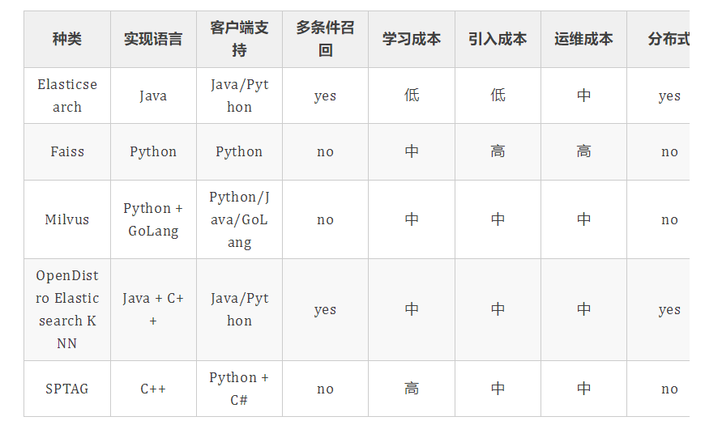
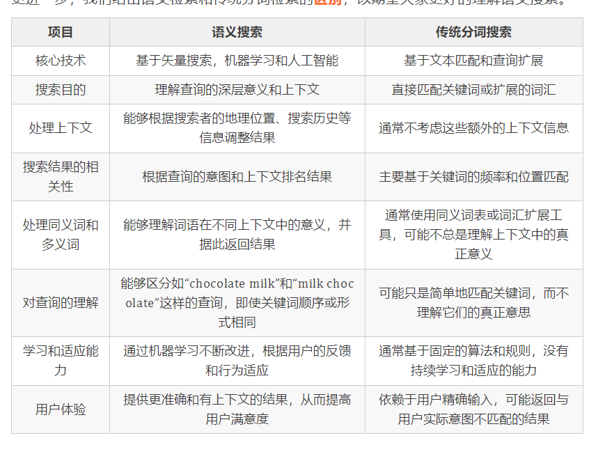

解决模糊查询的问题 那么你的查询最好是对时效性要求不是那么高的查询 对于电商的案例大概就是最好不要有那种
一个商品上架就要求立刻能查询到的情况 实际使用下来感觉ES的写入的性能消耗要远远大于查询时的性能消耗
对于有大量数据的index来说如果一次性写入过多的数据 对查询性能影响非常的大操作不当非常容易造成ES服务宕机

ES的nested类型字段来解决一对多表格数据存储的方案

搜索的内容应该也是标题吧, 把整个文章的内容构建索引, 你这个字段对应的Term Index、Term Dictionary都太庞大了

标题如果取得不好都搜不出来, 是不是把内容替换成一组关键词

terms 要完全匹配包含多个值使用, 只要查询的字段符合其中一个就可以被匹配到, 包含指定术语, 精确查询
与 filter 和 query 结合

# 相似推荐

more like this 并没有实现完全的相关度推荐, 出现了噪音数据

```sql
POST
news/_search
{
  "query": {
    "more_like_this": {
      "fields": [
        "title"
      ],
      "like": [
        "张杰开演唱会从升降机上掉落"
      ],
      "analyzer": "ik_smart",
      "min_doc_freq": 2,
      "min_term_freq": 1
    }
  }
}
```

# 应用场景

1. 存储 app 端日志
2. 存储项目楼盘
3. 存储项目详情

存储文档
存储的时候, 先将文档解析 word ,ppt 等通过 java 读取到到内存,然后作为一个字段如 cont 存入 ES
存储的时候,如果太大比如几 MB,考虑分多个 document 存储。 拆解文档,固定大小,比如: 1MB或者100kB一个文档。
存入 ES 就能方便实现全文检索了

排序的时候使用 index-sort 加速排序, 空间换时间, 预先排好序

# 缺点

对磁盘消耗太大了

线下有100g的索引

# 索引的设计

一开始

基于模板+时间+rollover api 滚动创建索引,
设计阶段定义: blog索引的模板格式为: blog_index_时间戳的形式, 每天递增数据
这样做的好处: 不至于数据量激增导致单个索引数据量非常大, 接近于上线2的32次幂-1, 索引存储达到了TB+甚至更大。
一旦单个索引很大, 存储等各种风险也随之而来, 所以要提前考虑+及早避免

冷热数据分离存储,热数据（比如最近3天或者一周的数据）,其余为冷数据。
对于冷数据不会再写入新数据,可以考虑定期force_merge加shrink压缩操作,节省存储空间和检索效率

# 实战问题

明明有这个词, match-phrase + ik分词器却怎么都匹配不到

## 原因分析

词典里面的新词, 字典里面没有的词

高精准检索要求的场景才考虑 Ngram 分词, 从文本中提取 n 个连续字符的滑动窗口来创建词元, 空间换时间, 可能会导致写入的延时以及存储的成倍增长

# match_phrase

分词结果要和文档的分词结果顺序一致

## 解决办法

1. 可以用 match 或者 filter
2. 业务上需要支持完整匹配, 又需要支持单字查询, 配置1个keyword字段, 1个text字段, 默认分词器standard, 按单个汉字切分

# 向量数据库

## 场景
1. 个性化推荐: 通过余弦相似度分析用户的行为和兴趣，提供更个性化的推荐内容
1. 图像识别和搜索: 使用欧几里得距离快速检索与给定图像相似的图像
1. 声音分析: 在声音文件之间寻找相似模式，用于语音识别和分析


搜索时不知道确切的query 词元, 或者你希望能对更广泛的同/近义词所指向的内容进行召回, 可以考虑通过向量搜索来完成

无论是业界流行的 Faiss、ScANN库, 还是工业级的开源解决方案Milvus、Jina, 或者Elasticsearch及其衍生品Elastiknn、OpenDistro
Elasticsearch KNN, 多少会通过 KNN(K nearest neighbors)对向量进行预聚类的方式进行存取加速

1. 较慢的索引速度
1. 较大的索引大小
1. 较慢的查询速度(在大数据量的场景)
1. 有限的缩放比例
1. (对于精确匹配) 具有较低的精度
1. 较差的词元和词组的搜索能力
1. 通过向量(某些解决方案中可以包含一部分标量字段)进行召回
1. 对近似语义的捕获程度较高, 可以很好的处理同/近义词

## 聚类索引

市面上大部分的向量搜索引擎是靠 KNN 配合距离计算来进行存储的, 差别可能会是距离计算公式以及存储结构的优化

先通过各种 machine learning、deep learning 技术将文档、句子、词组等转化成向量存进搜索引擎, 搜索引擎会根据配置使用距离计算模块对向量进行聚类保存

## 召回数据

向量搜索的召回和索引一样是基于向量距离的, 从简单到复杂可以大致分为线性搜索、分级导航（Hierarchical Navigable Small
Worlds (HNSW)）、索引分块及聚类等

在相同的搜索场景中, 准确性往往意味着更高维更高精度的向量, 但是这些向量的计算(无论是线性还是聚类)中, 单个向量间的计算成本会随之上升,
使得整个召回过程性能下降

## 向量搜索实战

1. 离线数据准备
    1. 在离线数据构建完成后，存入该引擎
    2. 引擎对数据中各字段进行索引
2. 在线数据召回
    1. 根据 query 理解结果构建的 query 语句进行数据召回
    2. 对结果进行一定的筛选
    3. 对结果进行一定的打分排序

### 字段

1. 唯一 id: 用以做知识的去重和快速获取
1. 实体、属性、取值: 用来描述知识的具体内容
1. 置信度: 用来描述知识的可信度
1. 分类 flag: 知识主要分类及推荐 category 等
1. 向量表示: 作为知识相似性、相关性召回、打分的依据
1. ref 信息: 用来回溯解析/获取该知识的源信息
1. 其他属性: 包括生效、删除、修改时间等支持性的通用属性



### 数据流转
1. 离线数据处理部分
   1. 从多数据源采集数据
   2. 数据清洗及预处理
   3. 通过算法引擎提取知识
   4. 通过算法引擎将知识转换为向量
   5， 将知识的基础信息连同向量数据存入 
2. 在线数据召回部分
   1. 从前端获取搜索条件
   2. 通过 query 理解模块进行检索条件解析
   3. 从 ES 中进行搜索
   4. 对结果进行分数调整
   5. 返回前端

### 使用实例

**索引设计**
```json
{
    "settings": {
        "number_of_shards": 3,
        "number_of_replicas": 2,
        "index": {
            "routing": {
                "allocation": {
                    "require": {
                        "node_group": "hot" // 1 由于向量数据较大，所以倾向于将整个索引都放置在硬件性能更好的节点
                    }
                }
            },
            "store": {
                "preload": [ // 2 为了支持高性能过滤，将常用的字段预先加载在内存中
                    "knowledge",
                    "category",
                    "available",
                    "confidence",
                    "del",
                    "kid"
                ]
            },
            "search": {
                "slowlog": {
                    "threshold": {
                        "query": {
                            "warn": "1s" // 3 慢查询开启日志方便后续性能问题的调查
                        },
                        "fetch": {
                            "warn": "1s" // 3
                        }
                    }
                }
            },
            "translog": {
                "flush_threshold_size": "512mb", // 4 知识库的重建是离线的，会在更新时进行大量写入，所以对 translog 的提交间隔拉长，加快写入速度
                "sync_interval": "5m", // 4)
                "durability": "async" // 4)
            },
            "sort": {
                "field": [ // 5) 在实际使用中kid是自增id，同时可能会对知识的置信度做排序等
                    "kid",
                    "confidence"
                ],
                "order": [ // 5)
                    "asc",
                    "desc"
                ]
            }
        }
    }
}
```

**mapping**
```json
{
    "mappings": {
        "properties": {
            "kid": {
                "type": "keyword"
            },
            "knowledge": {
                "type": "keyword"
            },
            "knowledge_phrase": { // 1)  除了对知识条目的完整搜索之外，还会需要进行模糊检索
                "type": "text",
                "analyzer": "faraday"
            },
            "attribue": { // 1)
                "type": "keyword",
                "fields": {
                    "phrase": {
                        "type": "text",
                        "analyzer": "faraday"
                    }
                }
            },
            "value": { // 1)
                "type": "keyword",
                "fields": {
                    "phrase": {
                        "type": "text",
                        "analyzer": "faraday"
                    }
                }
            },
            "confidence": { // 2)  知识库中的知识条目会有一部分进行专家/人工审核和维护，所以会对不同的条目设置不同的置信度
                "type": "double"
            },
            "category": {
                "type": "keyword"
            },
            "vector": { // 3)  数据预处理之后会转成 512 位的向量存在这个字段中
                "type": "dense_vector",
                "dims": 512
            },
            "ref": {
                "type": "text",
                "index": false
            },
            "available": {
                "type": "keyword"
            },
            "del": {
                "type": "keyword"
            },
            "create_timestamp": {
                "type": "date",
                "format": [
                    "strict_date_hour_minute_second",
                    "yyyy-MM-dd HH:mm:ss"
                ]
            },
            "update_timestamp": {
                "type": "date",
                "format": [
                    "strict_date_hour_minute_second",
                    "yyyy-MM-dd HH:mm:ss"
                ]
            }
        }
    }
}
```
### 处理流程
离线部分: 
数据采集及清洗
通过 模型A 从文章中找到知识条目
通过 模型B 将知识条目转化成向量
此处 模型A 模型B 为自研模型，运用了包括知识密度计算等算法以及 bert tersonflow 等框架
将原文、知识条目等核心内容插入数据库
将核心知识内容、向量等组装成检索单元插入 ES
专家团队会针对数据库中的知识条目进行审核、修改和迭代
算法团队会根据知识条目的更新以及其他的标注对数据链路中的模型进行迭代，对在线知识库进行更新

在线部分: 
前端收到请求之后调用 query 理解 组件进行分析
剔除无效内容之后，找出 query 里的分类信息等意图之后，构建用来召回的向量和相关的筛选条件
通过组合出来的 ES 的 query 条件对知识库进行筛选，并配合置信度等对结果进行调整
对召回结果进行不同策略的分数调整和排序，最后输出给前端

## 语义搜索


# 京东商城搜索

## 建表

```sql
PUT
product
{
  "mappings": {
    "properties": {
      "id": {//商品id
        "type": "long"
      },
      "name": {//商品名字, 
        "type": "text",//text类型可以分词, 用于全文匹配
        "analyzer": "ik_max_word" //指定中文分词器
      },
      "subTitle": {//商品副标题
        "type": "text",
        "analyzer": "ik_max_word" //指定中文分词器
      },
      "saleCount":{//销量
        "type": "long"
      },
       "putAwayDate":{//上架时间
        "type": "date"
      },
      "price": {//价格
        "type": "double"
      },
      "pic": {//商品图片
        "type": "keyword"//图片没必要分词, 使用keyword来表示无需分词的字符串类型
      },
      "hasStock": { //是否有库存
        "type": "boolean"
      },
      "brandId": { //品牌id
        "type": "long"
      },
      "brandName": {//品牌名称
        "type": "keyword"  //品牌也无需分词
      },
      "brandImg": {//品牌图标
        "type": "keyword"
      },
      "categoryId": {//商品类别
        "type": "long"
      }+
      "categoryName": {//类别名称
        "type": "keyword"
      },
      "attrs": {//商品特定属性-嵌套类型
        "type": "nested",  //指定嵌套类型
        "properties": { //相当于上面关系型数据库建模图中的子表
          "attrId": {
            "type": "long"
          },
          "attrName": {
            "type": "keyword"
          },
          "attrValue": {
            "type": "keyword"
          }
        }
      }
    }
  }
}

```

## 查询

```sql
GET
product/_search
{
  "query": {
    "bool": {
      "must": [
        {
          "multi_match": {  // 多字段(name
、subTitle)全文检索, 分词器分解
            "query": "显示器",
            "fields": [
              "name",
              "subTitle"
            ]
          }
        }
      ],
      "filter": [ // 不算分提升查询性能
        {
          "term": { // 不会分词
            "categoryId": 1
          }
        },
        {
          "range": { // 价格区间
            "price": {
              "gte": 10,
              "lte": 20000
            }
          }
        },
        {
          "term": {
            "hasStock": "true"
          }
        },
        {
          "terms": {
            "brandId": [
              1
            ]
          }
        },
        {
          "nested": { //嵌套对象
            "path": "attrs",
            "query": {
              "bool": {
                "must": [
                  {
                    "term": {
                      "attrs.attrId": {
                        "value": 1
                      }
                    }
                  },
                  {
                    "term": {
                      "attrs.attrValue": {
                        "value": "120Hz"
                      }
                    }
                  }
                ]
              }
            }
          }
        },
        {
          "nested": {
            "path": "attrs",
            "query": {
              "bool": {
                "must": [
                  {
                    "term": {
                      "attrs.attrId": {
                        "value": 2
                      }
                    }
                  },
                  {
                    "term": {
                      "attrs.attrValue": {
                        "value": "Type-C"
                      }
                    }
                  }
                ]
              }
            }
          }
        }
      ]
    }
  },
  "aggs": { // 聚合
    "brandId_aggs": {
      "terms": {
        "field": "brandId",
        "size": 100  // 根据实际情况展示多少个品牌
      },
      "aggs": {
        "brandName_aggs": {
          "terms": {
      }
    },
    "categoryId_aggs": {
      "terms": {
        "field": "categoryId",
        "size": 100
      },
      "aggs": {
        "categoryName_aggs": {
          "terms": {
            "field": "categoryName",
            //品牌子聚合, 品牌名聚合, 只应该取一个才对
            "size": 1
          }
        }
      }
    },
    "attr_aggs": {
      "nested": {
        "path": "attrs"
      },
      "aggs": {
        "attrId_aggs": {
          "terms": {
            "field": "attrs.attrId",
            "size": 100
          },
          "aggs": {
            "attrName_aggs": {
              "terms": {
                "field": "attrs.attrName",
                "size": 1 // 一个属性名字
              }
            },
            "attrVal_aggs": {
              "terms": {
                "field": "attrs.attrValue",
                "size": 100 // 每个属性对应多个属性值
              }
            }
          }
        }
      }
    }
  },
  "sort": [  // 多字段排序
    {
      "saleCount": {
        "order": "desc"
      }
    }
  ],
  "highlight": {
    "pre_tags": [
      "<strong style='color: red;'>"
    ],
    "post_tags": [
      "</strong>"
    ],
    "fields": { // name 和 keyword 两个字段高亮
      "name": {},
      "keywords": {}
    }
  },
  // 分页
  "from": 0,
  "size": 50
}
```

1. 商品搜索权重扩展, 利用多种收费方式智能为不同店家提供增加权重, 增加曝光度适应自身营销策略
2. 记录用户的行为, 跑模型等方式只能为商品增加权重
3. 分词扩展, 因为商品特殊性或者行业相关分词, 自定义扩展分词字典, 精准人性化搜索
4. function_score/script_score 自定义评分

```sql
GET
/_search
{
  "query": {
    "function_score": {
      "query": {
        "match": { "message": "elasticsearch" }
      },
      "script_score": {
        "script": {
// doc['field'] 的形式去引用字段
          "source": "Math.log(2 + doc['my-int'].value)"  
        }
      }
    }
  }
}

GET /_search
{
  "query": {
    "function_score": { // 把额外的参数与脚本内容分开
      "query": {
        "match": { "message": "elasticsearch" }
      },
      "script_score": {
        "script": {
          "params": {
            "a": 5,
            "b": 1.2
          },
          "source": "params.a / Math.pow(params.b, doc['my-int'].value)"
        }
      }
    }
  }
}

```

```sql
{
  // terms聚合获取title.keyword字段的前10000个唯一值,并使用cardinality聚合计算该字段的唯一值总数
  "size": 0,
  "aggs": {
    "unique_values": {
      "terms": {
        "field": "title.keyword",
        "size": 10000
      }
    },
    "unique_count": {
      "cardinality": {
        "field": "title.keyword"
      }
    }
  }
}
```

# 万能模板

```sql
PUT
blog_index
{
  "mappings": {
    "doc": {
      "_source": {
        "enabled": false
      },
      "properties": {
        "title": {
          "type": "text",
          "fields": {
            "keyword": {
              "type": "keyword",
              "ignore_above": 100
            }
          },
          "store": true
        },
        "publish_date": {
          "type": "date",
          "store": true
        },
        "author": {
          "type": "keyword",
          "ignore_above": 100,
          "store": true
        },
        "abstract": {
          "type": "text",
          "store": true
        },
        "content": {
          "type": "text",
          "store": true
        },
        "url": {
          "type": "keyword",
          "doc_values": false,  // 不能聚合排序
          "norms": false,
          "ignore_above": 100,
          "store": true
        }
      }
    }
  }
}

```

ES集群架构13个节点,索引根据通道不同共20+索引,根据日期,每日递增20+,索引: 10分片,每日递增1亿+数据,
每个通道每天索引大小控制: 150GB之内