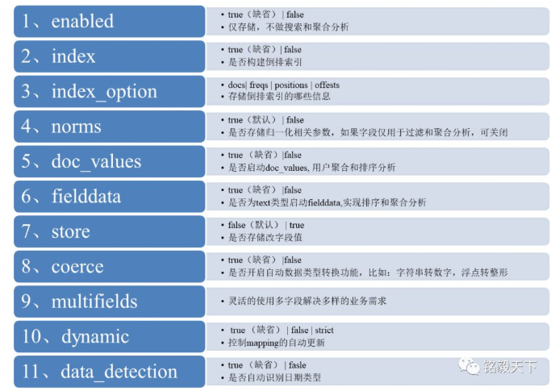
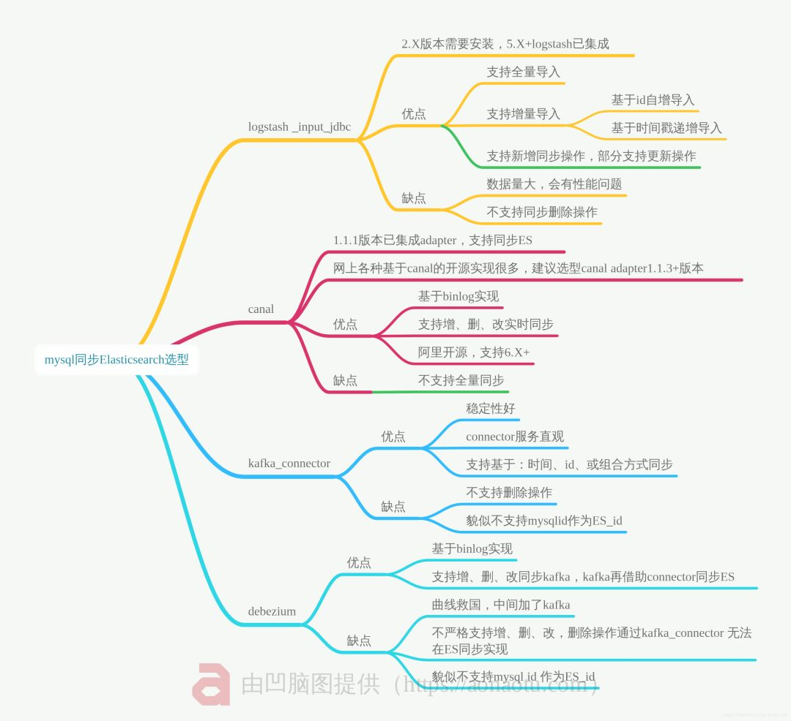

# 集群规模

Elasticsearch 节点可以是主节点(Master), 数据节点(Data), 客户端/路由节点(Client)或某种组合,
大多数人大规模集群选择专用主节点(至少3个), 然后选择一些数据和客户端节点

# 安全

在应用程序 API 和 Elasticsearch 层之间以及 Elasticsearch 层和内部网络之间保护您的 Elasticsearch 集群

# 数据建模

## 使用别名进行检索、聚合

1. 将应用和索引名称隔离
2. 可以方便的实现跨索引检索

## 数据类型选型

1. 是否需要快速响应(keyword 和 long 类型选型)
2. 是否需要多表关联(nested 类型、join 或者是宽表存储)
3. 字符串默认存储类型是 text 和 keyword

### 字符串类型
1. text类型作用: 分词, 将大段的文字根据分词器切分成独立的词或者词组, 以便全文检索  
适用: email内容、某产品的描述等需要分词全文检索的字段  
不适用: 排序或聚合(Significant Terms 聚合例外)  
2. keyword类型: 无需分词、整段完整精确匹配  
适用：email地址、住址、状态码、分类tags

### Array 数组类型
根据数组值进行查询操作, 使用 nested 嵌套类型

## 监控和警报

监控: 通过可视化方式, 只管看到内存、JVM、CPU、负载、磁盘使用情况, 对可能突发情况急早做出应对方案  
警报: 异常实时预警  
ElastAlert: 业务场景几乎实时将数据写入ElasticSearch并希望在数据与某些模式匹配时收到警报, 则使用
[ElastAlert](https://github.com/Yelp/elastalert)

## 节点配置和配置管理

1. chef 和 Ansible 帮助管理 ElasticSearch 集群
2. rollover + curator + crontab, 6.6 版本新特性 Index Lifecycle Management(索引生命周期管理)

## 备份和恢复

1. ES 中误删除的数据(delete 或者 delete_by_query)能恢复吗? 如果做了备份, 是可以的。如果没有, 不可以, 推荐使用 Elasticsearch 内置的“快照”功能, 可以备份您的索引
2. 迁移节点, 直接 data 路径原封不动拷贝可以吗? 推荐使用 reindex 或其他工具实现
3. Elasticsearch 内置的“快照”功能, 可以备份您的索引

# 量化指标

1. 召回率: 本次搜索结果中包含的相关文档占整个集合中所有相关文档的比率, 衡量检索结果的查全率
2. 精确率: 本次搜索结果中相关文档所占的比例, 衡量检索结果的查准率

# 搜索体验

## 分词器

1. 如果要求细粒度, 只要存在就要召回, 那 ngram 分词适合或者 7.9+ 新推出的 wildcard 数据类型优先考虑
2. 中文选择: IK、结巴、ansj或者其他

## 词典更新

1. 在基础词库相对全的前提下, 需要结合业务场景添加属于自己的行业词库、领域词库等
2. 即便添加了行业, 领域词典, 也涵盖不全新词怎么办, 分词器作为插件, 原始词典一旦配置, 是不支持动态更新的, 需要借助第三方机制实现, IK 词典的动态更新实现机制: 结合修改 IK 分词器源码 + 动态更新 mysql 词条达到更新词典的目的

## 重视 Mapping 环节数据建模

1. text 类型的 fielddata 是内存耗费大户, 除非必须, 不建议开启
2. 根据是否需要排序或者聚合决定是否启用 keyword 类型
3. 不需要索引的字段, “index”设置为“false”
4. 不需要存储的字段, “store”设置为“false”
5. 大文本如 word, pdf 文本信息, 考虑切分成小的片段后存储

# 索引

## 正排索引

除 text 之外的所有字段类型均启用 Doc Values

1. 在索引时创建
2. 序列化到磁盘
3. 适合排序操作
4. 将单个字段的所有值一起存储在单个数据列中
5. 默认情况下, 除 text 之外的所有字段类型均启用 Doc Values

### 场景

1. 对一个字段进行排序
2. 对一个字段进行聚合
3. 某些过滤, 比如地理位置过滤
4. 某些与字段相关的脚本计算

## 倒排索引

text/keyword

text 字段不支持 Doc Values 正排索引的, 使用是查询时创建的基于的内存数据结构, fielddata 将 text 字段用于聚合、排序或在脚本中使用时,
将按需构建此数据结构, 和 docvalues 不一样的是, fielddata 保存的是 text 类型的字段分词后的 terms, 而不是保存源字段数据

### fieldData 使用场景

1. 全文统计词频
2. 全文生成词云
3. text类型: 聚合、排序、脚本计算

## 使用场景

1. 全文检索以及任何使用相关性评分的场景使用 query 检索
2. 除此之外的其他使用 filter 过滤器过滤

# 堆内存

1. 默认情况下, Elasticsearch JVM 使用堆内存最小和最大大小为 2 GB
2. 不要将 Xmx 设置为 JVM 超过 32 GB, 让 Lucene 通过操作系统文件系统缓存使用剩余的内存
3. Xmx 设置为不超过物理内存的 50％

# hot_threads

```shell
GET /_nodes/hot_threads
GET /_nodes/<node_id>/hot_threads
```

Hot Threads API 从CPU 端返回有关 ElasticSearch 代码的哪些部分是热点或返回当前集群因某些原因而被卡在何处的信息

# 线程池队列大小

增加队列的大小以防止请求被拒绝, 该节点将需要使用更多的内存来存储队列, 这就意味着将剩下相对较少的内存来响应和管理实际请求

# 词频

1. 词频 TF: 分词单元(Term)在文档中出现的频率, 一个词出现的次数越多, 它的得分就越高
2. 逆文档频率 IDF: 衡量分词单元 Term 的重要性

# 索引

## 别名

方便批量操作, 简化从 es 中删除数据的过程

## 模板

template 针对多个索引, Mapping 针对单一索引

# mapping 设置



# 预处理

1. 定义 Pipeline, 通过 Pipeline 实现数据预处理, 根据实际要处理的复杂数据的特点, 有针对性的设置 1 个或者多个 pipeline(管道), 上图的粉红和黄色部分
2. 写入数据关联 Pipeline, 写入数据、更新数据或者 reindex 索引环节, 指定要处理索引的 pipeline , 实际就是写入索引与上面的 pipeline0 和 pipelineZ 关联起来
3. 写入数据
4. 创建索引、创建模板、更新索引、reindex 以及 update_by_query 环节 都可以指定 pipeline

# Ingest 节点

1. 线上写入数据改字段需求
2. 线上业务数据添加特定字段需求
3. 小数据规模, 建议使用 Ingest 节点
4. 数据量大了, 架构中使用 Logstash 结合消息队列如 Kafka 的架构选型

# 查询语法

1. query_string 查询提供了以简明的简写语法执行多匹配查询
2. multi_match queries 提供在多个字段上查询的意思
3. 布尔查询 bool queries
4. 提升得分 boosting
5. 模糊匹配 fuzzy matching
6. 通配符 wildcards
7. 正则表达式 regexp
8. 范围查询 range queries 的方式
9. Term/Terms 检索, 指定字段检索

# 高级检索

1. 需要分词处理
    1. 需要指定字段, matchQuery
    2. 无需指定字段的全文检索, queryStringQuery
2. 包含以下的完整关键词, wildcardQuery结合 *
3. 包含以下任意一个关键词, 空格分隔每个关键词, 需要将多个词空格拆分, 然后对每个关键词通过 should 结合 wildcardQuery 遍历实现
4. 不包括以下关键词
    1. 需要指定字段, 则使用 must_not 结合 matchQuery 实现
    2. 无需指定字段, 则使用 must_not 结合 queryStringQuery 实现
5. 限定要搜索的网页的时间, 限定搜索的开始和结束时间, 通过 rangeQuery 实现
6. 关键词位置
    1. 关键词位于 title 字段: 指定 title 进行检索
    2. 关键词位于 content 字段: 指定 content 进行检索
    3. 关键词位于全部字段: 不指定字段进行检索, 多使用 queryStringQuery 实现

# match_phrase 的坑

match_phrase 检索时候, 文档必须同时满足以下两个条件, 才能被检索到

1. 分词后所有词项都出现在该字段中
2. 字段中的词项顺序要一致

可以利用位置信息去匹配包含所有查询词项, 且各词项顺序也与我们搜索指定一致的文档, 中间不夹杂其他词项

match_phrase_prefix 支持最后一个 term 前缀匹配, 解决 match_phrase 搜索不出来的问题和用 wildcard 检索的性能问题

1. match_phrase_prefix 结合 slop 的方案, slop设置不论多大、多小, 都可能会引入噪音数据, 导致结果不准确
2. match_phrase 结合 match should 关联匹配, 依然会引入噪音数据
3. 单字分词应用场景——对于像姓名类字段, 业务上需要支持完整匹配, 又需要支持单字查询, 可以配置 1 个 keyword 字段
4. 1 个 text 字段, 分词器选择 Elasticsearch 默认分词器 standard, 按单个汉字切分

# Ngram的本质

用空间换时间。其能匹配的前提是写入的时候已经按照: min_gram、max_gram切词, 将文本里面的内容按照字节进行大小为N的滑动窗口操作, 形成了长度是N的字节片段序列

数据量非常少且不要求子串高亮, 可以考虑keyword
数据量大且要求子串高亮, 推荐使用: Ngram 分词结合 match 或者 match_phrase 检索实现
数据量大, 切记不要使用wildcard前缀匹配

# 评分

布尔查询中的每个 must, should 和 must_not 元素称为查询子句, filter、must_not 不影响评分, 其他影响评分

1. 文档满足 must 或 should 条款的标准的程度有助于文档的相关性得分, 分数越高, 文档就越符合您的搜索条件
2. must_not 子句中的条件被视为过滤器, 它会影响文档是否包含在结果中, 但不会影响文档的评分方式
3. filter 必须匹配, 但它以不评分、过滤模式来进行, filter 内部语句对评分没有贡献, 只是根据过滤标准来排除或包含文档

# 相关性

## Index Boost 索引层

索引级别调整评分, 先展示 A 类, 然后 B 类, 然后 C 类

```shell
GET index_*/_search
{
  "indices_boost": [
    {
      "index_a": 1.5
    },
    {
      "index_b": 1.2
    },
    {
      "index_c": 1
    }
  ],
  "query": {
    "term": {
      "subject.keyword": {
        "value": "subject 1"
      }
    }
  }
}
```

## negative_boost 降低相关性

对某些返回结果不满意, 但又不想排除掉(must_not), 可以考虑 boosting query 的 negative_boost

## function_score 自定义评分

1. 同时根据销量和浏览人数进行相关度提升
2. 基于文章点赞数计算评分, title: 代表文章标题, like: 代表点赞数

### 场景
1. 根据价格评分排序 boost
2. 根据距离评分排序 
3. 根据距离价格综合评分排序
4. 自定义编写脚本, 酒店价格结尾含 8 的评分最高

## 二次打分 rescore query

二次评分是指重新计算查询返回结果文档中指定个数文档的得分, Elasticsearch 会截取查询返回的前 N 个, 并使用预定义的二次评分方法来重新计算他们的得分, 适合对查询语句的结果不满意, 需要重新打分的场景
可以根据不同的评分算法、过滤器或其他上下文信息, 对搜索结果进行个性化的定制排序。它可以根据文档的属性、时间戳、地理位置等进行排序

## script score 自定义评分

```html
POST /_search
 {
    "query" : {
       "match" : {
          "message" : {
             "operator" : "or",
             "query" : "the quick brown"
          }
       }
     },
     "rescore" : [ {
        "window_size" : 100,
        "query" : {
           "rescore_query" : {
              "match_phrase" : {
                 "message" : {
                    "query" : "the quick brown",
                    "slop" : 2
                 }
              }
           },
           "query_weight" : 0.7,
           "rescore_query_weight" : 1.2
        }
     }, {
        "window_size" : 10,
        "query" : {
           "score_mode": "multiply",
           "rescore_query" : {
              "function_score" : {
                 "script_score": {
                    "script": {
                      "source": "Math.log10(doc.count.value + 2)"
                    }
                 }
              }
           }
        }
     } ]
  }

```
# 安全

## 怎么知道公网开放端口

1. 穷举公网IP地址
    1. A 类地址范围: 1.0.0.0—126.0.0.0
    2. B 类地址范围: 128.0.0.0—191.255.0.0
    3. C 类地址范围: 192.0.0.0—223.255.255.0
    4. D 类地址范围: 224.0.0.0—239.255.255.255
    5. E 类地址范围: 240.0.0.0—255.255.255.254
2. 扫描常用端口
    1. 穷举方式是很笨, 但几乎没有漏网之鱼
    2. 在线扫描网站

# 数据 ELT



# elasticsearch 调优

## 设计调优阶段

1. 根据业务增量需求, 采取基于日期模板创建索引, 通过 roll over API 滚动索引
2. 使用别名进行索引管理
3. 每天凌晨定时对索引做 force_merge 操作, 以释放空间
4. 采取冷热分离机制, 热数据存储到 SSD, 提高检索效率, 冷数据定期进行 shrink 操作, 以缩减存储
5. 采取 curator 进行索引的生命周期管理
6. 仅针对需要分词的字段, 合理的设置分词器
7. Mapping 阶段充分结合各个字段的属性, 是否需要检索、是否需要存储等

## 写入调优

1. 写入前副本数设置为 0
2. 写入前关闭 refresh_interval 设置为 -1, 禁用刷新机制
3. 写入过程中, 采取 bulk 批量写入
4. 写入后恢复副本数和刷新间隔
5. 尽量使用自动生成的 id

## 查询调优

1. 禁用 wildcard
2. 禁用批量 terms (成百上千的场景)
3. 充分利用倒排索引机制, 能 keyword 类型尽量 keyword
4. 数据量大时候, 可以先基于时间敲定索引再检索
5. 设置合理的路由机制

## 动态索引

模板 + 时间 + rollover api 滚动创建索引

## 存储层面

冷热数据分离 force_merge + shrink

# 高级检索
## 包含全部关键词
1. 需要分词就用 matchQuery
2. 不需要分词使用 queryStringQuery 实现

## 包含完整关键词
wildcardQuery结合”*”实现

## 包含以下任意关键词
空格分隔每个关键词, 需要将多个词空格拆分, 然后对每个关键词通过 should 结合 wildcardQuery 遍历实现

## 不包括以下任意关键词
1. 需要指定字段, 使用 must_not 结合 matchQuery
2. 不需要指定字段结合 queryStringQuery

## 限定要搜索的网页的时间是
rangeQuery

## 关键词位置
1. 关键词位于 title 字段: 指定 title 进行检索
2. 关键词位于 content 字段: 指定 content 进行检索
3. 关键词位于全部字段: 不指定字段进行检索, 多使用 queryStringQuery 实现


```java
POST detail_index/_search
{
  "from" : 0,
  "size" : 10,
  "query" : {
    "bool" : {
      "must" : [
        {
          "match" : {
            "title" : {
              "query" : "苹果乔布斯",
              "operator" : "OR",
              "prefix_length" : 0,
              "max_expansions" : 50,
              "fuzzy_transpositions" : true,
              "lenient" : false,
              "zero_terms_query" : "NONE",
              "boost" : 1.0
            }
          }
        },
        {
          "wildcard" : {
            "title.keyword" : {
              "wildcard" : "*苹果总裁库克*",
              "boost" : 1.0
            }
          }
        },
        {
          "range" : {
            "create_time" : {
              "from" : "2017-09-07 00:00:00",
              "to" : "2017-09-15 23:59:59",
              "include_lower" : true,
              "include_upper" : true,
              "boost" : 1.0
            }
          }
        }
      ],
      "must_not" : [
        {
          "wildcard" : {
            "title.keyword" : {
              "wildcard" : "*苹果梨*",
              "boost" : 1.0
            }
          }
        }
      ],
      "should" : [
        {
          "wildcard" : {
            "title.keyword" : {
              "wildcard" : "*苹果手机*",
              "boost" : 1.0
            }
          }
        },
        {
          "wildcard" : {
            "title.keyword" : {
              "wildcard" : "*iphoneX*",
              "boost" : 1.0
            }
          }
        }
      ],
      "disable_coord" : false,
      "adjust_pure_negative" : true,
      "boost" : 1.0
    }
  },
  "_source" : {
    "includes" : [
      "title",
      "content"
  ],
    "excludes" : [ ]
  },
  "highlight" : {
    "pre_tags" : [
      "<span style=\"color:red\">"
    ],
    "post_tags" : [
      "</span>"
    ],
    "fragment_size" : 100,
    "number_of_fragments" : 5,
    "require_field_match" : true,
    "fields" : {
      "title" : { }
  }
  }
}
```

# 万能模板
```java
PUT testinfo_index
{
  "mappings": {
    "testinfo_type": {
      "properties": {
        "id": {
          "type": "long"
        },
        "title": {
          "type": "keyword"
        },
        "content": {
          "analyzer": "ik_max_word",
          "type": "text",
          "fields": {
            "keyword": {
              "ignore_above": 256,
              "type": "keyword"
            },
            "available": {
              "type": "boolean"
            },
            "review": {
              "type": "nested",
              "properties": {
                "nickname": {
                  "type": "text"
                },
                "text": {
                  "type": "text"
                },
                "stars": {
                  "type": "integer"
                }
              }
            },
            "publish_time": {
              "type": "date",
              "format": "yyyy-MM-dd HH:mm:ss||yyyy-MM-dd||epoch_millis"
            },
            "expected_attendees": {
              "type": "integer_range"
            },
            "ip_addr": {
              "type": "ip"
            },
            "suggest": {
              "type": "completion"
            }
          }
        }
      }
    }
  }
}
```