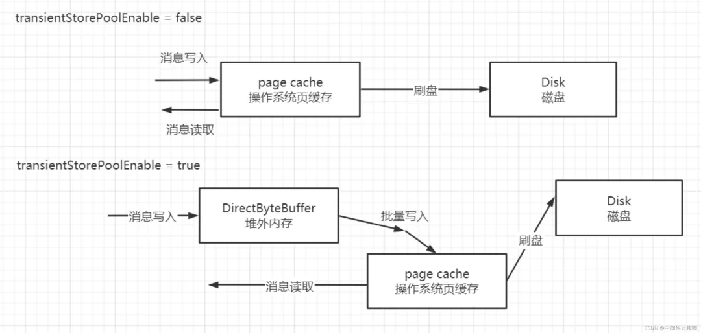
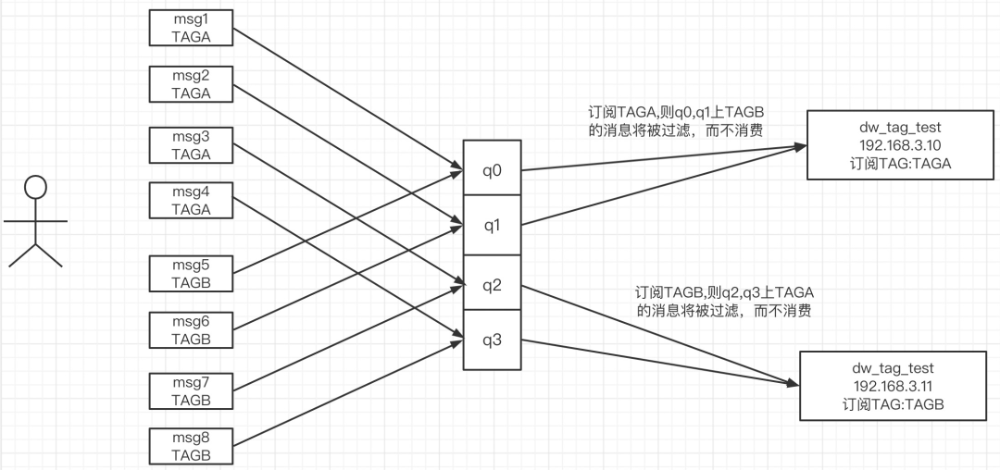

# 使用场景

1. 消息检索功能: hash索引
2. 事务消息
3. 消息回溯(指定时间点的消息回溯)
4. 消息重试
5. 定时消息: timer
6. 消息过滤

# 核心概念

1. 广播模式: 一个消费组内的所有消费者每一个都会处理 topic 中的每一条消息, 通常用于刷新内存缓存
2. 集群模式: 一个消费组内的所有消费者共同消费一个 topic 中的消息, 即分工协作, 一个消费者消费一部分数据, 启动负载均衡, 集群模式是非常普遍的模式, 符合分布式架构的基本理念, 即横向扩容, 当前消费者如果无法快速及时处理消息时, 可以通过增加消费者的个数横向扩容, 快速提高消费能力, 及时处理挤压的消息

# 存储精髓

1. Commitlog文件: 消息内容, 队列顺序写入, 根据物理偏移量 offset 查找
2. ConsumeQueue文件: 索引文件, 存储 hashcode, topic 和 commitlog 的映射关系, 可用参数是 commitlog offset, size, taghashcode
3. Index文件: 用于消息检索, 哈希索引, 并存储到 Index, 基于物理磁盘实现了hash索引, hashcode + offset + 时间戳 + 前一个index, 建立 key 和 hashcode 与物理偏移量映射关系,
   根据 key 定位到 commitlog, 可用参数是 commit offset
4. 内存映射机制: 通过 FileChannel 的 map 方法创建内存映射文件, 类似与操作系统的 pagecache(页缓存), 如果 broker 退出, 页缓存数据不会丢, 操作系统会把页缓存数据持久化到磁盘
5. 刷盘策略, 先刷到页缓存, 如机器断电等异常情况, 可能会丢失
    1. 同步刷盘: 组提交, 数据放内存, 刷盘线程提交请求, 加锁阻塞, 批量刷到磁盘, 优点是消息不丢失
    2. 异步刷盘: broker 将消息放 page cache 就返回成功, 开启异步线程定时 file channel 的 force 将内存刷到磁盘, 优点是快

# 内存读写

内存级别读写分离, 消息写入pagecache, pagecache 压力比较大出现 broker busy, transientStorePoolEnable 机制, 消息写入堆外内存后立即返回, 异步将堆外内存数据提交到pagecache, 再异步刷盘到磁盘

# Name Server

- Broker 每 30s 向 NameServer 发送心跳包, 包含路由信息(读写队列数, 操作权限), NameServer 通过 HashMap 更新 Topic 路由信息, 记录最后一次收到 Broker 心跳的时间戳
- NameServer 每 10s 清除宕机的 Broker, NameServer 认为 Broker 宕机的依据系统时间 - 最后一次时间戳 > 120s
- producer 每 30s 拉取 topic 路由信息, 消息生产者不会立刻感知 Broker 服务器新增和删除
- broker 与 NameServer 之间断开连接, 对应的 broker 路由会从 NameServer 剔除

**问题:**

1. 消息发送者、消息消费者无法及时感知 broker 服务器的宕机与假死, 即无法及时获取最新的路由信息
2. nameserver 之间相互不通信, nameserver 之间的路由信息会存在不一致现象, 但能最终保证一致性
3. 网络分区不会造成消息发送失败, 引发消息分布不均衡
4. 网络分区对消费端还是存在较大影响, 但容易感知, 并且在网络恢复后, 消息并不会丢失

# Broker

## handler 同步消息屏障

android冷知识: handler消息屏障是阻塞消息队列中同步消息, 取出异步消息先执行, viewrootimpl在绘制前会发一个同步消息屏障, 提升绘制效率, 优先消费队列里的高优先级的消息, 比如屏幕绘制相关的

### 快速失败

- 消息发送者向 Broker 发送消息写入请求, Broker 端在接收到请求后会首先放入一个队列中 (SendThreadPoolQueue), 默认容量为 10000
- Broker 会专门使用一个线程池 (SendMessageExecutor) 去从队列中获取任务并执行消息写入请求, 为了保证消息的顺序处理, 该线程池默认线程个数为 1
- broker 受到垃圾回收机制造成写入数据失败, 发生抖动, 单个 broker 积压太多不能处理, 引入快速失败, 开启定时调度线程, 10ms 检查队列头节点, 如果等待了 200ms, 那就取消所有等待 200ms 的请求, 立即向客户端返回失败, 客户端能尽快重试, 并给客户端返回失败, 每隔 3s 就重试
- 注意一点, SYSTEM_ERROR 会重试, 但是 SYSTEM_BUSY 不会重试, 解决方案是 waitTimeMillsInSendQueue 设置为 1000ms
- 定时任务, 定时将内存的消息持久化到 broker 磁盘

# Rocketmq的理由注册与剔除机制:

1. 集群中所有的Broker每隔30s向集群所有的NameServer发送心跳包, 注册Topic路由信息
2. Nameserver 收到包更新路由表, 记录心跳包时间
3. 启动定时任务每 10s 扫描 Broker 存活状态表, NameServer 连续 120s 未收到, 则 Broker 下线, 从路由表移除 Broker
4. NameServer 与 Broker 长连接断开, NameServer 立刻感知 Broker 下线并从路由表剔除 broker
5. 消息客户端任意时刻和其中一台 NameServer 连接, 30s 向 NameServer 查询路由信息, 查询到结果会更新客户端本地路由信息, 查询失败就忽略
6. 如果 NameServer 与 Broker 的服务器 TCP 断开, NameServer 立即感知路由信息变化, 如果未断开但 Broker 无法提供服务, NameServer 要 120s 才能感知 Broker 宕机

# 生产者数据丢失:

丢失消息在于程序发送失败抛出异常没有重试处理, 发送过程成功但是 MQ 网络闪断消息丢失, 同步发送不会出现这种情况, 异步发送分为异步有回调和异步无回调, 无回调生产者发送完不管结果造成消息丢失, 异步发送+回调通知+本地消息表做出解决方案

**以下单为例**

1. 保存本地数据和 MQ 消息表, 消息状态是发送中, 本地事务失败, 下单失败, 事务回滚
2. 下单成功, 返回客户端成功, 异步发送 MQ 消息
3. MQ 回调通知消息发送结果, 对应更新数据库 MQ 发送状态
4. JOB 轮询超过一定时间未发送成功的消息去重试
5. 监控平台配置或者 JOB 处理超过一定次数不成功的消息, 警报, 人工介入

# Message

还有一个可选的 tag 设置, 以便消费端可以基于 tag 进行过滤消息, 也可以添加额外的键值对, 例如你需要一个业务 key 来查找 broker 上的消息, 方便在开发过程中诊断问题

## tag消息过滤机制

**问题** rocketmq 的 diff 计算逻辑是 brock-offset - consumer-offset 当某个consumer标记 tag 流量非常少的情况下, 对业务来说应该有积压, 实际并没有

### 目前猜想

一个topic四个队列, producer发送4条tagA后, 再继续发送4条tagB, producer端默认采取轮询负载均衡, topic每一个队列都存在tagA和tagB消息, 一个消费组订阅tagA, 另一个订阅tagB,
经过消息过滤后, q0、q1的 tagB 不会投递到另外一个订阅 tagB 的消费者, 相当于消息丢失了

### 验证解答

1. 消息拉取流程
    1. 客户端拉取消息会设置超时时间, 与超时时间相关的两个变量, 都不支持自定义
        - brokerSuspendMaxTimeMillis: 当前没有符合的消息, broker挂起的时间, 默认是15s
        - timeoutMillis: 消息拉取超时时间, 默认是30s
    2. 拉取到maxMsgNums条消息, 正常退出
    3. 一次消息拉取过程中, 服务端最大扫描字节数量,即一次拉取扫描ConsumeQueue的字节数量
    4. 长轮询机制, 扫描指定的字节数, 一条都没查询到, broker挂起一段时间, 知道有新的消息符合过滤条件, 就唤醒
    5. 综上, 服务端连续1000w条都不符合过滤的tag1条件, 拉取请求不会一次性筛选, 而是返回不至于让客户端超时
2. offset提交机制
    1. rocketmq 成功消费的标准是提交 offset, pull 线程从服务端拉消息提交到消费组线程池, 拉取到的消息放入 treemap 中, 消费线程成功消费一条消息就从 TreeMap 移除, 计算位点
    2. treeMap 如果有消息, 就返回第一条（最小的消息）
    3. 如果TreeMap没有消息, 返回当前队列中拉取到的最大消费位点, 此时拉渠道的消息全被消费了
    4. // todo 如果没有拉取到合适的消息, 会把下一次拉取的偏移量当成offset
    5. 第一种提交机制: 消息拉取到时候, 先将消息 offset 存储本地缓存, 定时提交到 broker 端
    6. 第二种提交机制: 拉取消息的时候, 本地缓存存在位点, 会标记, 触发服务端提交 offset

# 启动的时候从哪里消费:

1. 当新实例启动的时候, PushConsumer会拿到本消费组broker已经记录好的消费进度(consumer offset), 按照这个进度发起自己的第一次 Pull 请求
2. 如果这个消费进度在Broker并没有存储起来, 证明这个是一个全新的消费组, 这时候客户端有几个策略可以选择:
    1. CONSUME_FROM_LAST_OFFSET //默认策略, 从该队列最尾开始消费, 即跳过历史消息, 只有全新的消费组才会使用到这些策略, 老的消费组都是按已经存储过的消费进度继续消费
    2. CONSUME_FROM_FIRST_OFFSET //从队列最开始开始消费, 即历史消息（还储存在broker的）全部消费一遍
    3. CONSUME_FROM_TIMESTAMP//从某个时间点开始消费, 和setConsumeTimestamp()配合使用, 默认是半个小时以前

# 清理消息文件:

1. 消息文件过期(默认72小时), 且到达清理时点(默认是凌晨4点), 删除过期文件
2. 消息文件过期(默认72小时), 且磁盘空间达到了水位线(默认75%), 删除过期文件
3. 磁盘已经达到必须释放的上限（85%水位线）的时候, 则开始批量清理文件（无论是否过期）, 直到空间充足
4. 磁盘空间达到危险水位线（默认90%）, 出于保护自身的目的, broker会拒绝写入服务

只要消息还在, 就可以消费到, 这使得RocketMQ可以支持其他传统消息中间件不支持的回溯消费。即我可以通过设置消费进度回溯, 就可以让我的消费组重新像放快照一样消费历史消息, 或者我需要另一个系统也复制历史的数据,
只需要另起一个消费组从头消费即可

# 消费问题:

**如果消息积压到磁盘上限被删除了怎么办?**
转发程序落数据库, 根据数据库找到丢失的数据, 跑个脚本重发就可以了

# 重复消费:

消费者拉取消息还没提交, broker故障, 下次拉取会从上次提交的位置开始消费, 造成消息重复

1. 对于已经存在的消费者组+topic+queue 的订阅关系, 无论如何都是遵循历史进度进行消费
2. 对于新的消费者组+topic+queue 关系, 在正常情况下, 遵循客户端配置的策略
3. 对于特殊的场景被 broker 认为 queue 是新 queue 的情况下, 一律从头开始消费(令可杀错不放过)
4. 代码中进行时间判断做跳过
5. 消费者组启动消费前前先重置一下消费进度, 建议这种情况下手动创建消费者组, 并把 consumeEnable 关闭让他不能消费, 再调整进度, 再重新开启 consumeEnable

# 消息轨迹:

最佳的选择还是存储在Broker服务器中, 将消息轨迹数据也当成一条消息存储到Broker服务器。

1. 系统默认 Topic 如果 Broker 的 traceTopicEnable 配置设置为 true, 表示在该 Broker 上创建 topic 名为, RMQ_SYS_TRACE_TOPIC, 队列个数为1, 默认该值为false,
   表示该 Broker 不承载系统自定义用于存储消息轨迹的 topic
2. 自定义 Topic 在创建消息生产者或消息消费者时, 可以通过参数自定义用于记录消息轨迹的 Topic 名称, 不过要注意的是, rokcetmq 控制台(rocketmq-console)中只支持配置一个消息轨迹 Topic,
   故自定义 Topic, 在目前这个阶段或许还不是一个最佳实践, 建议使用系统默认的 Topic 即可

# 主从同步:

1. 主, 从服务器都在运行过程中, 消息消费者是从主拉取消息还是从从拉取
   默认情况下, 从主服务器拉取, 当主服务器积压的消息超过了物理内存的 40%, 则建议从从服务器拉取。但如果 slaveReadEnable 为 false, 表示从服务器不可读, 从服务器也不会接管消息拉取。

2. 当消息消费者向从服务器拉取消息后, 会一直从从服务器拉取
   答: 不是的。分如下情况
    1. 如果从服务器的slaveReadEnable设置为false, 则下次拉取, 从主服务器拉取
    2. 如果从服务器允许读取并且从服务器积压的消息未超过其物理内存的30%, 下次拉取使用的Broker为订阅组的brokerId指定的Broker服务器, 该值默认为0, 代表主服务器
    3. 如果从服务器允许读取并且从服务器积压的消息超过了其物理内存的30%, 下次拉取使用的Broker为订阅组的whichBrokerWhenConsumeSlowly指定的Broker服务器, 该值默认为1, 代表从服务器

3. 主从服务消息消费进是如何同步的？
   消息消费进度的同步时单向的, 从服务器开启一个定时任务, 定时从主服务器同步消息消费进度；无论消息消费者是从主服务器拉的消息还是从从服务器拉取的消息, 在向Broker反馈消息消费进度时,
   优先向主服务器汇报；消息消费者向主服务器拉取消息时, 如果消息消费者内存中存在消息消费进度时, 主会尝试跟新消息消费进度

读写分离的正确使用姿势:
1、主从Broker服务器的slaveReadEnable设置为true
2、通过updateSubGroup命令更新消息组whichBrokerWhenConsumeSlowly、brokerId, 特别是其brokerId不要设置为0, 不然从从服务器拉取一次后, 下一次拉取就会从主去拉取

# 消息丢失:

1. 生产端, 发送采用同步发送保证消息写commitlog之后返回到发送端, 不丢消息。
2. 消费端, 发送消息到消费者的时候可以ack, 在程序里面当事务提交了自己来ack就行了

# 遇到的问题:

1. 跨机房消费 rebalance 策略选择错误导致消费错误 , 调整一下 
2. 定时消息来消费, 没有做幂等性, 任务处理时间超过rmq重试的时间, 导致消息重发

# RocketMQ的网络处理机制:

1. 每个命令或每类请求命令定义一个处理器(NettyRequestProcessor), 每一个 NettyRequestProcessor 绑定到一个单独的线程池, 进行命令处理, 不同类型的请求将使用不同的线程池进行处理, 实现线程隔离
2. 比如消息发送处理器 SendMessageProcessor 和消息拉取处理器 PullMessageProcessor

# 顺序消费:

同一个账号的消息发送到同一个分区, 具体做法是按照账户 key 进行 hash 并取模, 顺序消费主要依赖三把锁:

1. 负载算法消费者分配到队列后开始进行消息拉取前需要向Broker申请队列的锁
2. 消费者拉取消息到队列, 消费队列消息会对队列加锁, 保证顺序消费
3. 消费过程中处理队列加锁, 防止重平衡导致重复消费, 顺序消费端重试次数并不是16, 而是Integer.MAX_VALUE, 业务类异常一定在消费端监听器中必须处理, 如果是由于不满足业务规则, 则重试无限次意义不大

