# redis

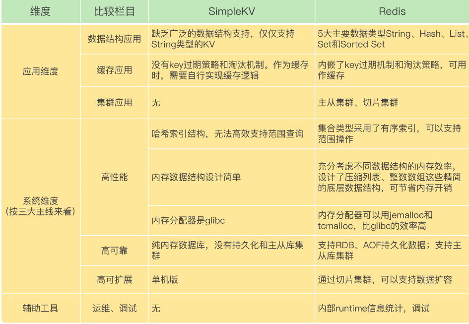

## redis 问题画像图

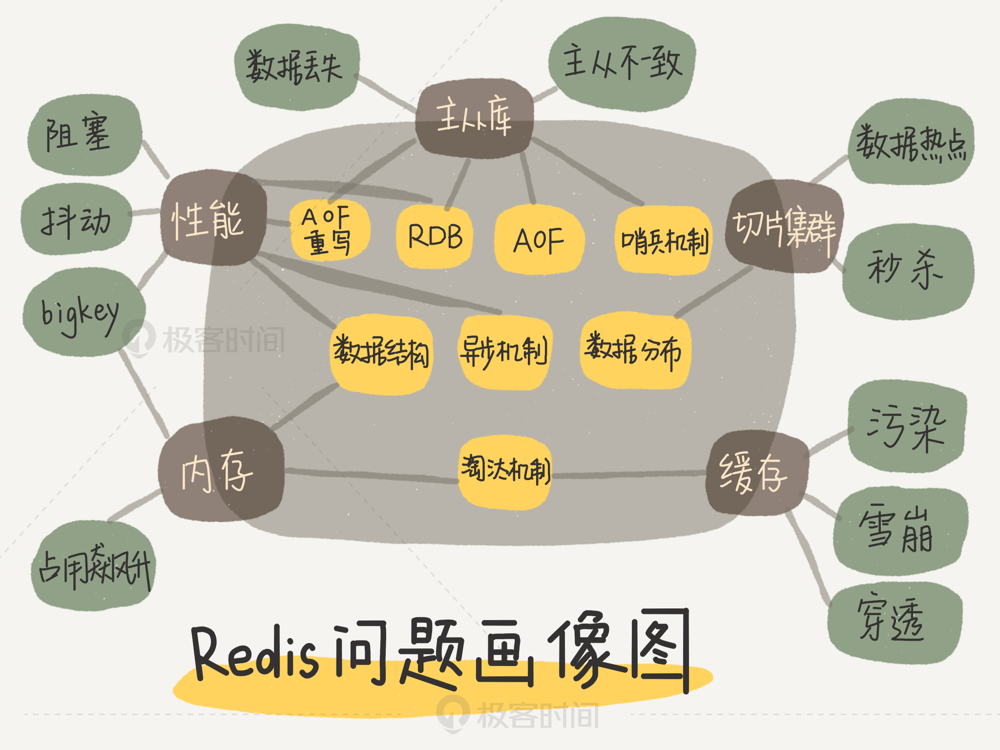

# 数据结构

1. 简单动态字符串
2. 双向链表
3. 压缩列表
4. 哈希表
5. 跳表
6. 整数数组

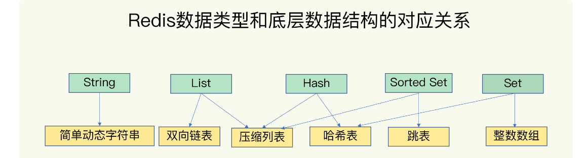

## Sorted Set

1. 点查询: 根据一个时间戳, 查询相应时间的数据
2. 范围查询: 查询起始和截至时间戳范围内的数据
3. 聚合计算: 针对起始和截止时间戳范围内所有的数据进行计算, 比如求最大/最小/平均值

## GEOhash

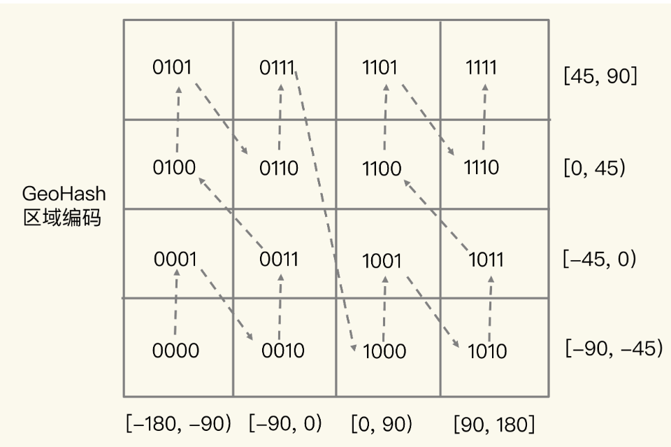

底层数据结构就是用 Sorted Set

## 压缩列表和数组

一个挨另一个保存, 非常节省内存空间
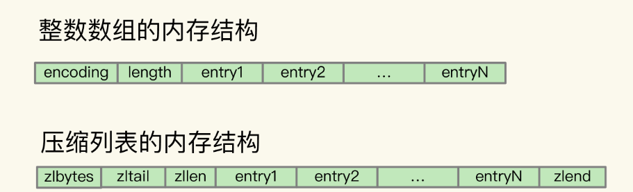

## hash 桶的存储结构

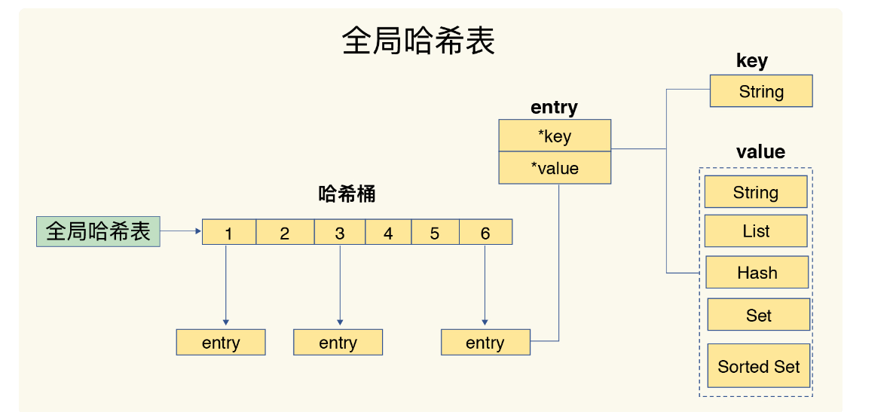

### 链表解决 hash 冲突

### 哈希冲突链上的元素通过指针逐一查找再操作

1. hash 表写入的数据越来越多, hash 冲突越来越多, 导致冲突链越来越长, 查找耗时
2. redis 会对 hash 表做 rehash 操作, 增加 hash 桶数量, 让逐渐增多的 entry 元素能够再更多桶之间分散保存, 减少单个桶元素数量和冲突
3. rehash 使用两个 hash 表, h2 是 h1 的 2 倍
    1. h1 数据重新放到 h2 中
    2. 释放 h1, 作为下一次扩容备用
    3. 渐进式 rehash, 每次迁移一个 hash 桶的数据, 从 h1 的第一个索引位置开始, 将这个索引位置上所有的 entries 拷贝到 h2,
       下一次处理再次拷贝 h1 下一个索引位置的 entries
    4. 避免一次性大量拷贝的开销, 如果 rehash 中途没新的请求, 定时刷

## RedisTimeSeries

直接在 redis 实例上进行聚合计算, 每 3 min 算一次最大值为例。每 3 min 记录 12 条数据可以聚合计算一个值。
大量聚合计算, 网络带宽不好的话, hash 和 sorted set 组合就不适合了, 使用 redisTimeSeries

# rehash

1. 触发时机和渐进式执行机制, 定时去执行 rehash
2. 装载因子大于 1 可以brehash, 装载因子大于 5

## 时间复杂度

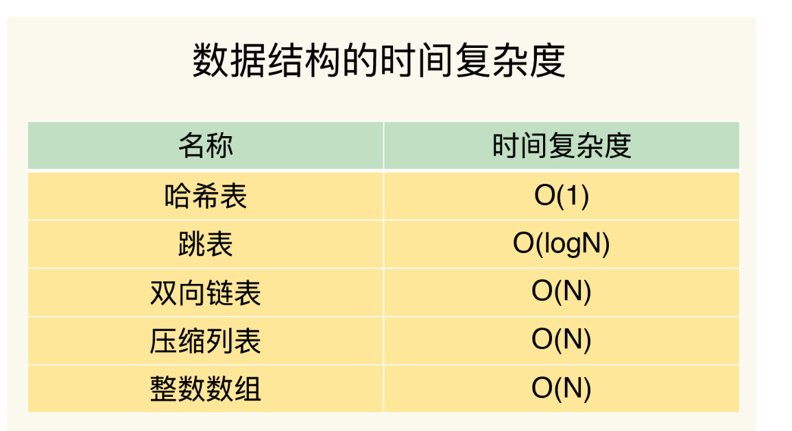

## 单个元素操作

使用 hash

## 范围操作

**复杂度O(N)**

1. HgetAll
2. smembers
3. lrange
4. zrange

**REDIS 2.8 版本以后, 渐进式遍历, 每次返回有限数量的数据, 避免了一次性返回所有元素**

1. hscan
2. sscan
3. zscan

## 统计操作 时间复杂度O(1)

1. Llen
2. Scard

# 持久化方式

1. AOF: 命令
2. RDB: 文件是二进制文件, 把 RDB 写入磁盘或者通过网络传输 RDB, IO 效率都比记录和传输 AOF 高, 恢复效率高于 AOF

# 事务

1. MULTI 命令: 接下来收到的命令放到内部队列, 后续执行保证原子性
2. EXEC 命令: redis 收到命令表示所有要保证原子性的命令操作发送完成了, redis 执行刚才放到内部队列所有命令操作

# 主从同步

## 读写分离

1. 读: 主从都可以接收
2. 写: 先到主库执行, 主库将写操作同步给主库

**复制方案**

1. 全量复制
2. 增量复制
3. 基于长连接命令传播

# 持久化方法

内存数据容易丢失, 怎么恢复

1. RDB(内存快照): bgsave 命令 fork 子进程, 不影响父进程对线程的修改, 避免了对业务的影响, 记录增量
2. AOF: 记录RDB, 过程期间的修改操作
3. RDB 和 AOF 混合的方式, redis 重启的时候可以恢复数据

# 线程模型:

I/O多路复用程序同时监听多个套接字, 被监听的套接字准备好执行accept、read、write、close操作, 将所有产生事件的套接字压入一个队列,
每次有序的仅一个套接字传给文件事件分派器, 分派其根据事件类型调用对应事件处理器

# 数据类型

## String

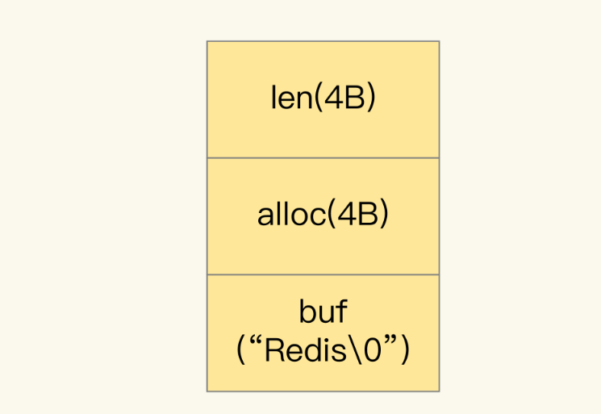

1. buf: 字节数组, 保存实际数据
2. len: 占用 4 个字节, 表示 buf 长度
3. alloc: 表示 buf 实际分配长度, 一般大于 len

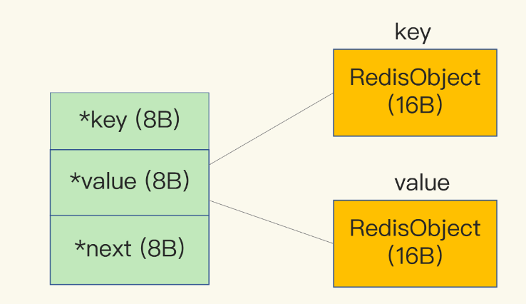
三个指针 24 个字节为什么分配 32 个字节呢, 因为 jemalloc, 申请比 N 大的最小 2 次冥的数值从而减少频繁分配的次数

使用 ziplist 可以节省内存

## bitmap

展示某一个月的签到情况, 用bitmap 日期 offset = hash % 365 ; key = 年份#用户 id 统计活跃用户 , 使用时间作为 cacheKey, 然后用户 ID 为 offset, 如果当日活跃过就设置为 1

## hyperloglog

基于概率来统计的, 误差率 0.81%

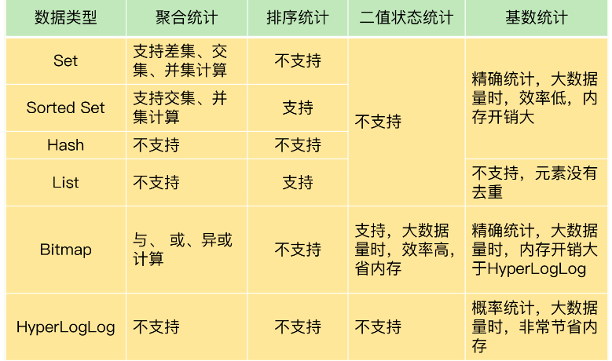

# 删除过期键策略:

1. 被动删除: key 被操作的时候, redis 先检查 key 是否过期, 过了就删
2. 主动删除: REDIS 会定期扫描一批设置过期时间的 key 进行删除处理, 已用内存超过最大内存也会触发主动清除策略
3. 采用主动删除+被动删除
    1. 主动删除: 设置定时器, 过了时间就删除。 ——对内存好
    2. 惰性删除: 放任不管, 直到获取的时候检查是否过期, 过期就删除。——对CPU好, 对内存不好, 库可能存在大量没被访问到的过期键, 可能永远不会被删除
    3. 定期删除: 隔一段时间检查一次过期键

redis 实际采用惰性删除和定期删除的配合使用

## redis 的 lua 脚本:

**原子操作**
将脚本作为一个整体执行, 中间不会插入其他命令, 无需使用事务, 通过脚本一次发送, 减少网络延迟, 但也不能回滚,
如果是单线程就有了隔离性和一致性, 再加上持久化机制就有了持久性

**主从一致性**
首先求出 memcached 服务器的哈希值, 并将其配置到0～2‘32的圆上, 然后采用同样的方法求出存储数据的键的哈希值, 并映射到相同的圆上

## 持久化:

[持久化](https://www.yuque.com/happy-coder/qka0of/xc3nt3)

第一种是快照, 第二种是 AOF 日志。快照是一次全量备份, AOF 日志是连续的增量备份。快照是内存数据的二进制序列化形式, 在存储上非常紧凑,
而 AOF 日志记录的是内存数据修改的指令记录文本。AOF 日志在长期的运行过程中会变的无比庞大, 数据库重启时需要加载 AOF
日志进行指令重放,
这个时间就会无比漫长。所以需要定期进行 AOF 重写, 给 AOF 日志进行瘦身。随着AOF文件越来越大, 里面会有大部分是重复命令或者可以合并的命令

[AOF和RDB](https://www.cnblogs.com/xxj-bigshow/p/10314414.html)

[pandas精确计算](https://github.com/sripathikrishnan/redis-rdb-tools)

### bigKey

1. 内存空间不均匀
2. 超时阻塞
3. 网络拥塞
4. 阻塞删除
5. 社交类: 某些大V明星不精细设计下, 必然bigKey
6. 统计类: 按天存储用户的网站和集合
7. 缓存类: 从数据库load出来序列化放redis

## 哨兵集群:

**哨兵sentinel作用:**

1. 监控
2. 选主
3. 通知(写入新节点)
4. 预警(通知技术人员要切换主节点)
5. 哨兵也有集群

**哨兵之间如何组成集群:**  
Redis 其实为我们提供了发布/订阅(pub/sub)机制, 每一个 redis 主节点起来的时候, 它都有一个频道叫"__sentinel__:hello", 那么哨兵实例启动后会订阅这个频道, 并在这个频道发布消息

**哨兵和从节点的通信:**  
哨兵实例启动后, 会先主节点发送 info 命令, 然后主库把从节点列表返回给哨兵, 然后哨兵再和从节点列表中的每一个从节点建立链接

## 哨兵断言主节点下线:

哨兵通过心跳检测来判断主节点是否已经 crash, 任何一个实例只要自身判断主库“主观下线”后, 就会给其他实例发送
is-master-down-by-addr 命令, 其他实例会根据自己和主库的连接情况, 做出 Y 或 N 的响应, 率先拿到了达到 quorum 数量的票数之后就判断为客观下线

## 性能影响因素

1. redis 内部阻塞
2. CPU 核
3. redis 关键系统配置
4. redis 内存碎片
5. redis 缓冲区

### 父子线程

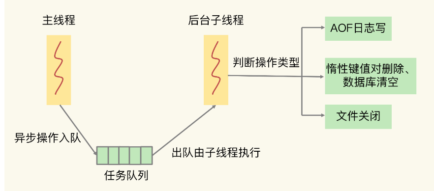

### 阻塞点

1. 客户端: 网络 IO, 键值对增删改查, 集合全量查询聚合操作, bigkey 或者频繁删除键值, 清空数据库(FLUSHDB 和 FLUSHALL)
2. 磁盘: 生成 RDB 快照, 记录 AOF 日志, AOF 日志重写
3. 主从节点: 主库生成、传输 RDB 文件, 从库接受 RDB 文件、清空数据库、加载 RDB 文件
4. 切片集群实例: 向其他实例传输 hash slot, 迁移数据

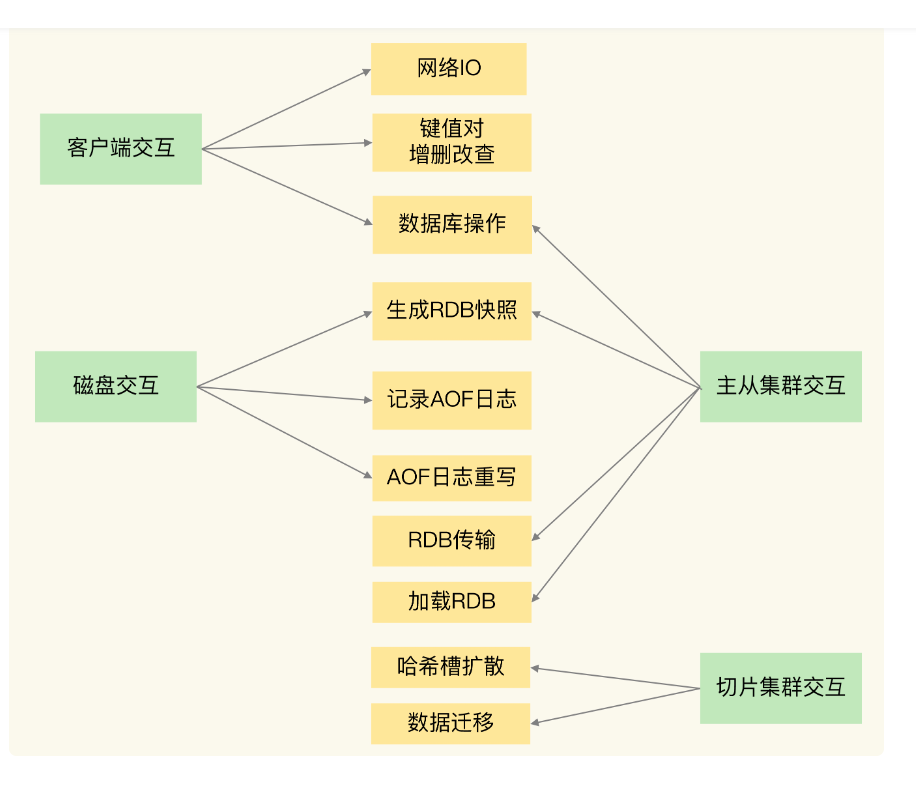

## 缓存击穿 缓存雪崩 缓存穿透:

### 缓存击穿:

就是单个key并发访问过高, 过期时导致所有请求直接打到db上, 这个和热key的问题比较类似, 只是说的点在于过期导致请求全部打到DB上而已。加锁更新,
比如请求查询A, 发现缓存中没有, 对A这个key加锁, 同时去数据库查询数据,
写入缓存, 再返回给用户, 这样后面的请求就可以从缓存中拿到数据了。将过期时间组合写在 value 中, 通过异步的方式不断的刷新过期时间,
防止此类现象

解决办法:

1. 后台定义一个job(定时任务)专门主动更新缓存数据.比如,一个缓存中的数据过期时间是30分钟,那么job每隔29分钟定时刷新数据(
   将从数据库中查到的数据更新到缓存中), 适合key相对固定的
2. 将缓存key的过期时间(绝对时间)一起保存到缓存中(
   可以拼接,可以添加新字段,可以采用单独的key保存..不管用什么方式,只要两者建立好关联关系就行)
   .在每次执行get操作后,都将get出来的缓存过期时间与当前系统时间做一个对比,如果缓存过期时间-当前系统时间<=1分钟(
   自定义的一个值),则主动更新缓存.这样就能保证缓存中的数据始终是最新的(和方案一一样,让数据不过期)
3. 采用 L1 (一级缓存)和 L2(二级缓存) 缓存方式, L1 缓存失效时间短, L2 缓存失效时间长。 请求优先从 L1 缓存获取数据, 如果
   L1缓存未命中则加锁, 只有 1
   个线程获取到锁,这个线程再从数据库中读取数据并将数据再更新到到 L1 缓存和 L2 缓存中, 而其他线程依旧从 L2 缓存获取数据并返回
4. 互斥锁双重判断虽然能够阻止高并发请求打到数据库,但是第二个以及之后的请求在命中缓存时,还是排队进行的.比如,当30个请求一起并发过来,在双重判断时,第一个请求去数据库查询并更新缓存数据,剩下的29个请求则是依次排队取缓存中取数据

### 缓存穿透:

1. 查询不存在缓存中的数据, 每次请求都会打到DB, 就像缓存不存在一样。加一层布隆过滤器。布隆过滤器的原理是在你存入数据的时候,
   会通过散列函数将它映射为一个位数组中的K个点, 同时把他们置为1。查询的时候先判断布隆过滤器是否存在
2. 不存在就是非法的, 不继续查询

### 缓存雪崩:

1. 当某一时刻发生大规模的缓存失效的情况, 比如你的缓存服务宕机了, 会有大量的请求进来直接打到DB上, 这样可能导致整个系统的崩溃,
   称为雪崩
2. 针对不同key设置不同的过期时间, 避免同时过期
3. 限流, 如果redis宕机, 可以限流, 避免同时刻大量请求打崩DB
4. 主缓存: 有效期按照经验值设置, 主要读取的缓存, 主缓存失效后从数据库加载最新值。备份缓存: 有效期长, 获取锁失败时读取的缓存,
   主缓存更新时需要同步更新备份缓存。其实就是缓存降级策略

# 业务方案:

读流量巨大就要降低一致性要求, 多加副本, 做两三个redis集群就行, 冷热分离

# redis 缓存打满了怎么办

本地缓存, 水平扩容, 注意本地缓存不会对 cpu 影响, 对磁盘 io 和 gc 会有影响

# redis 瓶颈

主要在网络IO, 看网络带宽

# 2核 CPU、4GB 内存、500G 磁盘, Redis 实例占用 2GB, 写读比例为 8:2, 此时做 RDB 持久化

1. 内存资源风险: Redis fork子进程做RDB持久化, 由于写的比例为80%, 那么在持久化过程中, “写实复制”会重新分配整个实例80%的内存副本,
   大约需要重新分配1.6GB内存空间, 这样整个系统的内存使用接近饱和,
   如果此时父进程又有大量新key写入, 很快机器内存就会被吃光, 如果机器开启了Swap机制, 那么Redis会有一部分数据被换到磁盘上,
   当Redis访问这部分在磁盘上的数据时, 性能会急剧下降, 已经达不到高性能的标准(可以理解为武功被废)。如果机器没有开启Swap, 会直接触发OOM, 父子进程会面临被系统 kill 掉的风险
2. CPU 风险: 虽然子进程在做 RDB 持久化, 但生成 RDB 快照过程会消耗大量的 CPU 资源, 虽然 Redis 处理处理请求是单线程的, 但Redis Server还有其他线程在后台工作,
   例如 AOF 每秒刷盘、异步关闭文件描述符这些操作。由于机器只有2核 CPU, 这也就意味着父进程占用了超过一半的 CPU 资源,
   此时子进程做 RDB 持久化, 可能会产生 CPU 竞争, 导致的结果就是父进程处理请求延迟增大, 子进程生成 RDB 快照的时间也会变长, 整个Redis Server性能下降
3. 如果绑定了 CPU, 那么子进程会继承父进程的 CPU 亲和性属性, 子进程必然会与父进程争夺同一个 CPU 资源, 整个 Redis
   Server 的性能必然会受到影响！所以如果 Redis 需要开启定时 RDB 和 AOF 重写, 进程一定不要绑定 CPU,
   主线程, 子线程和后台线程都会竞争 CPU 资源

# AOF 重写有什么阻塞风险

1. redis 主线程 fork 创建 bgrewriteaof 子进程时, 内核要把主线程的进程控制块拷贝给子进程, 会阻塞主线程, 拷贝过程中子进程要拷贝父进程页表,
   这个过程耗时和 redis 实例内存大小有关, redis 实例越大, 页表越大, fork 执行时间越长, 主线程阻塞风险多
2. bgwriteaof 子进程和主线程共享内存, 主线程收到新的写或者修改操作, 主线程申请新的内存空间, 保存新写或者修改的数据, 操作 bigkey, 主线程会申请大空间面临阻塞风险

# Redis 为什么不直接用一个表, 把键值对和实例对应关系记录下来

1. 键值对和实例对应关系发生变化, 比如增减或者重新分布, 就要修改表, 修改范围大的话, 会阻塞整个表, 多线程操作表会增加锁开销
2. 基于 hash slot 计算时, slot 个数要比键值对的个数少很多, 无论修改 hash slot 和实例对应关系, 或者使用额外空间存储hash slot 对应关系, 开销都小得多

# Redis 自身操作特性的影响

## 慢查询命令

1. 返回 set 所有成员, 不要使用 SMEMBERS 命令, 而是要使用 sscan 渐进式多次迭代返回, 避免一次返回大量数据, 造成线程阻塞
2. 执行排序、交集、并集操作, 可以在客户端完成, 而不要用 sort、sunion、sinter 这些命令
3. keys 命令不要在生产环境中使用, 可以用 hscan 和 sscan 代替

## 监控工具

latency monitor 查询变慢的请求

**设置两个参数**

1. slowlog-log-slower-than: 慢查询日志对执行时间大于多少微秒命令
2. slowlog-max-len: 慢查询日志最多能记录多少条命令记录, 一旦超过了队列长度, 最先记录的命令操作会被删除, 默认 128, 一般设置为 1000

使用 slowlog get 命令查询慢查询日志记录的命令操作

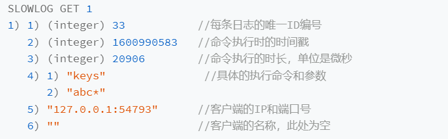

## 过期 key 操作

redis 默认每 100ms 删除一批过期的 key, 删除的操作是阻塞的, 如果线程一直在删除那就会阻塞, ACTIVE_EXPIRE_CYCLE_LOOKUPS_PER_LOOP 默认是 20, 一秒内会有200key过期被删除, expireat 和 expire 加上随机过期参数

## 分片

可不可以用 scan 命令, redis cluster 模式下不支持跨节点的 scan 操作

如果 redis-cluster 的话, 可以用 hash tag, 在键值对的 key 中使用花括号{}, 例如{user:}1, {user:}2, redis-cluster
会针对花括号中部分进行 hash, 可以把具有相同前缀的 key 分配到同一个 hash slot 里面, 但是可能导致分布不均衡

# 缓冲区溢出

1. 避免 bigkey 复制, 避免过大的 RDB 文件
2. 减少删除的阻塞操作, 比如异步删除
3. 缓冲区大小, 使用 client-output-buffer-limit 设置合理的输出缓冲区、复制缓冲区、复制积压缓冲区大小
    1. redis 客户端和服务端之间, 主从节点之间为了传输命令数据, 缓冲区溢出会直接关闭连接
    2. 环形缓冲区发生溢出新写入的命令覆盖旧命令会导致旧数据丢失, 主从节点重新全量同步

# redis 变慢的原因总结

1. 使用复杂度过高命令一次查询全量数据
2. 操作 bigkey
3. 大量 key 集中过期
4. 内存达到 maxmemory
5. 客户端使用短链接与 redis 相连
6. redis 数据量大, 生成 RDB 和 AOF 重写都会导致 fork 耗时严重
7. AOF 协会策略是 always, 导致每个操作同步刷盘
8. redis 实例运行机器内存不足, 导致 swap 发生, redis 到 swap 内存分区读数据
9. 进程绑定 CPU 不合理
10. redis 实例和运行机器上开启了透明内存大页机制
11. 网卡压力过大

# 缓存淘汰机制

1. noeviction: 一旦缓存别写满了, 不会淘汰数据, redis 不再提供服务, 直接返回错误
2. 优先使用 allkey-lru 策略, 可以充分利用 LRU 缓存算法优势
3. 没有明显冷热数据, 用 allkeys-random 策略选择随即淘汰
4. 有置顶需求, 使用 volatile-lru 不设置过期时间
5. 解决缓存污染(不访问的数据占内存)可以用 LFU
6. LRU 关注时效性, 通常情况下应用负载具有较好的时间局部性

# 数据倾斜

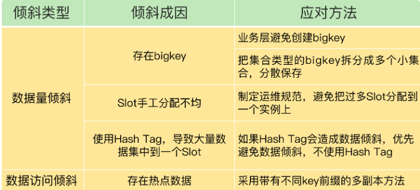

# reids 和 memcached 对比

memcached 集群规模可以很大, 使用一致性 hash 算法把数据分布到不同的实例上

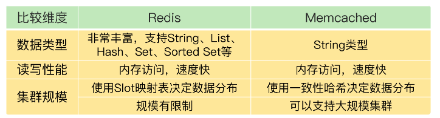

# redis 使用规范

**业务人员**

1. key 的长度尽量短, 节省内存空间
2. 避免 bigkey, 防止阻塞主线程
3. 4.0 + 版本建议开启 lazy-free
4. 把 Redis 当作缓存使用, 设置过期时间
5. 不使用复杂度过高的命令, 例如 SORT、SINTER、SINTERSTORE、ZUNIONSTORE、ZINTERSTORE
6. 查询数据尽量不一次性查询全量, 写入大量数据建议分多批写入
7. 批量操作建议 MGET/MSET 替代 GET/SET,HMGET/HMSET 替代 HGET/HSET
8. 禁止使用 KEYS/FLUSHALL/FLUSHDB 命令
9. 避免集中过期 key
10. 根据业务场景选择合适的淘汰策略
11. 使用连接池操作 Redis, 并设置合理的参数, 避免短连接
12. 只使用 db0, 减少 SELECT 命令的消耗
13. 读请求量很大时, 建议读写分离, 写请求量很大, 建议使用切片集群

# 监控工具

1. info 命令
   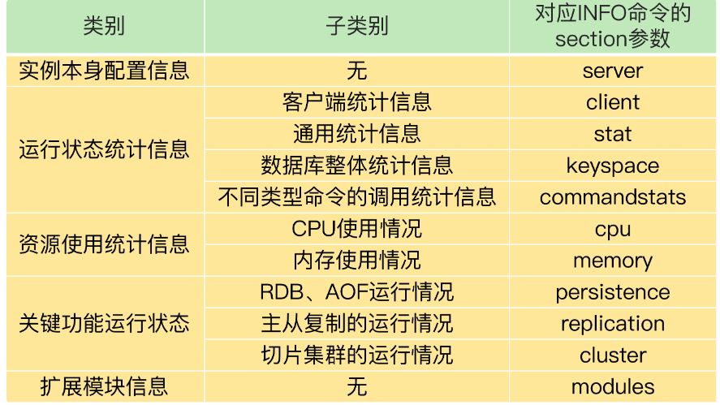
2. 基于 prometheus 的 redis-exporter 监控
3. redis-stat
4. redis live
5. 数据迁移工具 redis-shake
6. redis-full-check 对源实例和目的实例数据进行全量对比, 从而完成数据校验, redis-full-check 采用多轮比较方法, 记录到
   sqlite 数据库中, 第二次校验后会比较上一轮结束后记录在数据库中不一致的数据, 每次对比后会暂停一段时间
7. 集群管理工具 cachecloud

## 监控指标

1. 客户端相关: 当前连接数、总连接数、输入缓冲大小、QPS
2. CPU相关: 主进程 CPU 使用率、子进程 CPU 使用率
3. 内存相关: 当前内存、峰值内存、内存碎片率
4. 网络相关: 输入、输出网络流量
5. 持久化相关: 最后一次 RDB 时间、RDB fork 耗时、最后一次 AOF rewrite 时间、AOF rewrite 耗时
6. key 相关: 过期 key 数量、淘汰 key 数量、key 命中率
7. 复制相关: 主从节点复制偏移量、主库复制缓冲区

# roaringbitmap

交集或并集运算, 比 bitmap 更节省空间

Roaring Bitmap 将一个 32 位的整数分为两部分, 一部分是高 16 位, 另一部分是低 16 位。对于高 16 位, Roaring Bitmap
将它存储到一个有序数组中, 这个有序数组中的每一个值都是一个“桶”, 而对于低 16 位, Roaring Bitmap 则将它存储在一个 2^16
的位图中, 将相应位置置为 1。每个桶都会对应一个 2^16 的位图
