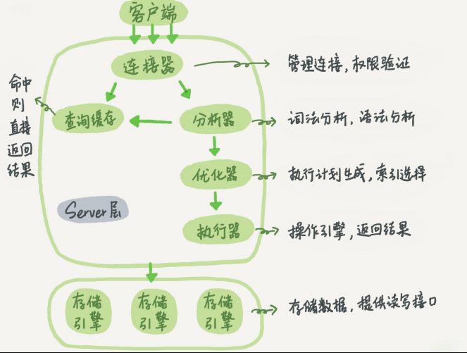
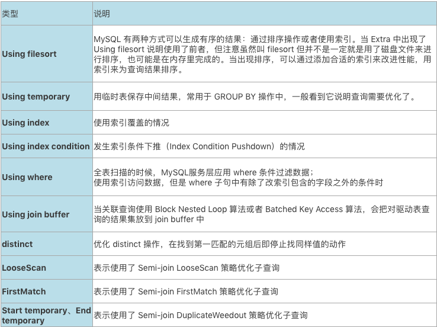

# mysql 写入 log 里面

# sql执行过程

**Mysql 分为 Server 层和存储引擎层两部分**

## 底层优化过程

# 查询缓存

1. 先到查询缓存看看,执行过的语句和结果以 key-value 的形式存储到缓存中
2. 但是不建议用查询缓存, 因为只要有表更新, 该表对应的查询缓存都会被清空
3. 8.0已经取消这个功能了

# 两阶段提交

对于 update 语句:

1. 先从内存找, 数据页如果在内存, 直接返回给执行器, 否则从磁盘读入内存, 然后返回
2. 这行数据更新到内存, 同时记录到 redo log, 处于 prepare 状态, 告知执行器执行结束了, 随时提交事务
3. 执行器生成 binlog, 写入磁盘, prepare 改成 commit 状态
4. 先 redo log 提交完成, 事务就不能回滚了, 如果可以的话, 就会把其他的更新给覆盖掉了

## Online DDL

1. 建立临时文件, 扫描 A 主键所有数据页
2. 数据页中表 A 记录生成 B+ 树, 存储到临时文件中
3. 生成临时文件过程, 将对 A 的操作放到一个临时文件, 得到一个逻辑数据上与表 A 相同的数据文件
4. 临时文件完成, 将日志文件操作应用到临时文件
5. 临时文件替换表 A 数据文件

## 行级锁

1. 行锁都是在需要的时候加上, 等到事务结束后才能释放
2. 如果你的事务中需要锁多个行, 要把最可能造成锁冲突、最可能影响并发度的锁的申请时机尽量往后放

**举例**

1. 记录一条交易日志
2. 顾客 A 账户余额中扣除电影票价
3. 从影院 B 账户余额增加电影票价

## 死锁和死锁检测

**用例**

1. 事务 A 等到事务 B 释放锁再提交
2. 事务 B 等到事务 A 释放锁再提交

**策略**

1. 直接进入等待到超时, 通过 innodb_lock_wait_timeout 设置, 默认值是 50 s
2. 发起死锁检测, 发现死锁后, 主动回滚死锁链条的某一个事务, 让其他事务得以继续执行,
   将参数 innodb_deadlock_detect 设置为 on 表示开启这个逻辑, 假设 1000 个并发会消耗大量的 CPU
3. 控制并发度, 一定程度上降低死锁概率, 如果在客户端控制, 也存在数据库压力很大的危险, 应该在中间件或者 mysql 上做
4. 业务妥协, 一行改成逻辑上的多行减少锁冲突, 批处理策略, 要结合业务逻辑设计, 因为可能存在退票导致记录变成 0 的时候

# 事务隔离

1. InnoDB行数据有多个版本, 每个事务或者语句有自己的一致性视图, 一致性读根据row trx_id确定数据版本的可见性

# Myisam

Myisam 是 b 树

# 索引

1. 最左匹配原则, 对索引包含的字段优先判断, 减少回表次数
2. 对于不符合最左前缀的部分进行索引下推

# 唯一索引和普通索引

1. 唯一索引: 读一条记录的时候, 查找到满足条件的第一个记录, 继续查下一个, 直到没有
2. 非唯一索引: 唯一性, 查找到满足条件的第一个记录后, 停止继续检索  
   **性能差异** 微乎其微, 因为 InnoDB 数据是按数据页为单位读写, 读一条记录的时候, 并不是将记录从磁盘读, 而是以页为单位,
   存入内存中, 因为引擎是按页读写, 找到 k=5 记录的时候, 所在的数据页都在内存里, 只需要一次指针和一次计算

# 联合索引

联合索引本质上也是辅助索引, 只不过它会对表上的多个列进行索引, 联合索引  
B+ 树的节点行记录中, 会同时记录多个索引列, 并且会按索引先后顺序分级别进行排序(类似于字符串的比较大小)

例如, 对于联合索引(a, b, c)

1. 在全局范围内, 按 a 排序
2. 在 a 相等的范围内, 按 b 排序
3. 在 a 和 b 都相等的范围内, 按 c 排序

# 最左匹配原则

当我们在使用复合索引时, 需要使用索引中的最左边的列进行查询, 才能使用到复合索引。例如我们在 order 表中建立一个复合索引
idx_user_order_status(order_no, status, user_id), 如果我们使用 order_no、order_no+status、order_no+status+user_id 以及
order_no+user_id 组合查询, 则能利用到索引；而如果我们用 status、status+user_id 查询, 将无法使用到索引, 这也是我们经常听过的最左匹配原则。

## innodb buffer poll

# change buffer

1. change buffer 用的是 buffer pool 里的内存, 通过参数 innodb_change_buffer_max_size 来动态设置,这个参数设置为 50 的时候,
   表示 change
   buffer 的大小最多只能占用 buffer pool 的 50%
2. 在 3-5之间插入 4, 先判断是否在内存中, 在的话先更新内存, 否则直接更新数据页, 唯一索引判冲突, 插入, 普通索引直接插入

# mysql 有时候选错索引怎么办？

1. force index 强行选择一个索引

# 前缀索引

1. 直接创建完整索引, 这样可能比较占用空间
2. 创建前缀索引, 节省空间, 但会增加查询扫描次数, 并且不能使用覆盖索引
3. 倒序存储, 再创建前缀索引, 用于绕过字符串本身前缀的区分度不够的问题
4. 创建 hash 字段索引, 查询性能稳定, 有额外的存储和计算消耗, 跟第三种方式一样, 都不支持范围扫描

**使用场景** 学号、身份证号、邮箱等查询

# 数据库为什么有时候 loading 了一下 flush 刷脏页(形容内存对于磁盘有变更的数据)

1. redo log 满了, 脏页刷到磁盘
2. 系统内存不够, 需要新的内存页, 不够用就淘汰脏页, 先刷盘
3. mysql 空闲的时候, 刷脏页
4. mysql 正常关闭时候, mysql 把内存的脏页 flush 到磁盘上, 下次 Mysql 启动的时候, 可以直接从磁盘上读数据, 启动速度很快

# order by

1. Mysql 每个线程分配一块内存用于排序, 排序所需参数 sort_buffer_size, 小于这个数就在内存完成
2. 大于 sort_buffer_size, 就用磁盘临时文件排序, 可能是归并排序算法
3. 排序内存小, 采用 rowId 排序算法, 单次可以排序更多行
4. 排序内存大, 优先选择全字段排序, 需要字段放到 sort_buffer, 这样排序后直接从内存返回结果, 不需要原表取数据

文件排序(filesort), filesort 是否会使用磁盘取决于它操作的数据量大小

1. 数据量小时, 在内存中快排
2. 数据量大时, 在内存中分块快排, 再在磁盘上将各个块做归并

# 索引失效, 全表扫描, 破坏索引值有序性

1. 对索引字段做函数操作
2. 隐式类型转换
3. 隐式字符编码转换

# 间隙锁和幻读

1. rc 隔离级别
2. binlog_format=row
3. 避免了可重复读引起的间隙锁性能问题

**加锁规则** 两个原则, 两个优化, 一个 bug

1. 原则 1: 加锁的基本单位是 next-key lock, next-key lock 是前开后闭 区间
2. 原则 2: 查找过程中访问到的对象才会加锁
3. 优化 1: 索引上的等值查询, 给唯一索引加锁的时候, next-key lock 退化为行锁
4. 优化 2: 索引上的等值查询, 向右遍历时且最后一个值不满足等值条件的时候, next-key lock 退化为间隙锁
5. bug: 唯一索引上的范围查询会访问到不满足条件的第一个值为止

## binlog 格式

1. statement: 记录sql语句的原文, 可能导致主备不一致, 最后会有commit, 比如主库用索引A, 备库执行SQL时, 使用了索引
   t_modified
2. row: 占用空间, 消耗IO资源, 最后会有XID event, 数据不一致很容易会发现
3. mixed: MYSQL自己判断SQL是否能引起主备不一致

# join

1. 驱动表 A, 被驱动表 B, 由于表 B 的 f1 字段上没有索引, 所以使用 Block Nexted Loop Join 算法
    1. A 内容读入 join_buffer 中, 因为是 select *, 字段 f1 和 f2 都被放入 join_buffer
    2. 顺序扫描表, 对每一行数据, 判断 join 条件是否满足, 满足条件的记录作为结果集的一行返回, 如果语句中有 where, 先判断
       where 部分满足条件后, 在返回
    3. B 扫描结束后, 没有被匹配的表A的行, 把剩余字段补上NULL, 放入结果集
       
2. B 驱动表 Index Nested-Loop Join（简称 NLJ）算法
    1. 顺序扫描 B, 每一行用 b.f1 到表 a 去查, 匹配到记录后判断 a.f2=b.f2 是否满足, 满足条件就作为结果集返回
3. Simple Nested Loop Join 算法把数据读入内存, 然后按照匹配条件进行判断
    1. 数据没有在 Buffer Pool 中, 要等待这份数据从磁盘读入, 从磁盘读入数据到内存, 会影响正常业务的 Buffer Pool 命中率,
       会对被驱动表的数据多次访问, 容易将数据页放到 Buffer Pool 头部
    2. 即使被驱动表数据都在内存, 每次查找下次记录操作, 都类似指针操作, join_buffer 遍历成本更低

# group by

1. 如果对 group by 语句的结果没有排序要求, 要在语句后面加 order by null
2. 尽量让 group by 过程用上表的索引, 确认方法是 explain 结果里没有 Using temporary 和 Using filesort
3. 如果 group by 需要统计的数据量不大, 尽量只使用内存临时表; 也可以通过适当调大 tmp_table_size 参数, 来避免用到磁盘临时表
4. 如果数据量实在太大, 使用 SQL_BIG_RESULT 这个提示, 来告诉优化器直接使用排序算法得到 group by 的结果

# 执行计划

## key 和 ref

1. key 实际使用索引
2. ref 这个 sql 执行预计会走普通索引

# 主从同步

# MVCC 机制

MVCC是对于事务隔离级别的读已提交RC和可重复读RR, 基于乐观锁的实现。在LBCC(基于锁的并发控制)
RC、RR和串行化分别是通过加行锁、间隙锁和表锁来基于悲观锁实现。而乐观锁的原理就是在特定的时间点(RC是每次读时,
RR是事务开始时)生成一个当前快照, 读数据读取快照, 只在提交时判断是否有冲突, 类似于 git 的 branch 和 commit

MVCC会在新开启一个事务时, 给事务里包含的每行记录添加一个当前事务ID和回滚指针。并包含一个Read View, Read
View里保存了当前活跃的事务列表, 小于这些列表的最近的事务ID才是可见的。这样保证了读到的都是已提交的事务

MVCC不仅可以用于数据库, 也是很常见的一种并发控制手段。比如使用有限状态自动机来控制的订单状态, 在更新订单状态的时候先查询当前状态,
比如当前状态是订单未提交, 则更新时update XXX set status='订单已提交' where status='订单未提交', 如果执行这条语句时,
status已经发生了改变, 这条语句就执行失败了

## mvcc 原理

开启事务的时候会生成当前活跃事务的trx_ids集合, 以及集合中最小的活跃事务id min_trx_id, 以及下次即将分配的max_trx_id,
每行记录都有两个隐藏列, 一个是trx_id表示为上一次修改的事务id, 一个是roll_pointor指向undo log

还有在两个范围之间的id, 非活跃事务可访问

mvcc解决了快照读的幻读问题, 间隙锁解决了当前读的幻读问题

如果要当前读也就是保证要读最新值的话, 就要加锁

分为快照读和当前读, 当前读可以加锁解决幻读, 快照读只能解决当前事务版本号未升级的幻读

mysql解决幻读是有缺陷的, 关键在于读看不到插入数据, 写却能看到, 造成了这种不一致

# 幻读和不可重复读

mvcc 只能解决 select 引起的幻读, next-key lock 解决插入更新引起的幻读。 幻读的定义就是同一事务两次读取, 第二次读到多余数量的数据。
不可重复读是同一事务两次读取, 第二次读取的数据被修改

‌脏读(Dirty Read)是指在数据库访问中, 一个事务(T1)修改了某一值, 然后另一个事务(T2)读取该值, 此后T1撤销对该值的修改, 导致T2读取到的数据是无效的, 也就是未提交读

Next-key lock 是行锁+区间锁, 关闭 gap lock 就剩行锁了

mvcc 从读的角度完全解决了幻读问题, 但是从写的角度没有解决写偏斜的问题, 所以需要配合间隙锁, 但是快照读和当前读混用的时候还是会有幻读问题

快照隔离这种级别下, 所有的读取都是快照读, 因此不会有幻读的问题, 但是它会有写倾斜的问题, 查(快照隔离)或者(写倾斜)都可以

在提交前, 读入的数据就已被别的事务修改并提交, 锁解决不了可见性, 可见性一般都是通过唯一版本解决

# 为什么 mysql 默认用 rr 隔离级别

MySQL 在主从复制的过程是通过 binlog 进行数据同步的, 而 MySQL 早期只有 statement 这种 binlog 格式, rc下主从同步会有问题, bin
log 记录的是 SQL 语句的原文。当出现事务乱序的时候, 就会导致备库在 SQL 回放之后, 结果和主库内容不一致。RR
会在更新数据的时候增加记录锁的同时增加间隙锁。可以避免这种情况的发生