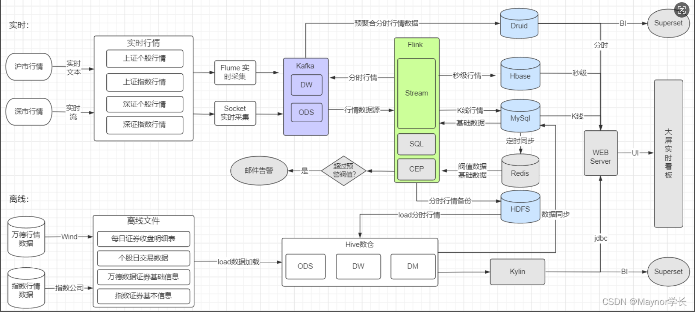
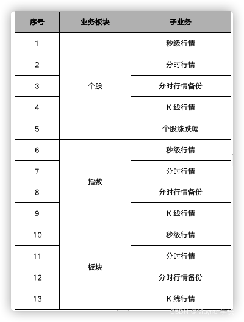
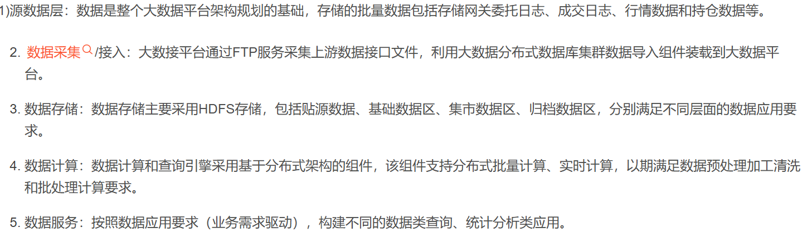
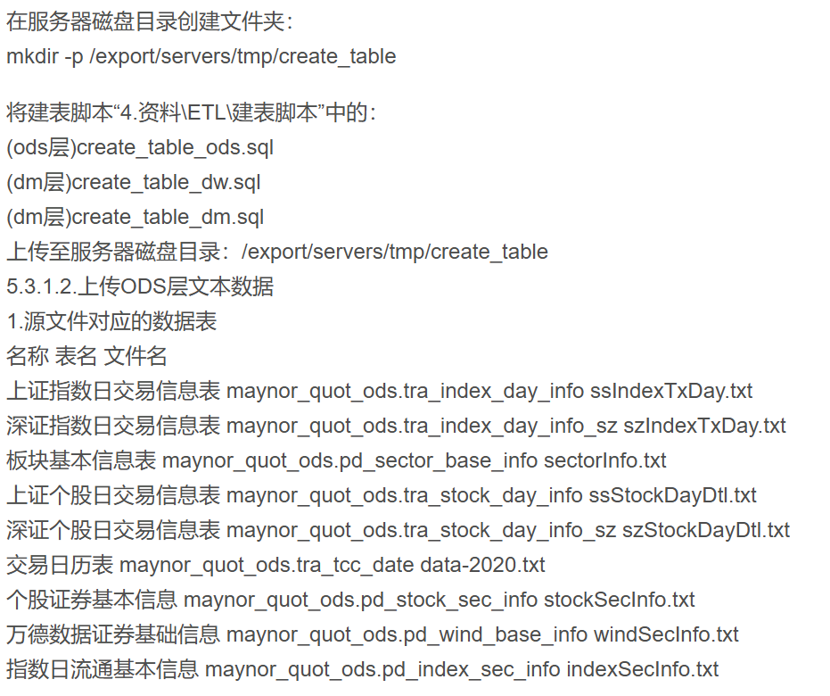

# 平台规划

1. 机器配置
   假设公司采购机器: 
   单机:  
   内存: 128G  
   CPU: 48C  
   磁盘: 10＊1.2T  

2. 以消息队列日吞吐量计算需占用磁盘空间
    1. 消息队列日数据吞吐量: 2000万只证券1条/秒60604=2.88亿条
    2. 每条行情数据1kb左右，每天日志量: 2.88亿kb/1024/1024275G
    3. 一年磁盘存储量: 275G*360天/1024≈97T
    4. 保存3个副本需占用磁盘总量: 97T*3=291T
    5. 预留30%的磁盘空间= 291T/70%≈ 416T
    6. 机器数量:
       (1)机器一方案: 416T/（1.2T*10）≈35台
       (2)机器二方案: 416T/（1.2T*15）≈23台
    7. 再加上元数据，主节点服务器，还需再加上一定数量的机器

3. 数据存储规模
   1. 秒级行情(Hbase): 存储5日内秒级行情，数据量为2.88亿条
   1. 分时行情(Druid 曰): 存储半年内分时行情数据，数据量为8.64亿条;
   1. 历史数据(Hive数仓): 以沪深市场2万只证券，存储时间按1年统计:
   1. 秒级行情: 210亿条以上
   1. 分时行情: 20亿条以上
   1. K线: 1500万条以上
# 性能指标

## 批处理部分指标

支持批处理集群批量总写入速度 2GB/秒，批量读取速度 300MB/秒  
平台支持并发执行 300 个查询和 200 个加载任务  
应用查询时间对于数据库的简单数据读取将不超过1-2秒，三个月统计计算查询时间将不超过15秒，复杂查询时间将不超过1分钟  
复杂批处理任务，ETL的处理时间将不超过 2 个小时  

## 实时流处理指标

平台支持接收峰值为每秒 100 万条+的流数据  
平台能够在峰值条件下，完成 2 秒内的实时预警，2 秒内完成针对当日数据的查询  
平台每日实时处理模块能够累积处理 144 亿笔（按 4 小时交易日保持峰值流速计）订单流数据  
平台支持至少 50 个并发访问/查询当日数据  

## 应用响应指标

数仓应用项目离线报表 30 秒内完成数据响应查询  
实时大屏数据展示 5 秒内完成数据响应查询   
应用平台支持并发执行 500 个用户查询请   

# 技术架构

# 实时业务三大板块

# 数据表设计

## 数据库表初始化
